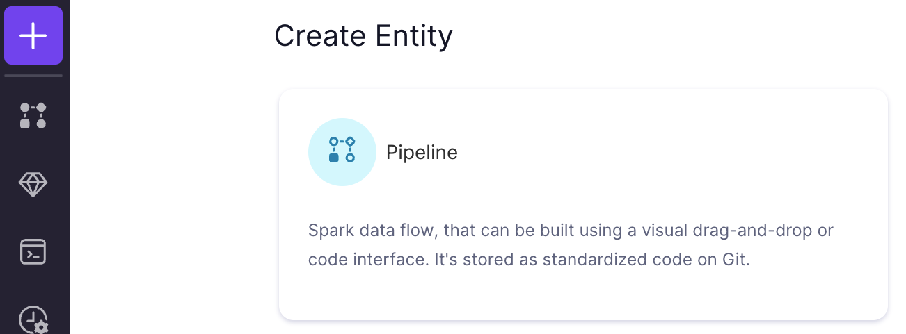
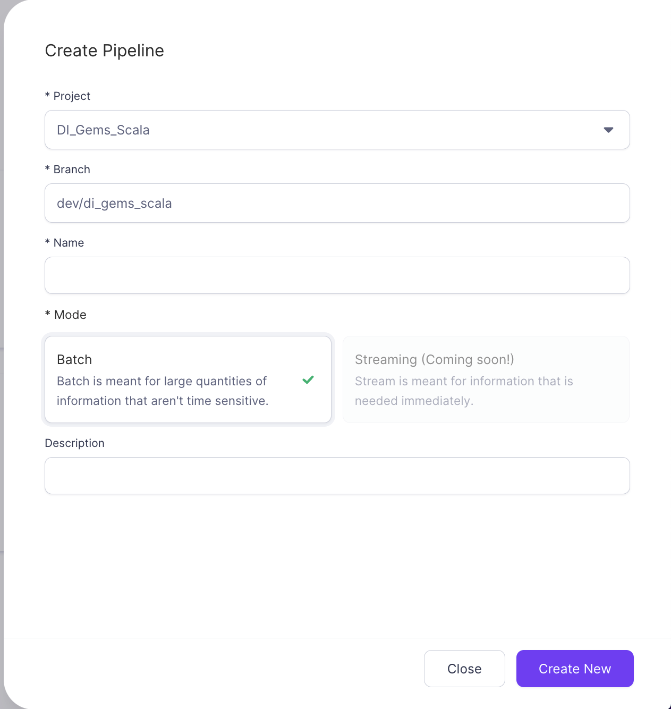

A `Pipeline` (formerly known as a *Workflow*) is a type of entity within Prophecy that is used to represent the flow of data. They are similar to directions you might use on a road trip: You have a ***Start*** and ***Finish*** ([Datasets](02-dataset.md)) and the ***steps*** to take along the way ([Instructions](03-instructions.md)). 

## Pipeline list

In the Metadata view of the UI you'll find the [Pipeline list](https://app.prophecy.io/metadata/entity/user/pipelines)

If this list is empty, follow the instructions below to create a new one

## Creating a pipeline

Pipelines can be created using the [Create Entity](https://app.prophecy.io/metadata/create) view. 

Clicking the `Pipeline` button will pop up the **Pipeline Creation** UI.

| Field Name  | Description                                                                                                                                                                                               |
| ----------- | --------------------------------------------------------------------------------------------------------------------------------------------------------------------------------------------------------- |
| Project     | Which project to create the `Pipeline` in. This controls who has access to the `Pipeline`, groups `Pipeline`s together for lineage, and allows you to use Datasets already published within that project. |
| Branch      | Which GIT branch to use when developing this `Pipeline`.                                                                                                                                                  |
| Name        | `Pipeline` name                                                                                                                                                                                           |
| Mode        | Whether the `Pipeline` will be Batch mode or Streaming                                                                                                                                                    |
| Description | Description for the `Pipeline`. Put whatever you want here that will help others (or yourself) understand the purpose of the `Pipeline`.                                                                  |

## Editing a pipeline

When editing a `Pipeline`, you'll be using the editor shown below. 

1. *Pipeline Config* : Buttons that bring up views related to the configuration of your `Pipeline`:
   1. [Config](../05-low-code-spark/03-configuration.md)
   2. [Scheduling](../06-low-code-jobs/00-intro.md)
   3. Unit Tests
   4. UDFs/UDAFs
   5. Dependencies
   6. Spark Version
   7. Visual Language
2. *View switch* : Switch between the Visual development and the Generated Code. **Note:** The generated Code will only update if there are no errors detected in the Visual view.
3. *Fabric Switch* : Select the [Fabric](04-fabric.md) to use during development, start a new or connect to an existing cluster
4. *Gem drawer* : Click to select a category, then click on the Gem you wish to insert into the editor. See [here](03-instructions.md) for more information on the Gems
5. *Workspace* : Everything in the middle of the view is the *Workspace*. This is where you'll create and manipulate the gems that make up this `Pipeline`.
6. *GIT Status* : In Prophecy almost everything is stored in GIT, and this is where you can interact with the version control for your Pipeline. See [Projects & Git](04-project.md) for more information
7. *Run* : If you just want to run your `Pipeline` from start to finish, click this button