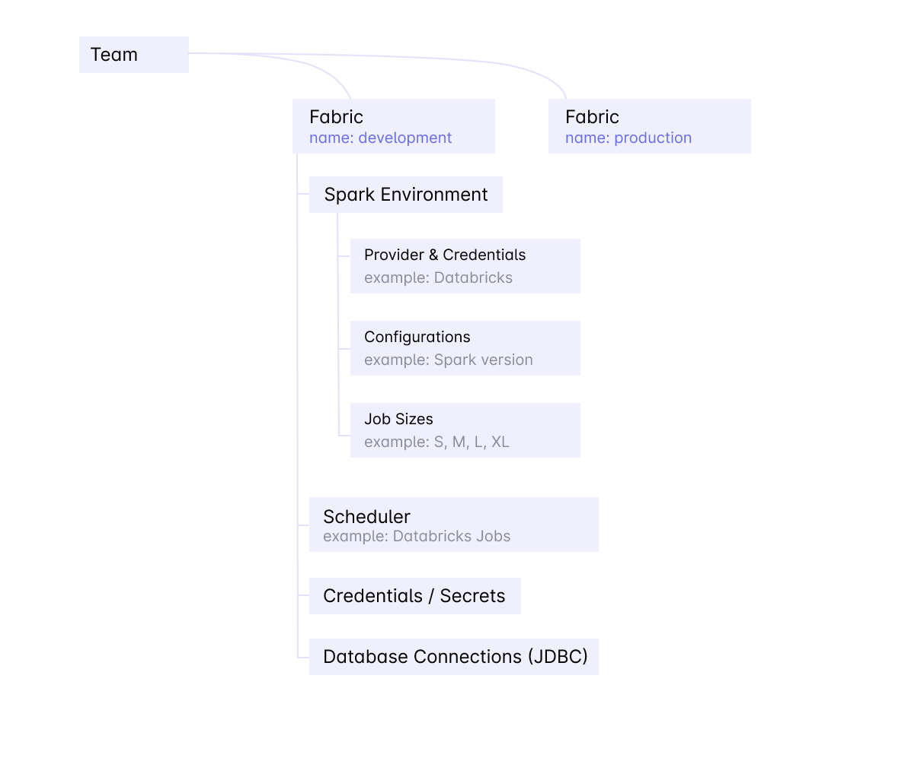

Fabric is a logical execution environment. Teams organize their data engineering into multiple environments such as *development*, 
_staging_, and _production_.

## Common Usage Pattern

* Admin sets up a Prophecy account & creates a **dev** fabric for development, and **prod** fabric for production
* Admin adds a team for Marketing Decision Support System (Marketing_DSS)
* Users in the Marketing_DSS Team now use the
   * **dev** fabric for development
   * **prod** fabric for production pipelines

## What's in a Fabric

Fabric includes everything required to run a data pipeline

* **Spark Environment**
  * This is a named Spark environment, owned by one team and used by one or more teams
  * It contains
    * **Connection Credentials** - for Databricks this includes the _Workspace URL_ and the _Access Token_
    * **Cluster Configuration** - for Databricks this includes the _Databricks Runtime Version_, _Machine Type_, and _Idle Timeout_
    * **Job Sizes** - for convenience Prophecy enables you to create commonly used cluster sizes and name them. For example an XL cluster might be 10 servers of i3.xlarge instance type that will have 40 CPUs and 70GB memory
* **Scheduler**
  * Scheduler runs one more Spark data pipelines based on a schedule (e.g. every weekday at 9am)
  * Databricks workspaces come with a default scheduler that is always available
  * Enterprise environments have Airflow Scheduler option as well
* **Database Connections**
  * Data pipelines will often read operational databases such as MySql or Postgres, and read/write Data Warehouses such as Snowflake
  * JDBC or other connections to these databases can be stored on the Fabric
* **Credentials & Secrets**
  * Prophecy enables you to store credentials safely in the Databricks environment. You can store key-value pairs as secrets that are made available for reading to the running workflows.
  * Please note that after a secret is created, Prophecy does not have the value, and it is only readable by a running job
