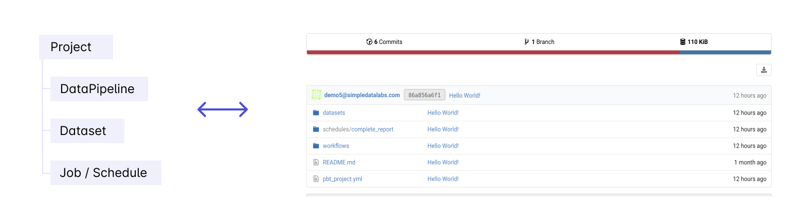
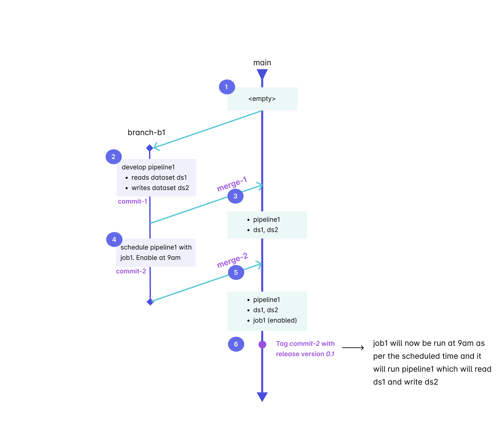
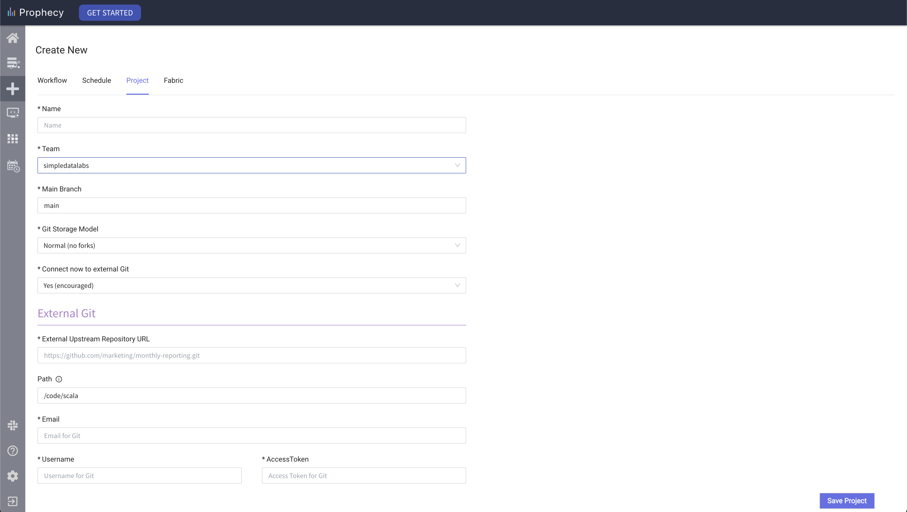
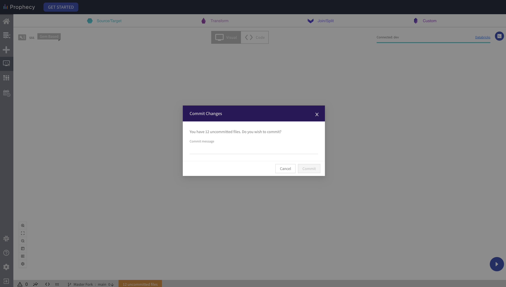

Project is the primary unit of development and deployment to production in Prophecy.

A **project** contains

* **Data pipelines** that read, transform and write data using Spark
* **Datasets** point to the data that is read and written to by the _Data Pipelines_
* **Jobs** run _Data Pipelines_ based on a **schedule**

## Project is Code on Git

A **project** is **code** on **git**. This means that within a project, the business logic of all the assets
including _data pipelines_, _datasets_, and _jobs_ is stored as code on Git. This might be a repository on Github
or a folder in a repository.

## Development & Deployment

Prophecy provides a standard and recommended mechanism for using Git based development 
(though other mechanisms are possible - including fork based development in our Enterprise product)

Here are the steps explained:

### 1. Create new project

First you'll create a new project as shown below. It is strongly recommended that you connect to your Git repository
to ensure that there is a secure copy of the code that you have direct access to.

### 2. Create, edit & commit the pipeline

When you **create a new pipeline**, you have to choose the **branch** where it will be created - an existing one or a new one. 

Then you will **develop** this pipeline - you will make **changes** & **commit** them in this branch multiple times. 
The commit dialog opens when you click the bottom bar - orange color indicates uncommitted changes.

Now you've made all the changes back and are ready to push them back to the main repository

### 3. Merge your changes

When you create a new workflow, a default branch is created for you. 

