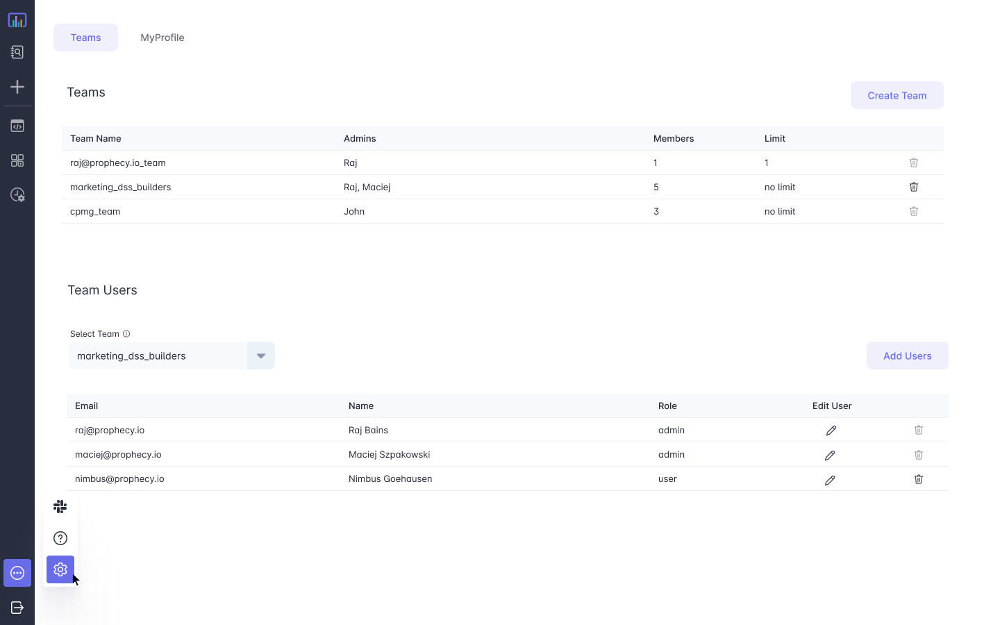

## Teams & Users

Teams represent a group of users who work together

* Teams are the primary mechanism of ownership
   * **Teams own projects** where pipelines, datasets and jobs live
   * **Teams own execution fabrics** that provide the execution and storage resources for execution including spark clusters
* Users get access via teams
   * **Personal Teams** For every user, a default team in created that only contains one user. If only one user is to be given access to a project, it can be done via this team
   * **Personal Projects** Users can put personal projects in their _personal team_ and not share it with others

### Settings Page

Teams & User settings is accessed by clicking the **Settings** icon at the bottom left of the menu bar. The following image shows the page and the available functionality

