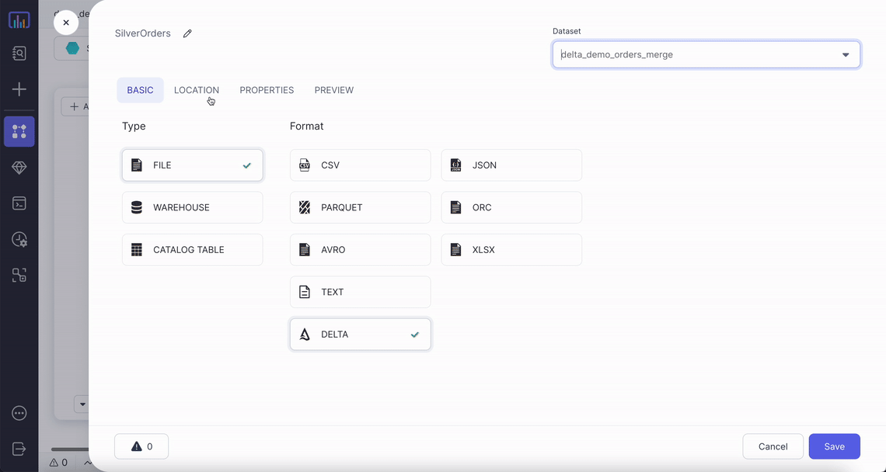

Reads data from delta files present at a path and writes delta files to a path based on configuration.

## Source
Reads data from delta files present at a path.


### Source Parameters
| Parameter      | Description                                | Required |
|:---------------|:-------------------------------------------|:---------|
| Location       | File path where delta files are present    | True     |
| Read Timestamp | Time travel to a specific timestamp        | False    |
| Read Version   | Time travel to a specific version of table | False    |

:::note
For time travel on delta tables:
1. Only one among timestamp and version can be chosen at a time for time travel.
2. Timestamp should be between the first commit timestamp and the latest commit timestamp in the table.
3. Version needs to be an integer. Its value has to be between min and max version of table.

By default most recent version of each row is fetched if no time travel option is used.
:::

:::info
To read more about delta time travel and its use cases [click here](https://databricks.com/blog/2019/02/04/introducing-delta-time-travel-for-large-scale-data-lakes.html).
:::

### Source Example


### Spark Code

#### Without time travel

````mdx-code-block

<Tabs>

<TabItem value="py" label="Python">

```py
def ReadDelta(spark: SparkSession) -> DataFrame:
    return spark.read.format("delta").load("dbfs:/FileStore/data_engg/delta_demo/silver/orders")

```

</TabItem>
<TabItem value="scala" label="Scala">

```scala
object ReadDelta {

  def apply(spark: SparkSession): DataFrame = {
    spark.read.format("delta").load("dbfs:/FileStore/data_engg/delta_demo/silver/orders")
  }

}
```

</TabItem>
</Tabs>

````

#### Timestamp based time travel

````mdx-code-block

<Tabs>

<TabItem value="py" label="Python">

```py
def ReadDelta(spark: SparkSession) -> DataFrame:
    return spark.read.format("delta").option("timestampAsOf", "2022-05-05")\
        .load("dbfs:/FileStore/data_engg/delta_demo/silver/orders")

```

</TabItem>
<TabItem value="scala" label="Scala">

```scala
object ReadDelta {

  def apply(spark: SparkSession): DataFrame = {
    spark.read.format("delta").option("timestampAsOf", "2022-05-05")
        .load("dbfs:/FileStore/data_engg/delta_demo/silver/orders")
  }

}
```

</TabItem>
</Tabs>

````

#### Version based time travel

````mdx-code-block
import Tabs from '@theme/Tabs';
import TabItem from '@theme/TabItem';

<Tabs>

<TabItem value="py" label="Python">

```py
def readDelta(spark: SparkSession) -> DataFrame:
    return spark.read.format("delta").option("versionAsOf", "0")\
        .load("dbfs:/FileStore/data_engg/delta_demo/silver/orders")

```

</TabItem>
<TabItem value="scala" label="Scala">

```scala
object readDelta {

  def apply(spark: SparkSession): DataFrame = {
    spark.read.format("delta").option("versionAsOf", "0")
        .load("dbfs:/FileStore/data_engg/delta_demo/silver/orders")
  }

}
```

</TabItem>
</Tabs>

````


---
## Target
Writes data in delta format in parquet files based on the configuration.

### Target Parameters
| Parameter                     | Description                                                                                                                                                                | Required |
|:------------------------------|:---------------------------------------------------------------------------------------------------------------------------------------------------------------------------|:---------|
| Location                      | File path where delta files needs to be written                                                                                                                            | True     |
| Write mode                    | Write mode for dataframe                                                                                                                                                   | True     |
| Optimise write                | If true, it optimizes spark partition sizes based on the actual data                                                                                                       | False    |
| Overwrite table schema        | If true, overwrites the schema of the delta table as per the dataframe                                                                                                     | False    |
| Merge schema                  | If true, then any columns that are present in the DataFrame but not in the target table are automatically added on to the end of the schema as part of a write transaction | False    |
| Partition Columns             | List of columns to partition the delta table by                                                                                                                            | False    |
| Overwrite partition predicate | If specified, then it selectively overwrites only the data that satisfies the given where clause expression.                                                               | False    |

### Write modes

Below are different type of write modes which prophecy provided delta format supports.

| Write Mode | Description                                                                                                                                                                                   |
|:-----------|:----------------------------------------------------------------------------------------------------------------------------------------------------------------------------------------------|
| overwrite  | If data already exists, existing data is expected to be overwritten by the contents of the DataFrame.                                                                                         |
| append     | If data already exists, contents of the DataFrame are expected to be appended to existing data.                                                                                               |
| ignore     | If data already exists, the save operation is expected not to save the contents of the DataFrame and not to change the existing data. This is similar to a CREATE TABLE IF NOT EXISTS in SQL. |
| error      | If data already exists, an exception is expected to be thrown.                                                                                                                                |
| merge      | Insert, delete and update data using the delta merge command.                                                                                                                                 |
| scd2 merge | It is a delta merge operation that stores and manages both current and historical data over time.                                                                                             |

Among these write modes overwrite, append, ignore and error works the same way as in case of parquet file writes.
Merge and SCD2 merge would be explained with examples in the following sections.


### Target Example


### Spark Code

````mdx-code-block

<Tabs>

<TabItem value="py" label="Python">

```py
def writeDelta(spark: SparkSession, in0: DataFrame):
    return in0.write\
            .format("delta")\
            .option("optimizeWrite", True)\
            .option("mergeSchema", True)\
            .option("replaceWhere", "order_dt > '2022-01-01'")\
            .option("overwriteSchema", True)\
            .mode("overwrite")\
            .partitionBy("order_dt")\
            .save("dbfs:/FileStore/data_engg/delta_demo/silver/orders")

```

</TabItem>
<TabItem value="scala" label="Scala">

```scala
object writeDelta {

  def apply(spark: SparkSession, in: DataFrame): Unit = {
    in0.write
        .format("delta")
        .option("optimizeWrite", True)
        .option("mergeSchema", True)
        .option("replaceWhere", "order_dt > '2022-01-01'")
        .option("overwriteSchema", True)
        .mode("overwrite")
        .partitionBy("order_dt")
        .save("dbfs:/FileStore/data_engg/delta_demo/silver/orders")
  }

}

```

</TabItem>
</Tabs>

````

## Merge write mode with Delta

You can upsert data from a source DataFrame into a target Delta table by using the
MERGE operation. Delta Lake supports inserts, updates and deletes in MERGE.

This operation is also commonly known as upserting (update/insert) or SCD1 merge.

### Parameters

| Parameter                       | Description                                                                                                                                   | Required |
|:--------------------------------|:----------------------------------------------------------------------------------------------------------------------------------------------|:---------|
| Source alias                    | Alias to use for source dataframe                                                                                                             | True     |
| Target alias                    | Alias to use for existing delta table                                                                                                         | True     |
| Merge Condition                 | Condition to merge data from source dataframe to target table, which would be used to perform update, delete, or insert actions as specified. | True     |
| When Matched Update Action      | Action to choose if update needs to be done or skipped.                                                                                       | False    |
| When Matched Update Condition   | Optional condition for updating row. If a condition is specified, then it must evaluate to true for the row to be updated.                    | False    |
| When Matched Update Expressions | Optional expressions for setting the values of columns that need to be updated.                                                               | False    |
| When Matched Delete Action      | Action to choose if delete needs to be done or skipped.                                                                                       | False    |
| When Matched Delete Condition   | Optional condition for deleting row. If a condition is specified, then it must evaluate to true for the row to be updated.                    | False    |
| When Not Matched Action         | Action to choose if inserts needs to be done or skipped.                                                                                      | False    |
| When Not Matched Condition      | Optional condition for inserting row. If a condition is specified, then it must evaluate to true for the row to be updated.                   | False    |
| When Not Matched Expressions    | Optional expressions for setting the values of columns that need to be updated.                                                               | False    |

:::note
1. At least one action out of update, delete or insert needs to be set. 
2. Delete removes the data from the latest version of the Delta table but does not remove it from the physical storage until the old versions are explicitly vacuumed. See [vaccum](https://docs.delta.io/latest/delta-utility.html#-delta-vacuum) for details.
3. A merge operation can fail if multiple rows of the source dataset match and the merge attempts to update the same rows of the target Delta table. Deduplicate gem can be placed before target if duplicate rows at source are expected.
:::

:::tip
When possible, provide predicates on the partition columns for a partitioned Delta table as such predicates can significantly speed up the operations.
:::

### Example
Let's assume our initial customers table is as below:


And we have the below updates coming in as customer table


Our output and configurations for SCD1 merge will look like below:


https://user-images.githubusercontent.com/103921419/173252757-0a1165f0-68e2-41ca-b6eb-58da51cb76d1.mp4


### Spark Code

````mdx-code-block

<Tabs>

<TabItem value="py" label="Python">

```py
def writeDeltaMerge(spark: SparkSession, in0: DataFrame):
    from delta.tables import DeltaTable, DeltaMergeBuilder

    if DeltaTable.isDeltaTable(spark, "dbfs:/FileStore/data_engg/delta_demo/silver/customers_scd1"):
        DeltaTable\
            .forPath(spark, "dbfs:/FileStore/data_engg/delta_demo/silver/customers_scd1")\
            .alias("target")\
            .merge(in0.alias("source"), (col("source.customer_id") == col("target.customer_id")))\
            .whenMatchedUpdateAll()\
            .whenNotMatchedInsertAll()\
            .execute()
    else:
        in0.write\
            .format("delta")\
            .mode("overwrite")\
            .save("dbfs:/FileStore/data_engg/delta_demo/silver/customers_scd1")

```

</TabItem>
<TabItem value="scala" label="Scala">

```scala
object writeDeltaMerge {

  def apply(spark: SparkSession, in: DataFrame): Unit = {
    import _root_.io.delta.tables._
    if (DeltaTable.isDeltaTable(spark, "dbfs:/FileStore/data_engg/delta_demo/silver/customers_scd1")) {
        DeltaTable
            .forPath(spark, "dbfs:/FileStore/data_engg/delta_demo/silver/customers_scd1")
            .as("target")
            .merge(in0.as("source"), (col("source.customer_id") === col("target.customer_id")))
            .whenMatched()
            .updateAll()
            .whenNotMatched()
            .insertAll()
            .execute()
    }
    else {
        in0.write
            .format("delta")
            .mode("overwrite")
            .save("dbfs:/FileStore/data_engg/delta_demo/silver/customers_scd1")
    }
  }

}

```

</TabItem>
</Tabs>

````

## SCD2 merge write mode with Delta

### Parameters
| Parameter          | Description                                                                           | Required |
|:-------------------|:--------------------------------------------------------------------------------------|:---------|
| Key columns        | List of key columns which would remain constant                                       | True     |
| Historic columns   | List of columns which would change over time for which history needs to be maintained | True     |
| From time column   | Time from which a particular row became valid                                         | True     |
| To time column     | Time till which a particular row was valid                                            | True     |
| Min/old-value flag | Column placeholder to store the flag as true for the first entry of a particular key  | True     |
| Max/latest flag    | Column placeholder to store the flag as true for the last entry of a particular key   | True     |
| Flag values        | Option to choose the min/max flag to be true/false or 0/1                             | True     |

### Example

Using the same customer tables as mentioned above, output and configurations  for SCD2 merge will look like below:


https://user-images.githubusercontent.com/103921419/173252742-00930084-b3b3-4b8a-b5bb-59f39b74792b.mp4


### Spark Code

````mdx-code-block

<Tabs>

<TabItem value="py" label="Python">

```py
def writeDeltaSCD2(spark: SparkSession, in0: DataFrame):
    from delta.tables import DeltaTable, DeltaMergeBuilder

    if DeltaTable.isDeltaTable(
        spark, "dbfs:/FileStore/data_engg/delta_demo/silver/customers_scd2"
    ):
        existingTable = DeltaTable.forPath(
            spark, "dbfs:/FileStore/data_engg/delta_demo/silver/customers_scd2"
        )
        updatesDF = in0.withColumn("minFlag", lit("true")).withColumn(
            "maxFlag", lit("true")
        )
        existingDF = existingTable.toDF()
        updateColumns = updatesDF.columns
        stagedUpdatesDF = (
            updatesDF.join(existingDF, ["customer_id"])
            .where(
                (
                    (existingDF["maxFlag"] == lit("true"))
                    & (
                        (
                            (
                                existingDF["customer_zip_code"]
                                != updatesDF["customer_zip_code"]
                            )
                            | (
                                existingDF["customer_city"]
                                != updatesDF["customer_city"]
                            )
                        )
                        | (existingDF["customer_state"] != updatesDF["customer_state"])
                    )
                )
            )
            .select(*[updatesDF[val] for val in updateColumns])
            .withColumn("minFlag", lit("false"))
            .withColumn("mergeKey", lit(None))
            .union(updatesDF.withColumn("mergeKey", concat("customer_id")))
        )
        existingTable.alias("existingTable").merge(
            stagedUpdatesDF.alias("staged_updates"),
            concat(existingDF["customer_id"]) == stagedUpdatesDF["mergeKey"],
        ).whenMatchedUpdate(
            condition=(
                (existingDF["maxFlag"] == lit("true"))
                & (
                    (
                        (
                            existingDF["customer_zip_code"]
                            != stagedUpdatesDF["customer_zip_code"]
                        )
                        | (
                            existingDF["customer_city"]
                            != stagedUpdatesDF["customer_city"]
                        )
                    )
                    | (
                        existingDF["customer_state"]
                        != stagedUpdatesDF["customer_state"]
                    )
                )
            ),
            set={"maxFlag": "false", "end_date": "staged_updates.updated_dt"},
        )\
        .whenNotMatchedInsertAll()\
        .execute()
    else:
        in0.write\
            .format("delta")\
            .mode("overwrite")\
            .save("dbfs:/FileStore/data_engg/delta_demo/silver/customers_scd2")


```

</TabItem>
<TabItem value="scala" label="Scala">

```scala
object writeDeltaSCD2 {

  def apply(spark: SparkSession, in: DataFrame): Unit = {
    import _root_.io.delta.tables._
    if (
      DeltaTable.isDeltaTable(
        spark,
        "dbfs:/FileStore/data_engg/delta_demo/silver/customers_scd2"
      )
    ) {
      val updatesDF = in
        .withColumn("minFlag", lit("true"))
        .withColumn("maxFlag", lit("true"))
      val existingTable: DeltaTable = DeltaTable.forPath(
        spark,
        "dbfs:/FileStore/data_engg/delta_demo/silver/customers_scd2"
      )
      val existingDF: DataFrame = existingTable.toDF
      val stagedUpdatesDF = updatesDF
        .join(existingDF, List("customer_id"))
        .where(
          existingDF.col("maxFlag") === lit("true") && List(
            existingDF.col("customer_zip_code") =!= updatesDF
              .col("customer_zip_code"),
            existingDF.col("customer_city") =!= updatesDF
              .col("customer_city"),
            existingDF.col("customer_state") =!= updatesDF
              .col("customer_state")
          ).reduce((c1, c2) => c1 || c2)
        )
        .select(updatesDF.columns.map(x => updatesDF.col(x)): _*)
        .withColumn("minFlag", lit("false"))
        .withColumn("mergeKey", lit(null))
        .union(updatesDF.withColumn("mergeKey", concat(col("customer_id"))))
      existingTable
        .as("existingTable")
        .merge(
          stagedUpdatesDF.as("staged_updates"),
          concat(existingDF.col("customer_id")) === stagedUpdatesDF(
            "mergeKey"
          )
        )
        .whenMatched(
          existingDF.col("maxFlag") === lit("true") && List(
            existingDF.col("customer_zip_code") =!= stagedUpdatesDF
              .col("customer_zip_code"),
            existingDF.col("customer_city") =!= stagedUpdatesDF
              .col("customer_city"),
            existingDF.col("customer_state") =!= stagedUpdatesDF
              .col("customer_state")
          ).reduce((c1, c2) => c1 || c2)
        )
        .updateExpr(
          Map("maxFlag" → "false", "end_date" → "staged_updates.updated_dt")
        )
        .whenNotMatched()
        .insertAll()
        .execute()
    } else {
      in0.write
        .format("delta")
        .mode("overwrite")
        .save("dbfs:/FileStore/data_engg/delta_demo/silver/orders")
    }

  }

}


```

</TabItem>
</Tabs>

````

## SCD3 implementation using delta

Using the same customer tables as mentioned above, output and configurations for SCD3 merge will look like below.

https://user-images.githubusercontent.com/103921419/173252728-8924f0fb-6e81-44b7-9c39-17ba1d8f4d4c.mp4

:::info
To checkout our blogpost on using delta with Prophecy to build data lakehouse [click here](https://www.prophecy.io/blogs/prophecy-with-delta).
:::
