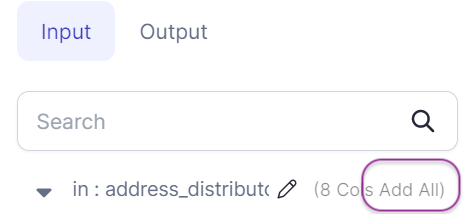

Edits one or more column names or values, by using expressions and functions. It's useful when we need to extract only the required columns or make changes column-wise.


### Parameters
| Parameter     | Description                                   | Required                             |
|:--------------|:----------------------------------------------|:-------------------------------------|
| Dataframe     | Input dataframe on which changes are required | True                                 |
| Target column | Output column name                            | False                                |
| Expression    | Expression to compute target column           | Required if target column is present |

:::info
If no columns are selected, then all columns are passed through to the output
:::
:::info 
To quickly select all the columns, click on the ADD ALL on the left side bar.


:::


### Example


### Spark Code
Reformat converts to a SQL `Select` or in relational terms into a projection, unlike `SchemaTransform` gem which uses underlying `withColumn` construct

````mdx-code-block
import Tabs from '@theme/Tabs';
import TabItem from '@theme/TabItem';

<Tabs>

<TabItem value="py" label="Python">

```py
def Reformat(spark: SparkSession, in0: DataFrame) -> DataFrame:
    return in0.select(
        col("id"),
        col("email").alias("email_address"),
        col("name"),
        col("updated_at"),
        concat_ws("$$$", col("address_line1"), col("address_line2"), col("postal_code"))
            .alias("address_string")
    )
```

</TabItem>
<TabItem value="scala" label="Scala">

```scala
object Reformat {
 
  def apply(spark: SparkSession, in: DataFrame): DataFrame =
    in.select(
      col("id"),
      col("email").as("email_address"),
      col("name"),
      col("updated_at"),
      expr("concat_ws('$$$', address_line1, address_line2, postal_code)").as("address_string")
    )
 }

```

</TabItem>
</Tabs>

````
 

