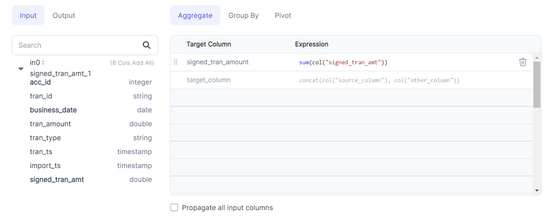

:::caution 🚧 Work in Progress 🚧

WIP
Need to add pivot doc
:::
Allows you to apply aggregation methods and group the data by one or more columns.


### Parameters
| Parameter     | Description                                                                                                                                | Required                                                                                                                                                                        |
|:--------------|:-------------------------------------------------------------------------------------------------------------------------------------------|:--------------------------------------------------------------------------------------------------------------------------------------------------------------------------------|
| Dataframe     | Input dataframe                                                                                                                            | True                                                                                                                                                                            |
| Target column | Output column name                                                                                                                         | True (when Aggregate tab is selected) , False (when Group By tab is selected)                                                                                                   |
| Expression    | Aggregate function expression (when Aggregate tab is selected), Column names the data should be grouped by (when Group By tab is selected) | True (when Aggregate tab is selected) , True (when Group By tab is selected and Target Value is present), False (when Group By tab is selected and Target Value is not present) |

:::info
Pivot documentation coming soon!
:::
:::info
Only the column names present in Target column are passed to the output dataframe. To select all the columns, click on Propagate all input columns checkbox under Aggregate tab
:::

### Example




### Spark Code

````mdx-code-block
import Tabs from '@theme/Tabs';
import TabItem from '@theme/TabItem';

<Tabs>

<TabItem value="py" label="Python">

```py
def sum_trans(spark: SparkSession, in0: DataFrame) -> DataFrame:
    df1 = in0.groupBy(col("acc_id"), col("business_date"))
    return df1.agg(sum(col("signed_tran_amt")).alias("signed_tran_amount"))
 

```

</TabItem>
<TabItem value="scala" label="Scala">

```scala
object sum_trans {
  def apply(spark: SparkSession, in: DataFrame): DataFrame =
    in.groupBy(col("acc_id"), col("business_date"))
      .agg(sum(col("signed_tran_amount")).as("signed_tran_amount"))
}


```

</TabItem>
</Tabs>

````
 


