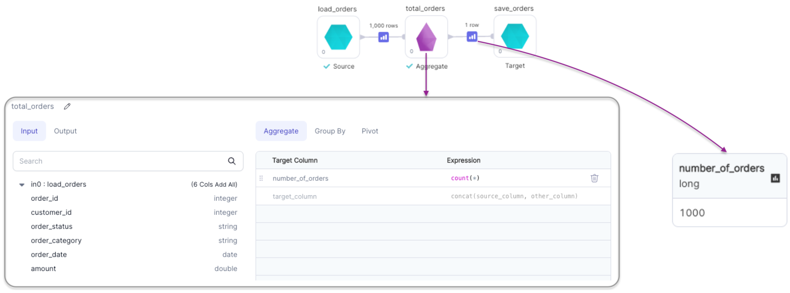
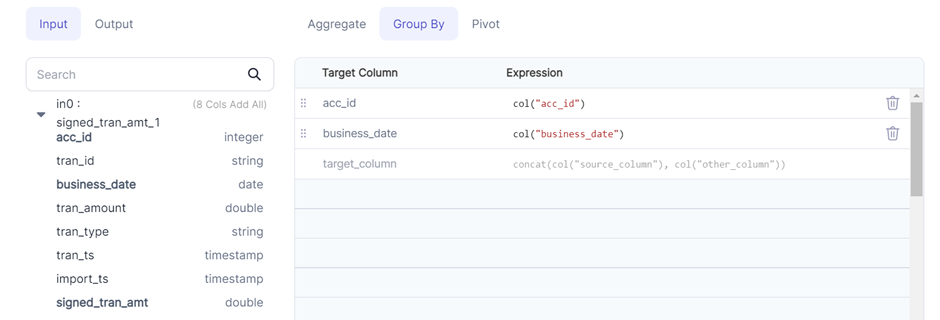

Allows you to group the data and apply aggregation methods and pivot operation.


### Parameters
| Parameter                     | Description                                                                                 | Required                                         |
|:------------------------------|:--------------------------------------------------------------------------------------------|:-------------------------------------------------|
| Dataframe                     | Input dataframe                                                                             | True                                             |
| Target column (Aggregate Tab) | Output column name of aggregated column                                                     | True                                             |
| Expression (Aggregate Tab)    | Aggregate function expression<br/> Eg: sum("amount"), count(*), avg("amount")               | True                                             |
| Target column (Group By Tab)  | Output column name of grouped column                                                        | Required if `Pivot Column` is present            |
| Expression (Group By Tab)     | Column expression to group on <br/> Eg: col("id"), month(col("order_date"))                 | Required if `Target Column`(Group By) is present |
| Pivot column                  | Column name to pivot                                                                        | False                                            |
| Unique values                 | List of values in `Pivot Column` that will be translated to columns in the output DataFrame | False                                            |

:::info
Providing `Unique values` while performing pivot operation improves the performance of the operation since Spark does not have to first compute the list of distinct values of `Pivot Column` internally.
:::

[//]: # (:::info)

[//]: # (Only the column names present in Target column are passed through to the output dataframe.  )

[//]: # (To select all columns, check `Propagate all input columns` under Aggregate tab)

[//]: # (:::)

### Examples
#### Example 1 - Aggregation without Grouping

````mdx-code-block
import Tabs from '@theme/Tabs';
import TabItem from '@theme/TabItem';

<Tabs>

<TabItem value="py" label="Python">

```py
def total_orders(spark: SparkSession, in0: DataFrame) -> DataFrame:
    return in0.agg(count(lit(1)).alias("number_of_orders"))
```

</TabItem>
<TabItem value="scala" label="Scala">

```scala
object total_orders {
  def apply(spark: SparkSession, in: DataFrame): DataFrame =
    in.agg(count(lit(1)).as("number_of_orders"))
}
```

</TabItem>
</Tabs>

````

#### Example 2 - Aggregation with Grouping

````mdx-code-block
<Tabs>

<TabItem value="py" label="Python">

```py
def orders_by_date(spark: SparkSession, in0: DataFrame) -> DataFrame:
    df1 = in0.groupBy(concat(month(col("order_date")), lit("/"), year(col("order_date")))
                      .alias("order_month(MM/YYYY)"))
    return df1.agg(count(lit(1)).alias("number_of_orders"))
```

</TabItem>
<TabItem value="scala" label="Scala">

```scala
object orders_by_date {
  def apply(spark: SparkSession, in: DataFrame): DataFrame =
    in.groupBy(
        concat(month(col("order_date")), lit("/"), year(col("order_date")))
          .as("order_month(MM/YYYY)")
      )
      .agg(count(lit(1)).as("number_of_orders"))
}
```
</TabItem>
</Tabs>

````

#### Example 3 - Pivot

````mdx-code-block
<Tabs>

<TabItem value="py" label="Python">

```py
def orders_by_date_N_status(spark: SparkSession, in0: DataFrame) -> DataFrame:
    df1 = in0.groupBy(concat(month(col("order_date")), lit("/"), year(col("order_date"))).alias("order_month(MM/YYYY)"))
    df2 = df1.pivot("order_status", ["Approved", "Finished", "Pending", "Started"])
    return df2.agg(count(lit(1)).alias("number_of_orders"))
```

</TabItem>
<TabItem value="scala" label="Scala">

```scala
object orders_by_date_N_status {
  def apply(spark: SparkSession, in: DataFrame): DataFrame =
    in.groupBy(
        concat(month(col("order_date")), lit("/"), year(col("order_date")))
          .as("order_month(MM/YYYY)")
      )
      .pivot(col("order_status"),
             List("Approved", "Finished", "Pending", "Started")
      )
      .agg(count(lit(1)).as("number_of_orders"))
}
```
</TabItem>
</Tabs>

````

 


