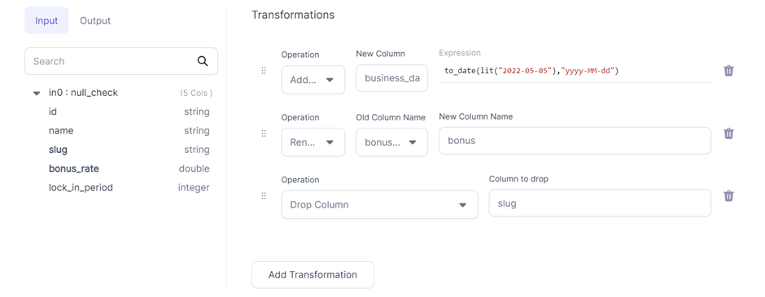

SchemaTransform is used to add, edit, rename or drop columns from the incoming dataframe. Unlike Reformat which is a set operation (where all the transforms are applied in parallel), here the transforms are applied in order.

:::info
Reformat is a SQL select and is preferable when making many changes.
:::


### Parameters
| Parameter        | Meaning                                       | Required                                     |
|:-----------------|:----------------------------------------------|:---------------------------------------------|
| Dataframe        | Input dataframe                                                | True                                         |
| Operation    | Add/Replace, Drop and Rename                                       | False                                        |
| New Column       | Output column name (when Add/Replace operation is selected)           | False (required if Add/Replace operation is selected) |
| Expression        | Expression to generate new column (when Add/Replace operation is selected) | False (required if Add/Replace operation is selected)                                         |
| Old Column Name | Column to be renamed (when Rename operation is selected)                            | False (required if Rename operation is selected)                                        |
| New Column Name      | Output column name (when Rename operation is selected)   | False (required if Rename operation is selected) |
| Column to drop       | Column to be dropped (when Drop operation is selected)           | False (required if Drop operation is selected) |


### Example



### Spark Code

````mdx-code-block
import Tabs from '@theme/Tabs';
import TabItem from '@theme/TabItem';

<Tabs>

<TabItem value="py" label="Python">

```py
def milestone_keys(spark: SparkSession, in0: DataFrame) -> DataFrame:
    return in0\
        .withColumn("business_date", to_date(lit("2022-05-05"), "yyyy-MM-dd"))\
        .withColumnRenamed("bonus_rate", "bonus")\
        .drop("slug")

```

</TabItem>
<TabItem value="scala" label="Scala">

```scala
object import_ts {
  def apply(spark: SparkSession, in: DataFrame): DataFrame =
    in.withColumn("business_date",     to_date(lit("2022-05-05"), "yyyy-MM-dd"))
      .withColumnRenamed("bonus_rate", "bonus")
      .drop("slug")
}


```

</TabItem>
</Tabs>

````
 

