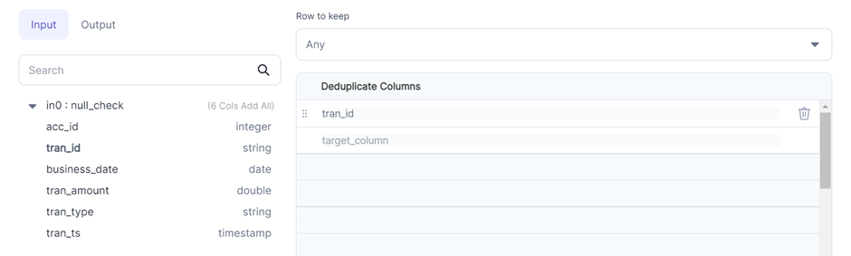

:::caution 🚧 Work in Progress 🚧

WIP 
Need to add more examples of each (any, first, last, unique only)

:::
Removes rows with duplicate values of specified columns. 

### Parameters
| Parameter           | Description                                                                                                                                                                                                                                                                                     | Required |
|:--------------------|:------------------------------------------------------------------------------------------------------------------------------------------------------------------------------------------------------------------------------------------------------------------------------------------------|:---------|
| Dataframe           | Input dataframe                                                                                                                                                                                                                                                                                 | True     |
| Row to keep         | - `Any`: Keeps any one row among duplicates. Uses underlying `dropDuplicates` construct<br/>- `First`: Keeps first occurrence of the duplicate row <br/>- `Last`: Keeps last occurrence of the duplicate row <br/>- `Unique Only`: Keeps rows that don't have duplicates <br/> Default is `Any` | True     |
| Deduplicate columns | Columns to consider while removing duplicate rows                                                                                                                                                                                                                                               | True     |


### Example



### Spark Code

````mdx-code-block
import Tabs from '@theme/Tabs';
import TabItem from '@theme/TabItem';

<Tabs>

<TabItem value="py" label="Python">

```py
def dedup(spark: SparkSession, in0: DataFrame) -> DataFrame:
    return in0.dropDuplicates(["tran_id"])

```

</TabItem>
<TabItem value="scala" label="Scala">

```scala
object dedup {
  def apply(spark: SparkSession, in: DataFrame): DataFrame = {
    import org.apache.spark.sql.expressions.Window
    in.dropDuplicates(List("tran_id"))
  }
}


```

</TabItem>
</Tabs>

````
 

