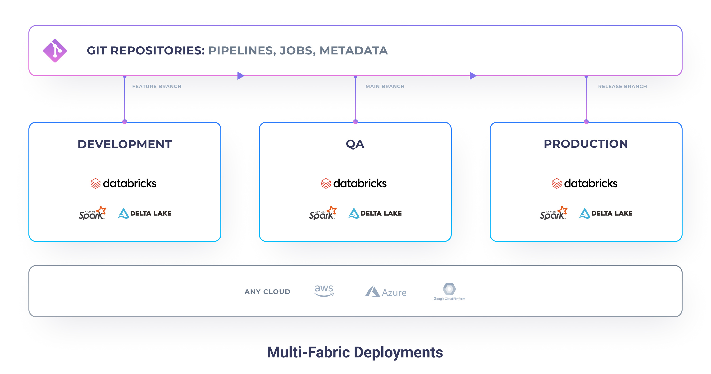

Often, organizations have multiple different execution environments for the various stages of development. A common
example is a setup with three stages: **Development**, **QA**, **Production**. Each environment has usually its own
independent data, metastore, clusters, and even permissions.

Historically, reliable promotion to production has been a challenge, many organizations have faced. With the
introduction of **modern software engineering practises**, many engineers, have been able to resolve it. However, data
engineers & practitioners in particular are often stuck in the old days. Thus, missing out on what's became a standard
in their sister industries.

Since, with Prophecy any data pipeline or job created is stored directly on GIT, we enable any data practitioners
to leverage the best deployment practises.

## Development

## Deployment with Prophecy

## Deployment with GitHub

