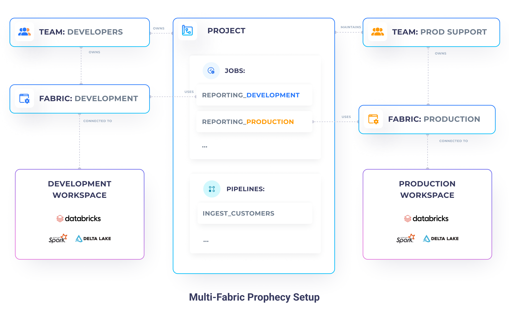
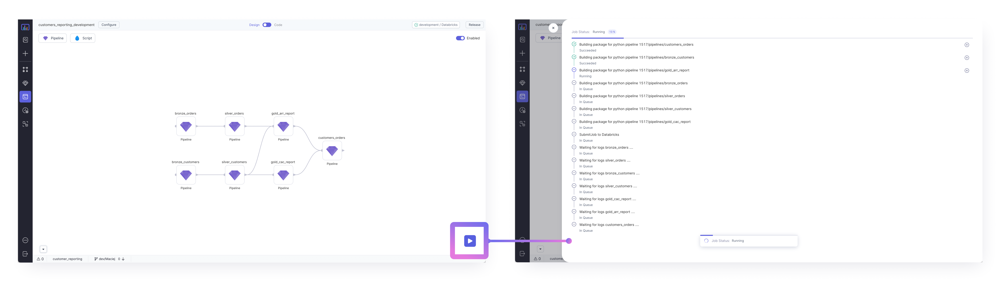

Often, organizations have multiple different execution environments for the various stages of development. A common
example is a setup with three stages: **Development**, **QA**, **Production**. Each environment has usually its own
independent data, metastore, clusters, and even permissions.

Historically, reliable promotion to production has been a challenge, many organizations have faced. With the
introduction of **modern software engineering practises**, many engineers, have been able to resolve it. However, data
engineers & practitioners in particular are often stuck in the old days. Thus, missing out on what's became a standard
in their sister industries.

Since, with Prophecy any data pipeline or job created is stored directly on GIT, we enable any data practitioners
to leverage the best deployment practises.

## Single-fabric Development

At minimum, you will find yourself building your **pipelines** and **jobs** as per usual. Your team might want to build
multiple different **pipelines** that perform different processing logic, and they orchestrate those pipelines - set
their dependencies, add various gluing scripts (e.g. notifications, simple data movement components), and set the time
when they should be executed using **jobs**.

In the simplest scenario, you work with a single execution environment only (e.g a single Databricks workspace). In
those cases, usually everyone on your team has access to that Databricks workspace. Everyone does both development and
productionization of your pipelines in the same place.

In Prophecy, at minimum, you will find yourself having:

- **multiple data pipelines** - various ETL / ELT tasks written in Spark
- **multiple jobs** - orchestration of your data pipelines written in Databricks Jobs or Airflow
- **a single team** - all your teammates in the same place, with the same accesses
- **a single fabric** - the connection to your Databricks workspace

This is great for simple setups and very small teams, but can quickly lead to many problems. In such a setup, it's very
easy for you and your teammates to make mistakes and accidentally affect production pipelines. There's also no data
separation, so any PII information becomes visible to everyone!

A better approach is to have physical environments, connected to different stages of development. A common example is a
setup with three stages: **Development**, **QA**, **Production**. Each environment has usually its own independent data,
metastore, clusters, and even permissions.

## Multi-fabric Deployment with Prophecy

Let's consider a better alternative to a single environment development.

### Why so many environments?

Simplest alternative involves adding just one more execution environment called **production**. Now you can separate
your **development use-cases**, where you can use near-real data (e.g. without PII information), smaller data samples
(for faster development), smaller cluster sizes (to reduce cost), from the **production use-cases**, where you push your
code only after you're confident it's going to work well. Only the production environment has access to your real data,
uses large optimal clusters, and has significantly restricted access. In some cases, only the operational support teams
should have access to your production environment.

If you'd like to involve more stages, to even further increase the reliability of your development process, you can add
a **QA environment**. That environment should have data, hardware, and software that closely simulate the Production
environment (e.g. data slices directly taken from production), and should serve as a holding area. Using QA, your
engineers make sure that the jobs are going to run smoothly in the production environment, without actually potentially
breaking production, if some code is wrong.

### Development and Production

For our example, however, let's focus on a setup with two environments: **Development** & **Production**. Our
**Development environment** is accessible to our whole organization (developers, analysts, support) and is connected to
our development databricks workspace, which contains only dummy customer's data. Whereas, our **Production environment**
is only accessible to our production support team and is connected to our production databricks workspace, which has
real customer's data.

#### Entities setup

1. Create two **teams**:
    - **developers** - superset of all the teams, which contains your developers and members of the _prod_support_ team
    - **prod_support** - team composed of members who have privileged production access permissions

2. Create two **fabrics**:
    - **development** - owned by the _developers_ team
    - **production** - owned by the _prod_support_ team

5. Set up your **projects** - create your projects, as you would before. Projects should be owned by the _developers_
   team.

6. Set up your **jobs** - for every single set of pipelines you'd like to schedule, create two jobs:
    - **job_development** - jobs built by the _developers_ for integration and testing purposes
    - **job_production** - jobs built by the _prod_support_ team, based on the development jobs - they will run in the
      production environment

   <iframe src="https://www.loom.com/embed/b9669f374f504e469b2f88374bcf35d3" frameborder="0" webkitallowfullscreen mozallowfullscreen allowfullscreen 
      style={{position: 'absolute', top: 0, left: 0, width: '100%', height: '100%'}}></iframe>

#### Development & Testing

Phew, that was a lot of work! But the biggest chunk is behind us 💪.

Now that we have set up our fabrics and teams, built some pipelines, it's time to test the whole data flow on our
development environment.

Testing your pipelines and jobs is very simple. Simple click on the play button and watch your code run!

:::info Coming Soon
Note, that currently, we're spinning up a new cluster for each of the tasks, therefore your job might take a few minutes
to complete. However, soon, you will be able to have a granular control over which pipeline runs on which cluster.
:::

#### Deployment to Production

Once we're confident that our job works correctly, and we have tested it well, we can start deploying it to our
**production** environment. In our setup only a production support engineer can do that. Therefore, login as them,
duplicate your job on the production fabric, set appropriate pipeline configurations and enable it.

That's it! Now you can commit any remaining changes and release your pipeline. Prophecy automatically takes care of the
release process, by building your pipelines, running unit tests, and finally deploying the pipeline jars/wheels
alongside the job definition directly to Databricks (or AirFlow).

If you're new to this process, check out, our [GIT](/metadata/git)
and [jobs deployment](/low-code-jobs/databricks-jobs#deployment) documentation.

   <iframe src="https://www.loom.com/embed/28153636876f409184e6ba2dcbc8f273" frameborder="0" webkitallowfullscreen mozallowfullscreen allowfullscreen 
      style={{position: 'absolute', top: 0, left: 0, width: '100%', height: '100%'}}></iframe>

## Multi-fabric Deployment with GitHub

:::info Coming Soon

:::
