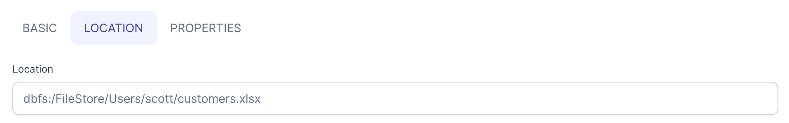

If you've worked with numbers in your day-to-day operations, odds are you've run into a need to use Excel at one point or another. This tutorial is going to cover the two most basic scenarios: Reading and Writing.

:::info
For a full list of options supported by Prophecy when interacting with Excel files [see here](/05-low-code-spark/05-gems/01-source-target/01-file/09-xlsx.md)
:::

## Reading XLSX files

Reading an Excel file is quite easy in Prophecy! Simply follow these steps to create a new XLSX source.

1. Select the XLSX format <br /><br />
2. Navigate to the desired XLSX source file <br /><br />
3. Customize any properties you might need and tweak the schema to your liking <br /> <br />
4. Preview the file and double-check that the schema matches your intentions <br />

Once the source gem is created and validation passes you'll be able to find the code of your new Source in the `graph` directory of your Pipeline code.

````mdx-code-block
import Tabs from '@theme/Tabs';
import TabItem from '@theme/TabItem';

<Tabs>

<TabItem value="py" label="Python">

```py
def Source_0(spark: SparkSession) -> DataFrame:
    if Config.fabricName == "demos":
        return spark.read\
            .format("excel")\
            .option("header", True)\
            .option("dataAddress", "A1")\
            .option("inferSchema", True)\
            .load("dbfs:/FileStore/Users/scott/plain_number.xlsx")
    else:
        raise Exception("No valid dataset present to read fabric")

```

</TabItem>
</Tabs>
````

## Writing XLSX files

Writing an Excel file is just as easy, with only one small caveat to be discussed after. Let's look at an example pipeline with an XLSX output target:


In this scenario we're building a report of spending by customer and want an XLSX file as output.

1. Select the XLSX format <br /><br />
2. Navigate to the target location <br /><br />
3. Customize any properties needed when writing the output file <br /><br />
4. Run the pipeline!

Once the target gem is created and validation passes you'll be able to find the code of your new Target in the `graph` directory of your Pipeline code.

````mdx-code-block
<Tabs>

<TabItem value="py" label="Python">

```py
def ExcelTarget(spark: SparkSession, in0: DataFrame):
    if Config.fabricName == "demos":
        in0.write\
            .format("excel")\
            .option("header", True)\
            .option("dataAddress", "A1")\
            .option("usePlainNumberFormat", False)\
            .mode("overwrite")\
            .save("dbfs:/FileStore/Users/scott/customers.xlsx")
    else:
        raise Exception("No valid dataset present to read fabric")
```

</TabItem>
</Tabs>
````

### Writing a single output file

As mentioned above, there's a caveat when working with any text-based files in Spark. Because of the distributed nature of the framework, you'll find that your output file is not just a single output file but instead a directory with multiple separately partitioned files within it.

For example, using `dbfs:/FileStore/Users/scott/customers.xlsx` as my Target location I can see the following in DBFS after running my pipeline:

1. `customers.xlsx` is, in reality, a directory...<br /><br />
2. ... that contains multiple partitions within it<br /><br />

Each file within this directory will be a separate valid XLSX file with a segment of the overall output data. If you want to output only a single file, you'll need to change your pipeline as such:

1. Add a `Repartition` gem in `Coalesce` mode with the `Partition Count` set to `1`. <br /><br />
2. Connect it between your second-to-last transformation and the target gem<br /><br />
   
After running, your output will still be a directory, but this time it will only contain a single output file.

