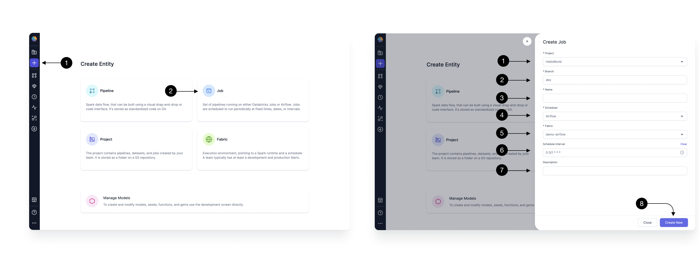

After setting up your [Airflow Fabric](../fabric/fabric.md), You can create an Airflow Job in any Project of your choice.
A Job is an entity that contains **Gems** to represent a DAG consisting of various Tasks (Pipelines/Models/Scripts, etc) which you can Run once or schedule to run at a frequency.
Each Airflow Job in Prophecy would represent one [Airflow DAG](https://airflow.apache.org/docs/apache-airflow/stable/core-concepts/dags.html) in Python.

## Create Airflow Job

A Job is an entity that contains Gems to represent a DAG consisting of various Tasks (Pipelines/Models/Scripts, etc) which you can Run once or schedule to run at a frequency. Each Job would represent an Airflow DAG in Python.

Let's see how to create an Airflow Job in Prophecy.

Click the **(1) Create Entity** button, and choose **(2) Create Job** option.

In the side drawer that opens, you would provide the Basic Info of the Job. Start by selecting the **(1) Project** in which you want to create the Job. You can pick the existing Databricks Spark or SQL project here where you have created Pipelines/Models.
Then pick your development **(2) Branch**. Here you can pick an existing branch for development, or create a new one. Provide a **(3) Name** and pick **Airflow** in the **(4) Scheduler**. Select the **(5) Fabric** we created in Step 1.
Pick a **(6) Schedule** with which you want to schedule the Job. Please note, you can modify this again after testing before releasing your Job.
Add a **(7) Description**, about the Job you are creating. Once done, click **(8) Create New**.

This will take you to the **Job IDE** where you would be creating the actual DAG for the Job.
Let's learn about our Interactive Development Environment (IDE) and its various components.

## Jobs Interactive Develop Environment (IDE)

This is where you would be adding Gems which represent Tasks in Airflow.

### Gems

### Code View

### Settings

### Config

### Functions
