Version 3.0.2 of our platform, Prophecy, introduces an exciting new integration: Orchestration with Airflow.
Now, users can effortlessly create and manage Airflow Jobs using a user-friendly drag-and-drop interface.
This empowers you to design and schedule intricate workflows without the need for coding expertise.
The tool seamlessly translates your designs into highly optimized Python Airflow code, stored in Git, ensuring complete accessibility and openness to all users.
Moreover, you have the flexibility to enhance functionality by incorporating your custom operators and sensors via our Gem Builder interface.

   <iframe src="https://www.loom.com/embed/e12bf4819ac84b93a3a6642df0f38450" frameborder="0" webkitallowfullscreen mozallowfullscreen allowfullscreen
      style={{position: 'absolute', top: 0, left: 0, width: '100%', height: '100%'}}></iframe>

#### In this quick-start, we will show you how to use Prophecy Managed Airflow to Run and schedule your Spark and SQL Pipelines

We'll take you step by step from connecting your compute cluster or warehouse to Prophecy Managed Airflow to creating your first [Airflow DAG](https://airflow.apache.org/docs/apache-airflow/stable/core-concepts/dags.html) and scheduling it.
By the end of this training, you'll have an understanding of Airflow DAGs, be able to use our Visual interface to quickly create your DAG, and schedule this DAG on Prophecy Hosted Airflow. Let's dig in!

#### You will need

- Databricks Account
- A Prophecy Project With Spark Pipeline or SQL Model running on Databricks

OR

- Snowflake Account
- A Prophecy Project with SQL Model running on Snowflake

If you don't have an existing project, please check out [this guide](https://docs.prophecy.io/concepts/project/#1-create-new-project) for setting up a Spark Project, and [this guide](/docs/getting-started/getting-started-with-low-code-sql.md) for setting up a SQL model in Prophecy.

**For this guide, let's create a Job that gets activated whenever a new file is uploaded to an S3 bucket. Additionally, we'll configure it to send an email notification prior to initiating the execution of both the Pipeline and SQL model.**

## 1. Setup Prophecy Fabric for Airflow

Prophecy introduces the concept of a Fabric to describe an execution environment. In this case, we create a Fabric to connect to Airflow, and create and schedule DAGs in it.
For this guide, we would be using Prophecy Managed Airflow, so an external Airflow instance is not required.

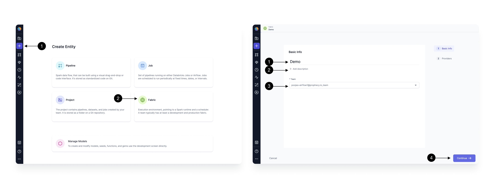

Setting up a Fabric is very straightforward. Click the **(1) Create Entity** button, and choose **(2) Create Fabric** option. The Fabric creation is composed of two steps: Basic Info and Providers setup.
On the Basic Info screen, enter a **(1) Fabric Name**, **(2) Fabric Description**, and choose the **(3) Team** that’s going to own the Fabric.

Once ready, click **(4) Continue**.

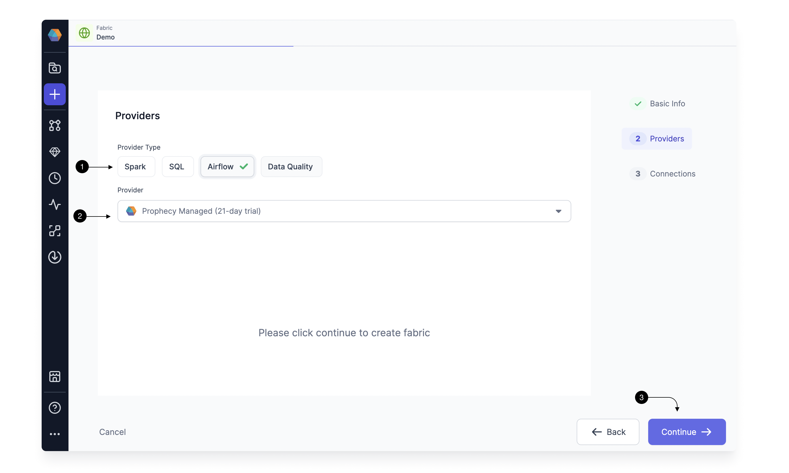

Since we’re setting up a Fabric connected to Airflow, choose **Airflow** as the **(1) Provider Type** and **Prophecy Managed** as the **(2) Provider**.
For connecting to Prophecy Managed Airflow, you don't need to provide any other details, so go ahead and click on **(3) Continue**.

### 1.1 Adding AWS Connection

To be able to trigger your Airflow Job, using an S3 File Sensor, you need to have connection from Prophecy Managed Airflow to you S3 account. For this, we need to add an AWS Connection.
Click on **(1) Add Connection** button. This Opens up the Connection form as shown.

Select AWS in **(1) Connection Type**. Provide a **(2) Connection Name** to identify your connection, add a **(3) Description** of your choice, and provide the **(4) AWS Access Key ID** and **(5)AWS Secret Access Key**. Please check [here](https://docs.aws.amazon.com/IAM/latest/UserGuide/id_credentials_access-keys.html) on how to get the access and secret key from AWS.
Once done, hit **(6) Save**.

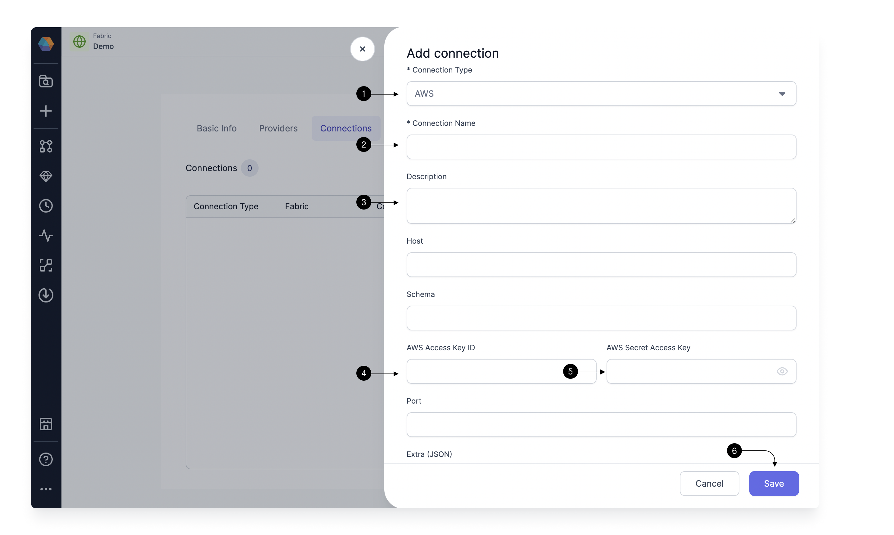

### 1.3 Adding Email Connection

To be able to send Email via Airflow using an Email gem, you need to have Email connection in Prophecy Managed Airflow.
Click again on Add Connection button and select Email in **(1) Connection Type**.

Provide a **(2) Connection Name** to identify your connection, add a **(3) Description** of your choice, and provide the **(4) Host** as your SMTP host example `smtp.gmail.com`. Provide the login credentials for this server in **(5)Login** and **(6)Password** and provide your SMTP port in **(7) Port**.
Once done, hit **(8) Save**.

### 1.3 Adding Databricks Spark Connection

To be able to Run your Databricks Pipelines, you need to have connection from Prophecy Managed Airflow to your Databricks Environment.
Click again on Add Connection button.

Select Databricks Spark in **(1) Connection Type**. Now under the **(2) Fabric**, you would select the already created Fabric for Databricks Spark and Prophecy would setup the connection.
You can provide a description in the **(3) Description**.
Once done, click **(4) Save**.

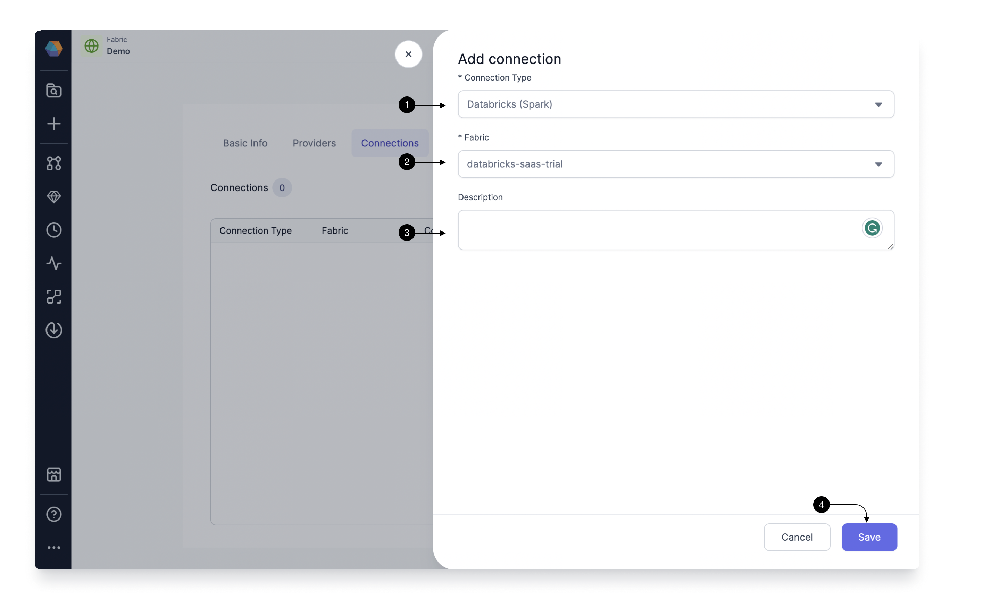

### 1.4 Adding Databricks SQL Connection

To be able to Run your Databricks SQL Models, you need to have connection from Prophecy Managed Airflow to your Databricks SQL Environment.
Click again on Add Connection button.

Select Databricks SQL in **(1) Connection Type**. Now under the **(2) Fabric**, you would select the already created Fabric for Databricks SQL and Prophecy would setup the connection.
You can provide a description in the **(3) Description**.
Once done, click **(4) Save**.

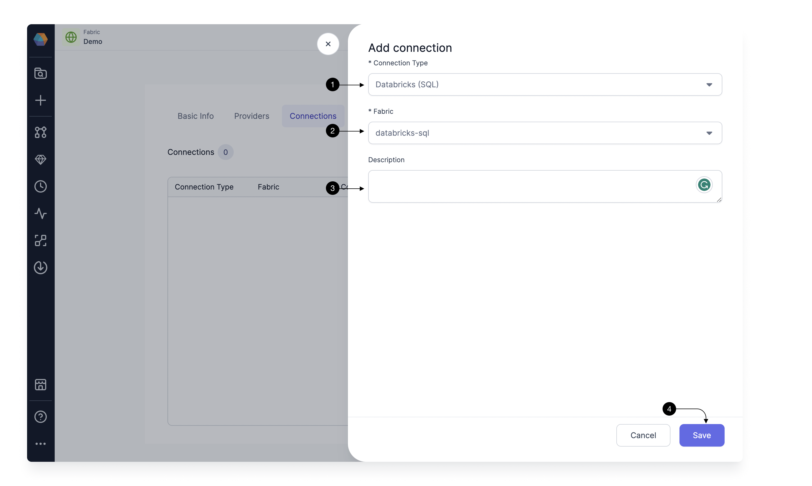

### 1.5 Adding Snowflake SQL Connection

To be able to Run your Snowflake SQL Models, you need to have connection from Prophecy Managed Airflow to your Snowflake SQL Environment.
Click again on Add Connection button.

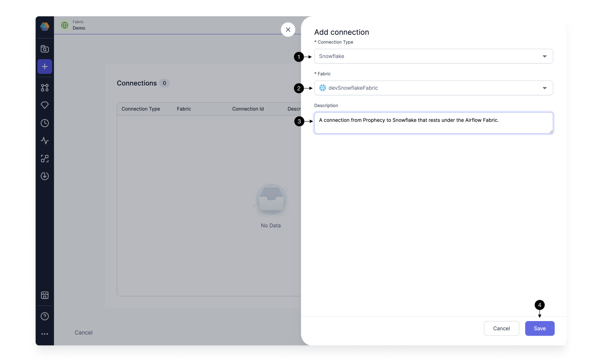

Select Snowflake SQL in **(1) Connection Type**. Now under the **(2) Fabric**, you would select the already created Fabric for Snowflake SQL and Prophecy would setup the connection.
You can provide a description in the **(3) Description**.
Once done, click **(4) Save**.

After adding all connections, click **(1) Complete**.

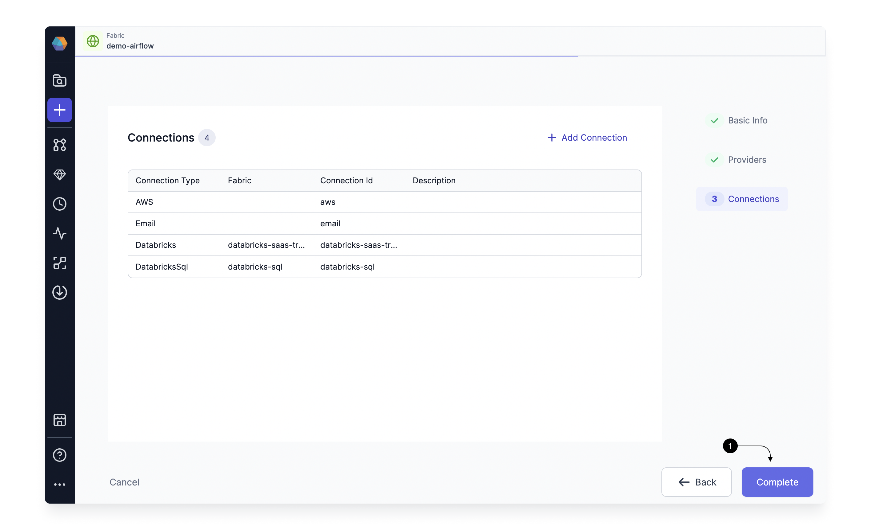

After creating the Fabric, Lets create our first Airflow Job.

## 2. Create an Airflow Job

A Job is an entity that contains gems to represent a DAG consisting of various Tasks (Pipelines/Models/Scripts, etc) which you can Run once or schedule to run at a frequency. Each Job would represent an Airflow DAG in Python.

Let's see how to create an Airflow Job in Prophecy.

Click the **(1) Create Entity** button, and choose **(2) Create Job** option.

In the side drawer that opens, you would provide the Basic Info of the Job. Start by selecting the **(1) Project** in which you want to create the Job. You can pick the existing Spark or SQL project here where you have created Pipelines/Models.
Then pick your development **(2) Branch**. Here you can pick an existing branch for development, or create a new one. Provide a **(3) Name** and pick **Airflow** in the **(4) Scheduler**. Select the **(5) Fabric** we created in Step 1.
Pick a **(6) Schedule** with which you want to schedule the Job. Note, you can modify this again after testing before releasing your Job.
Add a **(7) Description**, about the Job you are creating. Once done, click **(8) Create New**.

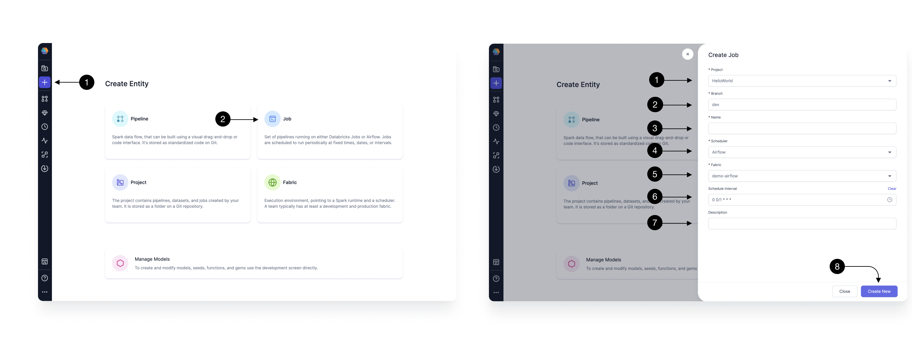

This will take you to the **Job editor** where you would be creating the actual DAG for the Job.
Let's start adding gems to our Job now.

### 2.1 Adding S3 file Sensor gem

Click on **(1) Sensors**, and Drag the **(2) S3FileSensor gem** from the dropdown to the canvas. Then click the newly added gem and click **(3) Open** to open the gem Configurations.
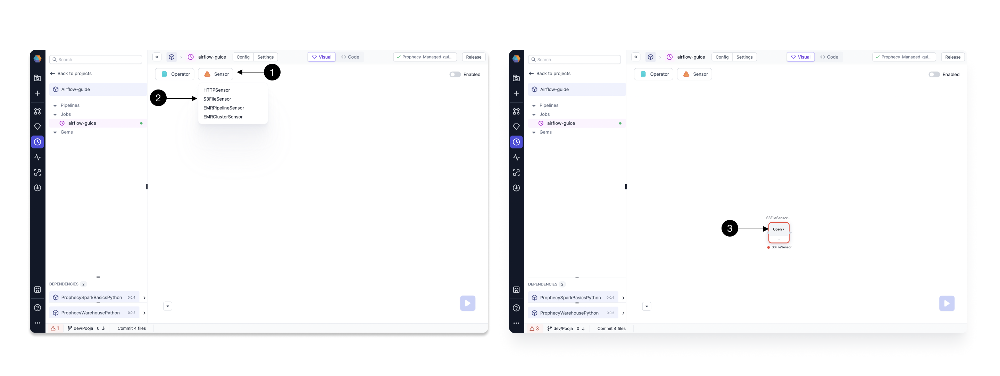

Here, we will specify the S3 bucket/path on which we want to trigger the Job.
In **(1) S3 Path(s)** specify the complete path of file in your Bucket. Airflow will check if this file exists in the specified bucket periodically and trigger the Job when it arrives. Select the created Connection for AWS in **(2) Connection name** and hit ** (3) Save**.

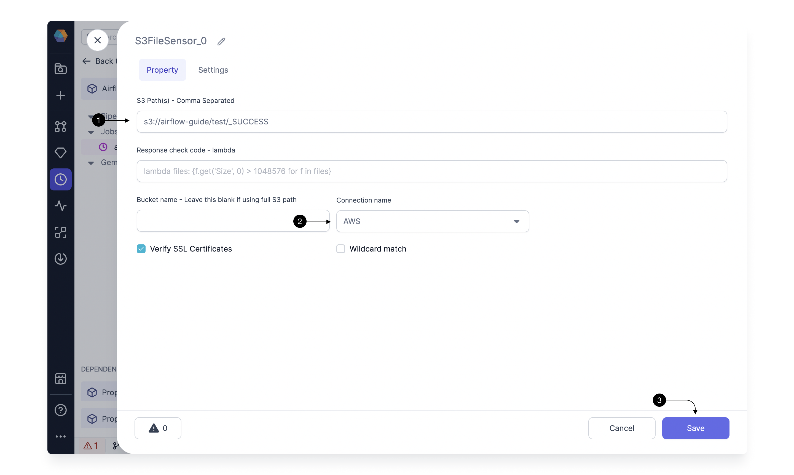

### 2.2 Adding Email gem

Click on the **(1) Operators**, and Drag the **(2) Email gem** from the dropdown to the canvas. If you drag this closer to output port of the previous gem, it will get auto-connected to it. Then click the newly added gem and click **(3) Open** to open the gem Configurations.

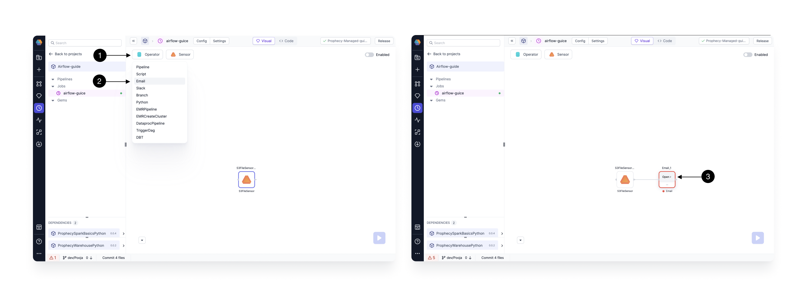

Here we will specify our Email configurations. In **(1) To**, add your Email id where you want to receive the notification Email when the Job is triggered. Select the **(2) Connection name**, you created for Email in step 1.3.
You can provide a **(3) Subject**, for the Email and also add **(4) Email content** you want to add to your email. Here in the example, we are using a Airflow param available to access the execution time in a Job.
Additionally, you can also add cc and bcc emails.
Once done, Click **(5) Save**!

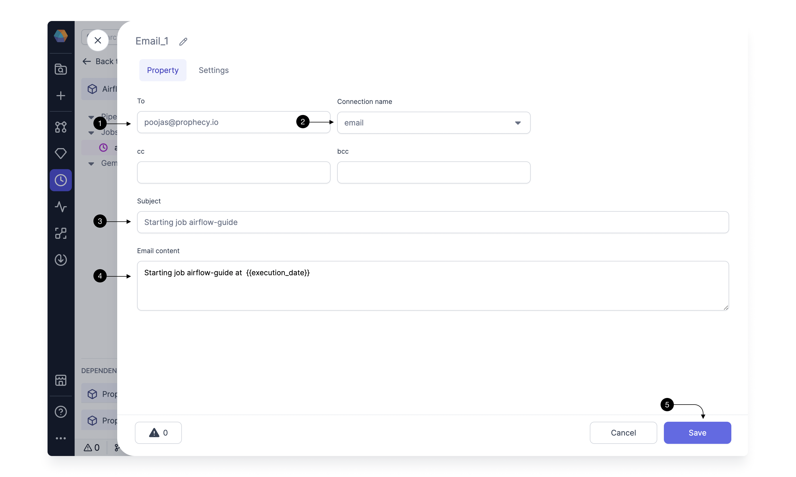

### 2.3 Adding Spark Pipeline gem

If you have a Spark Databricks connection and a Spark Project with Pipeline, you can include Spark Pipeline gems in the Job. Click on **(1) Operators**, and Drag the **(2) Pipeline gem** from the dropdown to the canvas. Drag it close to the output port of the Email gem, so that it gets auto-connected. Then click the newly added gem and click **(3) Open** to open the gem configurations.

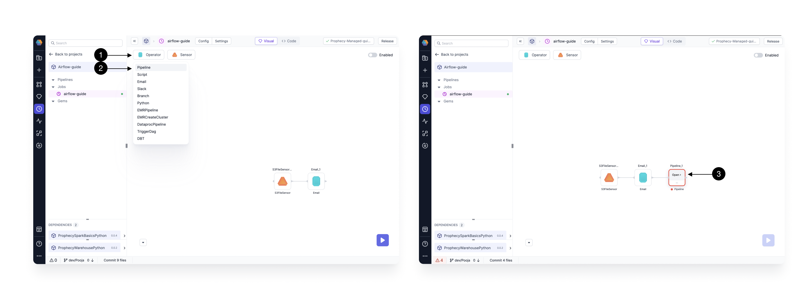

Here, you will select the Pipeline and optionally override any config values for the Pipeline.

Select the **(1) Pipeline to Schedule** you want to Run. As you select the Pipeline, You would start seeing the Configurations defined in the Pipeline. You would not be able to modify the schema of these configs but can override the Config values.
Pick (**2) Fabric and Cluster size to run this Pipeline** for running this Pipeline in Databricks. Here, select the Fabric for which you already created connection in step 1.3. Once done, Click **(3) Save**!

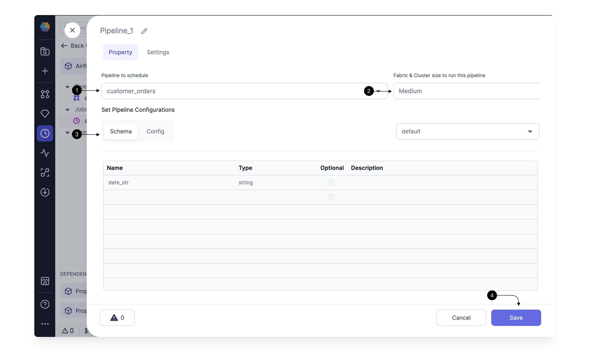

### 2.4 Adding SQL DBT gem

Click on **(1) Operators**, and Drag the **(2) DBT gem** from the dropdown to the canvas. Drag it close to the output port of the Pipeline gem, so that it gets auto-connected. Then click the newly added gem and click **(3) Open** to open the gem Configurations.

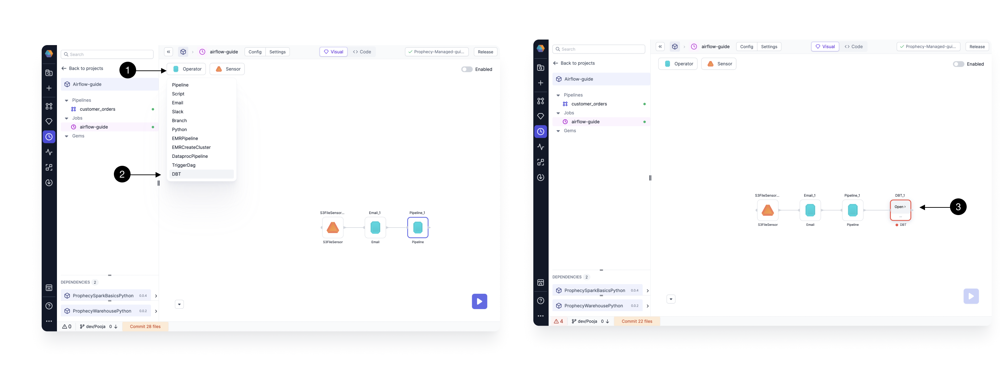

Here, you will select the DBT Project/Model to Schedule, what SQL Fabric to schedule it on, and other additional properties for running a DBT model.

Select the **(1) DBT commands** you want to run when scheduling your Models. You can select all ([Dependencies](docs/extensibility/dependencies/sql-dependencies.md), [Seed](/getting-started/sql-with-databricks#431-create-seeds), Run and Test) here.
Select the **(2) DBT Project to Schedule**. And then select the **(3) SQL Warehouse Fabric** to schedule the Module on. Select the Fabric for which connection was created in Step 1.4 or 1.5.
In **(4) Git reference**, select if you want to schedule a particular commit/tag or branch. Here you can select `branch` for this guide and then in **(5) Reference Value** give the current branch name you are working on.
You can provide any additional **(6) Properties** for your run and then click **(7) Save**!!

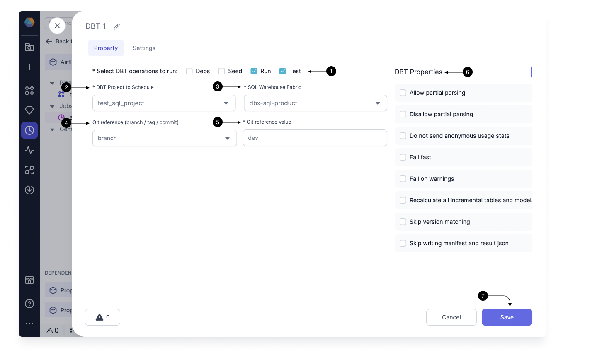

Congratulations!!! And just like that, you have created a very simple Airflow Job with one Databricks Pipeline Task and one DBT Model Task.

Let's go ahead and see how to Run and Schedule it.

## 3. Run and Debug

Now that we have our Job ready, we can go ahead and run it.

Click on the **(1) Run button** to trigger the One-time run. This creates a temporary DAG and uploads to Airflow. User can check logs and status in the Prophecy UI itself. When you click on run, you will see a Job Details Toaster.

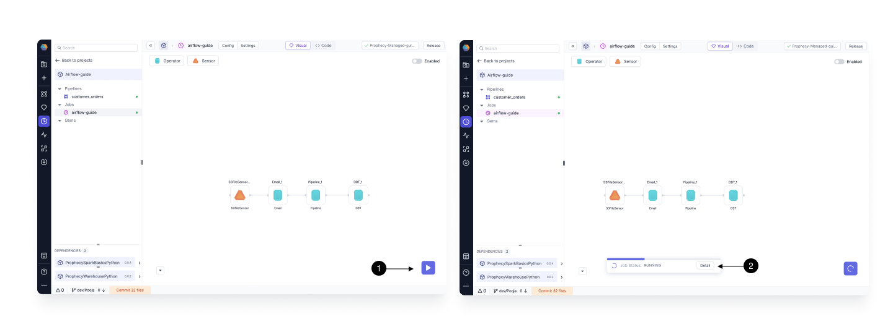

Click on **(2) Details** to open the detailed logs of the Run.
Here you can see all the steps involved in the Run and also detailed logs for each step.

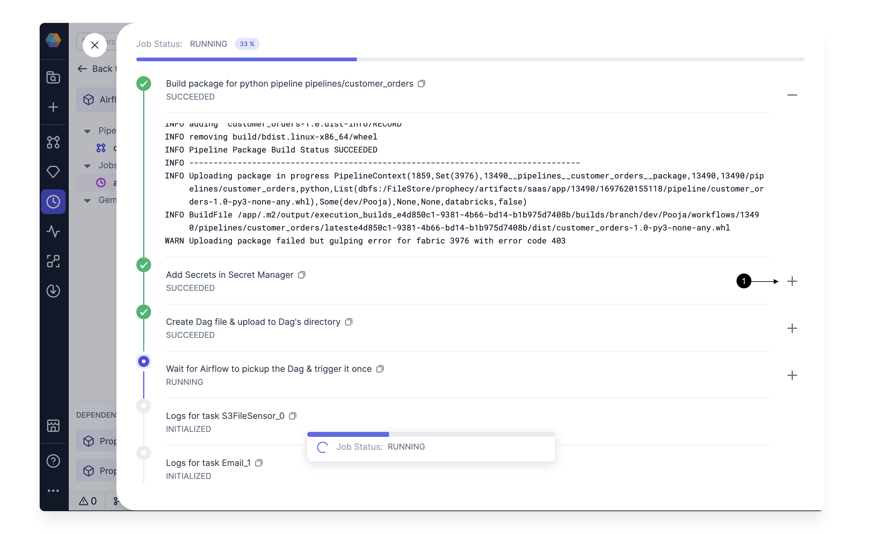
Click on **(1) + button**, to open the logs for a particular step.

## 4. Release and Schedule

Once we have developed and tested the Job, it’s time to commit and push our code to our Git repository and release the Job to our Airflow.

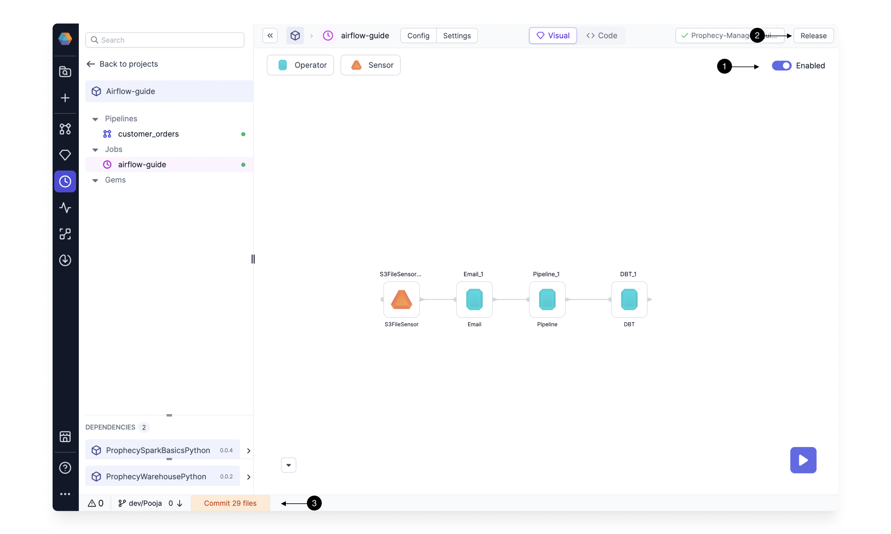

Start by toggling our Job to be **(1) Enabled**. This enables the Job on the Airflow and will ensure that the Job follows the previously set interval. Without enabling the DAG is not uploaded to Airflow.

Click on the **(2) Release** button in the top right corner or **(3) Commit** button in the middle of the footer (bottom of the screen) to start the commit process. This opens an easy-to-use Git management screen.

The process of deploying code is composed of 4 steps:

1. **Commit:** We start by creating a named version of our code and uploading it to our development branch on the secure Git repository. On the left-hand side you can see the **Current branch** and the associated history of commits and on the right side, there’s a list of **Entities changed** (models, Jobs, etc) and their status. If everything looks good, type in the **(1) Commit message** which should clearly describe, in few sentences, all the changes that we’ve introduced and click **(2) Commit**.
   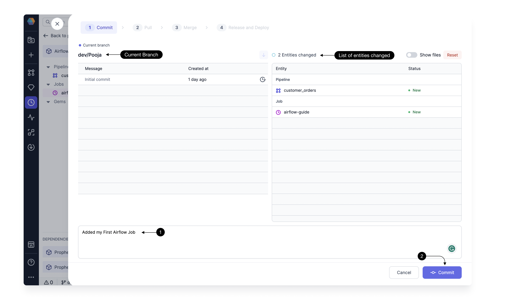

2. **Pull:** Before your changes can be safely merged into the **main** branch, we have to make sure that we’re up-to-date with it. If your colleagues introduced any code on **main** we have to **Pull** it first. For this, simply click on **(1) Continue** and then **(2) Pull**.
   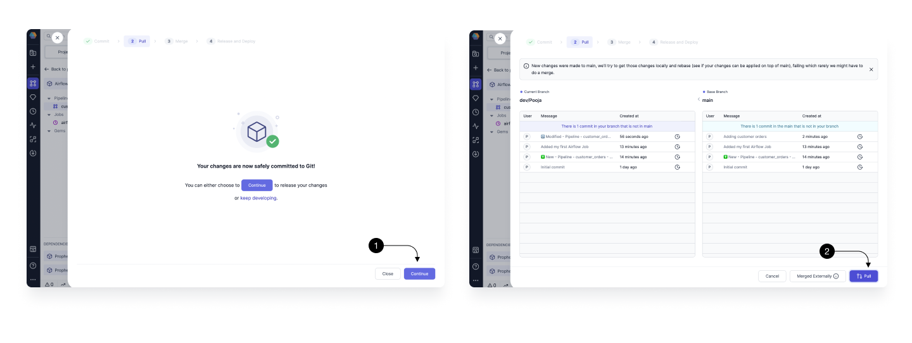

3. **Merge:** Now that our development branch is up-to-date, we can merge it to master. Here we can either create a **Pull Request** or if **Merge** the changes to main directly if your main branch isn't protected. For now, click on **(1) Merge** to merge them directly. Once the code is merged, you can now see the latest commits present on your **main** branch.
   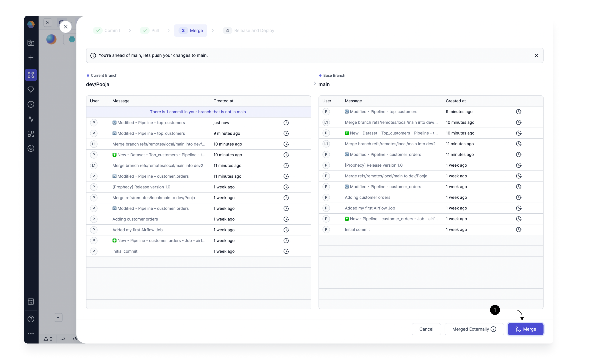

4. **Release:** Finally, now that our changes are all versioned on Git, we can release them to our scheduler. Simply specify a **(1) Release Version** number, e.g. `1.0` , and the **(2) Release Note,** which should clearly outline the latest changes. When ready, click **(3) Release.**
   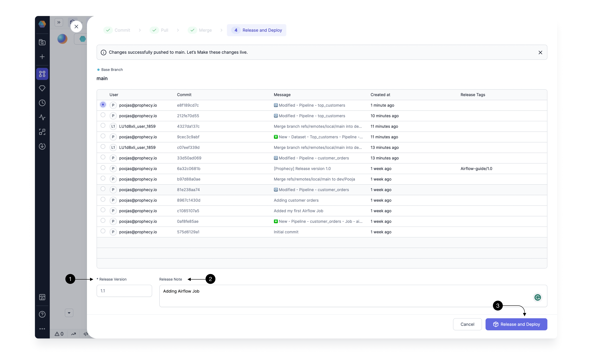

This will build and deploy your Airflow Job on the Airflow Fabric Specified in the Job and would schedule to run it on the specified schedule.

## 5. Monitor

During the release process Prophecy automatically packages, tests, and deploys your Jobs to Airflow. Once the process is finished you can see the deployed and running Job within your Airflow environment. You can monitor this Job within Prophecy in the **Observability** page.

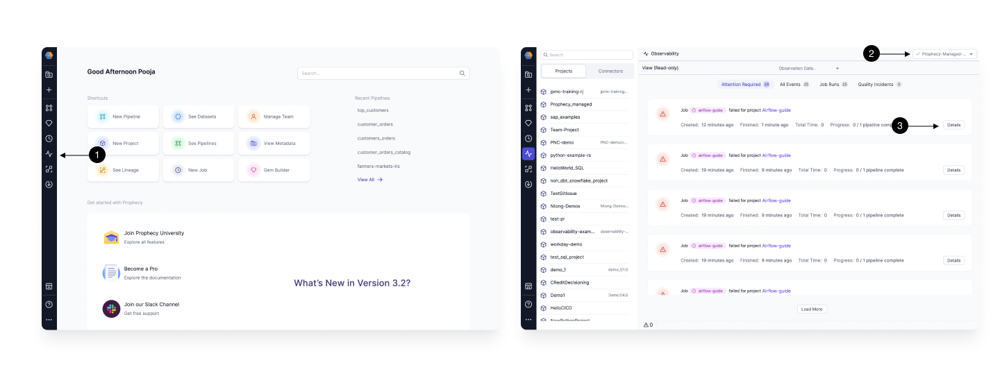

Click on **(1) Observability icon** on the left side menu bar to take you to the Observability page. Then in **(2) Fabric Selection box**, choose the Airflow Fabric your have. The Observability page will show all the Past and Current Runs of the Jobs you released on this Fabric. Switch between **Attention Required**, **All events**, **Job Runs** to find any Particular Run you are looking for. Click on the **(3) Details** button to open up the logs of any particular Run.

## What’s next?

Great work! 🎉

You've created your first Airflow Job in Prophecy, ran it successfully, released, scheduled, and monitored the Job. Take a moment to appreciate your accomplishment 🥳.

To continue learning and expanding your skills with Prophecy, feel free to explore other tutorials within our documentation!

If you ever encounter any difficulties, don't hesitate to reach out to us (contact.us@Prophecy.io) or join our [Slack community](https://prophecy-io-support.slack.com/join/shared_invite/zt-moq3xzoj-~5MSJ6WPnZfz7bwsqWi8tQ#/shared-invite/email) for assistance. We're here to help!

---
