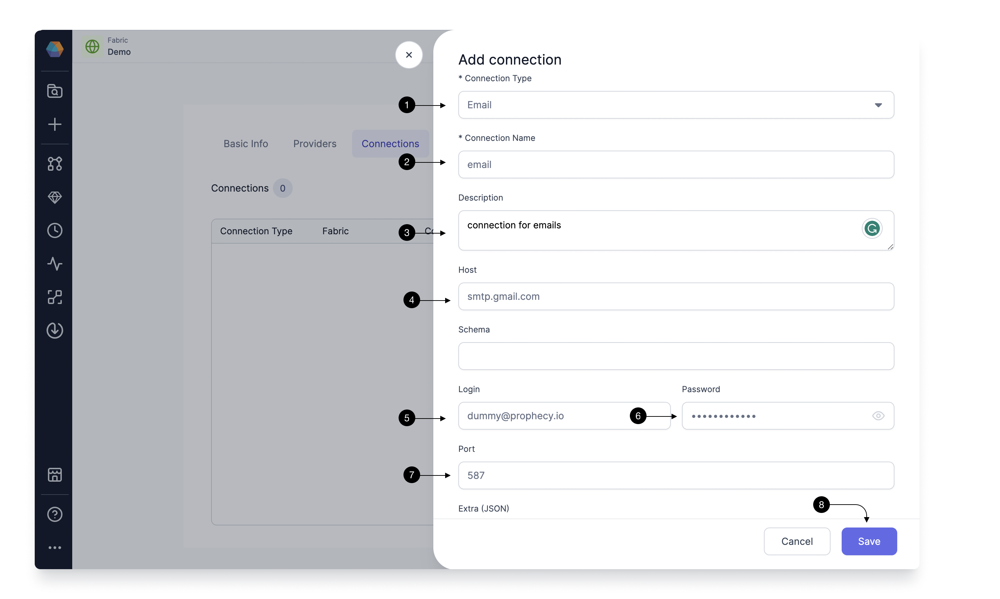

To be able to send email via Airflow using an Email Gem, you need to have Email connection in Prophecy Managed Airflow.

:::info

If your email account has two-factor authentication (2FA) turned on, you may run into an authentication error even if you provide the correct login credentials. To workaround this, you can generate an App password or provide additional parameters to add your Email connection.

:::

## Add an Email connection

To add an Email connection, click on **+ Add Connection** and select Email in **(1) Connection Type**.

Provide a **(2) Connection Name** to identify your connection, add a **(3) Description** of your choice, and provide the **(4) Host** as your SMTP host example `smtp.gmail.com`. Provide the login credentials for this server in **(5) Login** and **(6) Password** and provide your SMTP port in **(7) Port**. Once done, hit **(8) Save**.

