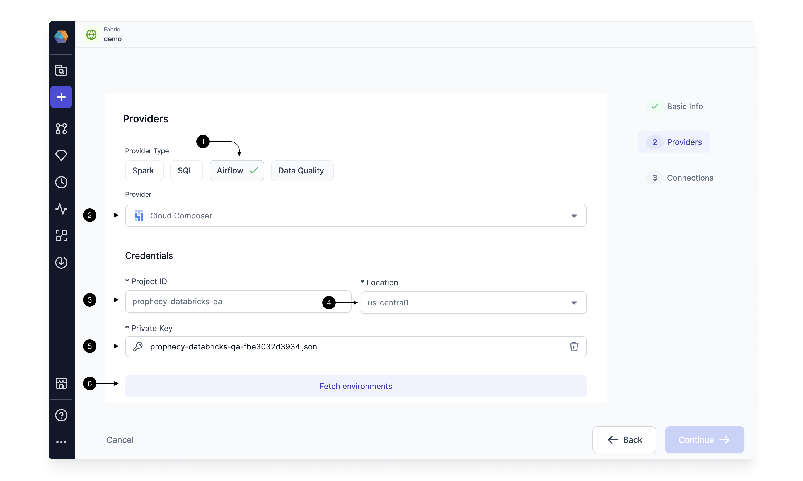
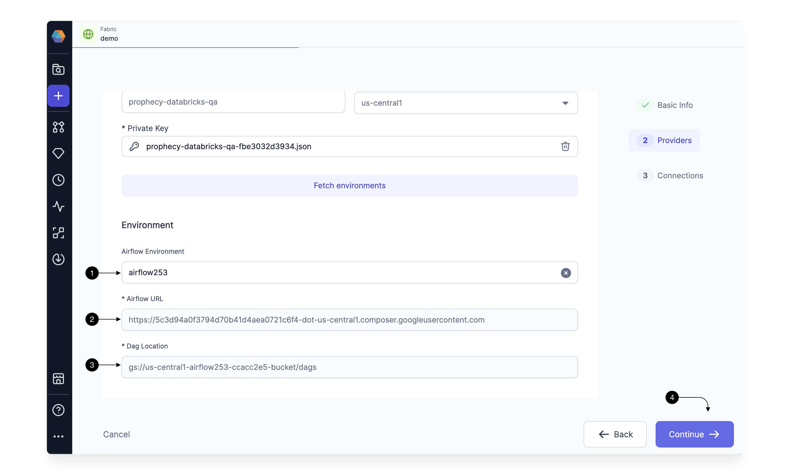
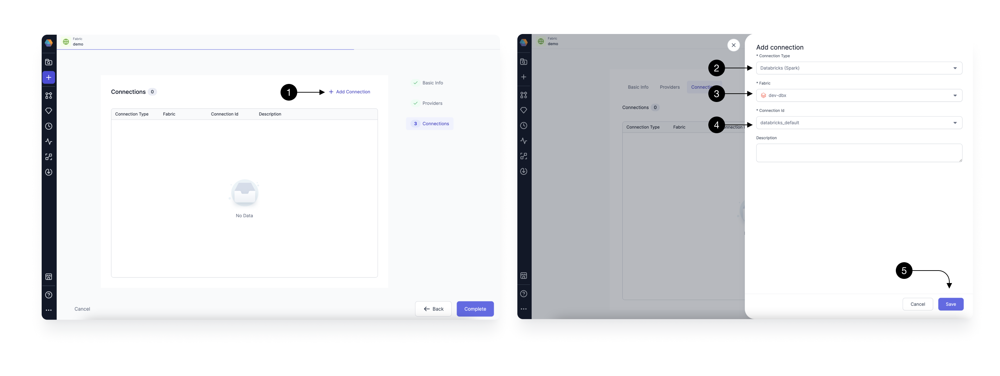

You can use Prophecy to connect to your Cloud Composer-based Airflow, to create, run, and monitor your Airflow DAGs.
For this, you would need to create a Composer Airflow Fabric.

## How to create a Composer Airflow Fabric

Setting up a Fabric is very straightforward. Click the **(1) Create Entity** button, and choose the **(2) Create Fabric** option. The Fabric creation is composed of two steps: Basic Info and Providers setup.
On the Basic Info screen, enter a **(3) Fabric Name**, **(4) Fabric Description**, and choose the **(5) Team** that’s going to own the Fabric.

Once ready, click **(6) Continue**.

Since we’re setting up a Fabric connected to Cloud Composer Airflow, choose **Airflow** as the **(1) Provider Type** and **Cloud Composer** as the **(2) Provider**.

Once you select Cloud Composer, you will start seeing fields for credentials as shown below.

Type in your GCP project in the **(3)Project ID** field, and select the **(4)Location** from dropdown. And Upload your **(5)Private key** file to authenticate.
Click on **(6) Fetch Environments** to fetch the Airflow Instances running in the mentioned GCP Project.

Select the desired instance of Airflow, in the **(1) Airflow Environment** dropdown. This will autofill the **(2) Airflow URL** and **(3)Dag location** field which are uneditable.
Click on **(4) Continue**.

This completes the Fabric Creation For Composer, and you can now start adding Connections.

## Setting up Connections

You need Airflow to talk to various other systems in your Data Platform to be able to do certain tasks like sending Email, triggering Spark pipelines, and SQL models.
For these, we create [connections](https://airflow.apache.org/docs/apache-airflow/stable/authoring-and-scheduling/connections.html) in Airflow.

You can map connections already created in your Composer, in the Connections Tab of the Fabric.
Prophecy will use these connections to fetch the connection-id to generate the correct Airflow Code when you use these in your Airflow Gems.

For adding a connection, Click on **(1) Add Connection** button. This Opens up the Connection form as shown.

### Setting up Databricks Spark connection

To be able to schedule your Databricks Spark pipelines via Airflow, you need to have a Databricks Spark Connections from Airflow to your Databricks Workspace. You need to create the connection in Airflow and provide the mapping to Prophecy in this form.

Select **(2) Connection Type** as Databricks(Spark), and select the **(3) Fabric** you have in Prophecy for the desired Databricks Workspace. Select the **(4) Connection id** you have created for this Databricks workspace in your Airflow.
Make sure you select the Fabric for the same Databricks workspace you have already created the connection for in your Airflow.
Once done, hit **(4) Save**.

### Setting up Snowflake SQL Connection

Similarly, setup a connection to a Snowflake Fabric following [these](./mwaa.md#setting-up-connections) steps.

## Create an Airflow Job

Once the Airflow Composer Fabric is setup with the relevant connections, Airflow Job scheduling is done with an easy-to-use interface. Follow this guide to [Create an Airflow Job](/docs/Orchestration/airflow/getting-started-with-low-code-airflow.md#2-create-an-airflow-job).
