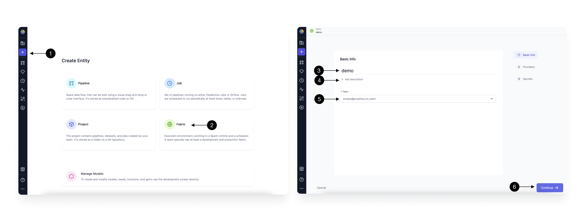
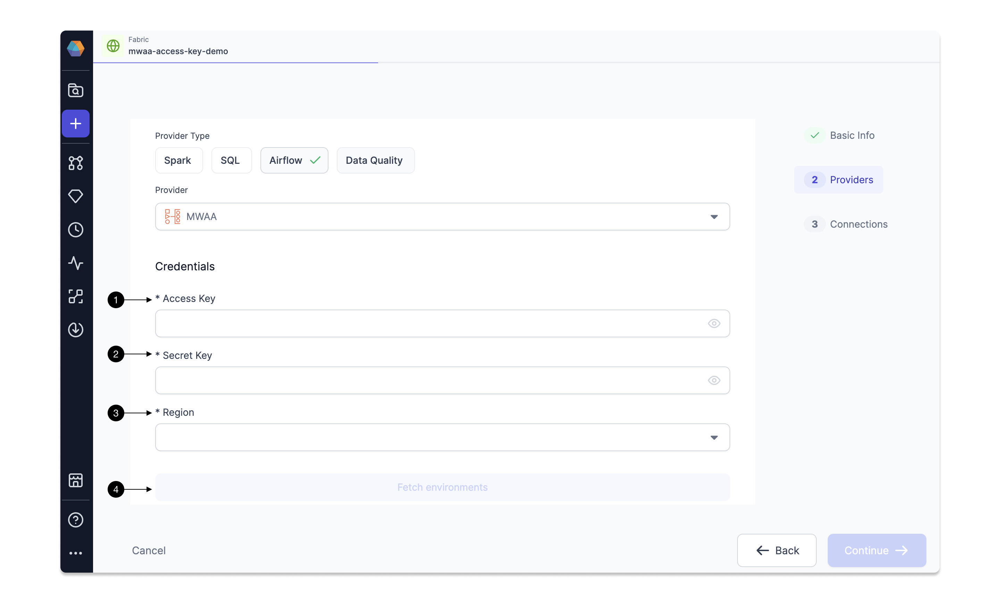
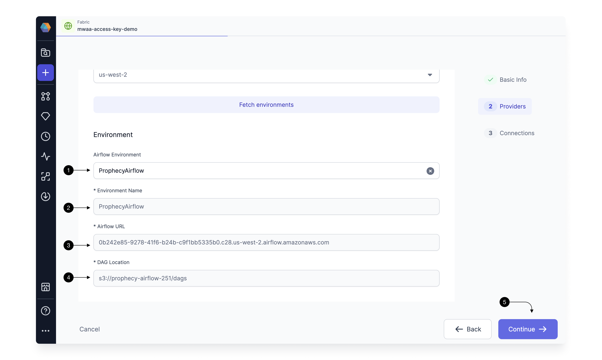
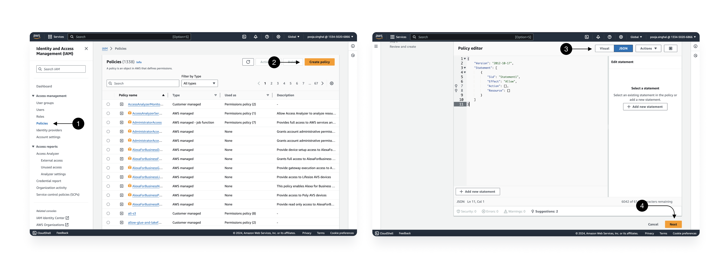
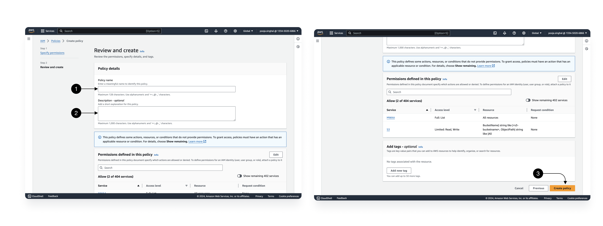
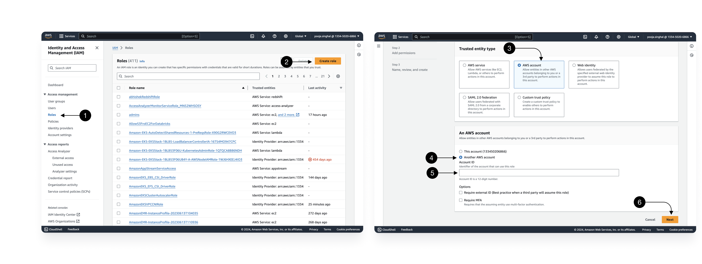
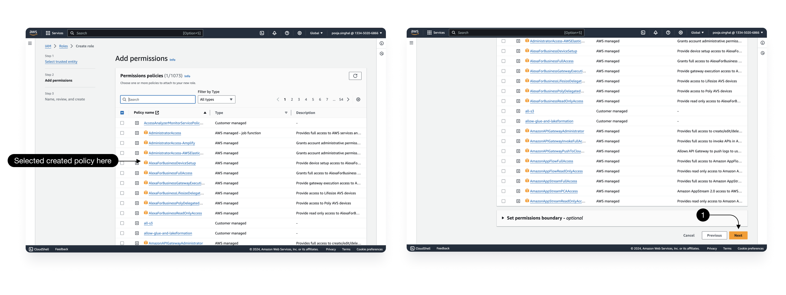
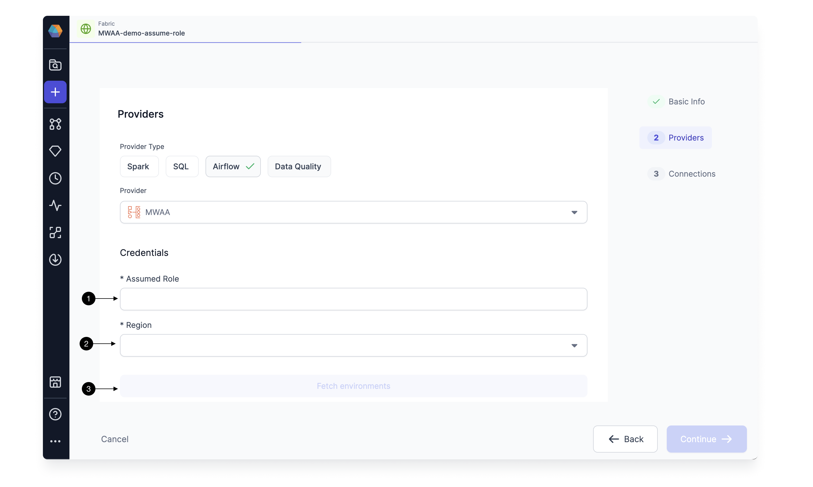
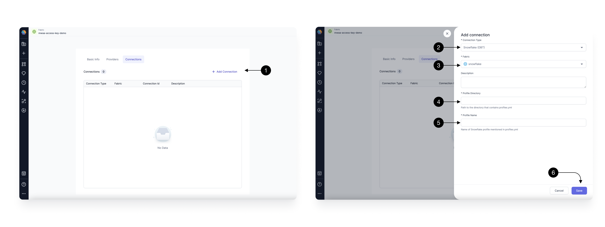

You can use Prophecy to connect to your [Amazon Managed Workflows for Apache Airflow (Amazon MWAA)](https://aws.amazon.com/managed-workflows-for-apache-airflow/) , to create, run, and monitor your Airflow DAGs.
For this, you would need to create a MWAA Airflow Fabric.

## How to create an MWAA Airflow Fabric

Setting up a Fabric is very straightforward. Click the **(1) Create Entity** button, and choose the **(2) Create Fabric** option. The Fabric creation is composed of two steps: Basic Info and Providers setup.
On the Basic Info screen, enter a **(3) Fabric Name**, **(4) Fabric Description**, and choose the **(5) Team** that’s going to own the Fabric.

Once ready, click **(6) Continue**.



Since we’re setting up a Fabric connected to MWAA Airflow, choose **Airflow** as the **(1) Provider Type** and **MWAA** as the **(2) Provider**.

Once you select MWAA, you will start seeing fields for credentials.
MWAA Fabric offers two types of authentication.

### MWAA Access key auth

By default, you would see option to provide your Access key and Secret key for authentication. Check [here](https://docs.aws.amazon.com/IAM/latest/UserGuide/id_credentials_access-keys.html) on how to set up and get your access and secret keys for authentication.
Provide your **(1) Access Key** and **(2) Secret Key** and then select the **(3) region** where your MWAA Airflow instance is running. Click on **(4) Fetch environments** to fetch all Airflow instances running in this region.



You can now select the Airflow environment for which you want to create the Fabric in Prophecy. As you select the **(1) Airflow Environment**, the **(2) Environment name**, **(3) Airflow URL** and **(4) DAG Location** would be fetched for you.
These details are only shown for verification purposes and cannot be edited. Once verified, click **(5) Continue**.



This completes the Fabric Creation and you can start setting up [Connections](#setting-up-connections).

### MWAA IAM Role auth

If you do not wish to provide Access keys and secret keys authentication to Prophecy, you can use [Assume Roles](https://docs.aws.amazon.com/STS/latest/APIReference/API_AssumeRole.html) as an alternate authentication mechanism.

:::info
Please reach out to Prophecy support team to enable assume role Auth and disable Access keys authentication in your teams.
:::

To create an AssumeRole for Prophecy, we are going to use [IAM role access across Account](https://docs.aws.amazon.com/IAM/latest/UserGuide/tutorial_cross-account-with-roles.html).

Go to the Identity and Access Management (IAM) home page in your AWS account, and go to **(1)Policies**. Click on **(2) Create policy** .



We need ListEnvironments permission for Airflow, PutObject, GetObject and DeleteObject to the S3 bucket used by your Airflow for uploading DAGs and Pipeline Artifacts and CreateCLiToken, GetEnvironment on the Airflow Instance.
For simplicity, you can switch to **(3) JSON** and use below JSON policy and replace values for Airflow Environment and S3 bucket.

```json
{
  "Version": "2012-10-17",
  "Statement": [
    {
      "Sid": "VisualEditor0",
      "Effect": "Allow",
      "Action": "airflow:ListEnvironments",
      "Resource": "*"
    },
    {
      "Sid": "VisualEditor1",
      "Effect": "Allow",
      "Action": [
        "s3:PutObject",
        "s3:GetObject",
        "airflow:CreateCliToken",
        "s3:DeleteObject",
        "airflow:GetEnvironment"
      ],
      "Resource": [
        "arn:aws:airflow:<location>:<account id>:environment/<mwaa-environment-name>",
        "arn:aws:s3:::<s3-bucketname>/*"
      ]
    }
  ]
}
```

Once the permissions are selected (or provided via json), click on **(4) Next**.


Give a **(1) Policy name. Optionally you can add a **(2) description** too. Once done, click on **(3) Create Policy\*\* to save this.

Now go to **(1) Roles** from the left sidebar, and click on **(2)Create Role**.


In Trusted entity type, select **(3) AWS Account** and select **(4)Another AWS account** in An AWS account section.  
Provide Prophecy's **(5) account ID** as `133450206866`. And click **(6) Next**.


Select the Policy which you created just above and click on **(1) Next**.

Provide a **(1)role name** and optionally provide a **(2)description**.
**(3)Edit** the trusted Select trusted entities Json, to only provide access to `prophecy-mwaa` users created for this auth and not to all Prophecy Users as shown below.

```json
{
  "Version": "2012-10-17",
  "Statement": [
    {
      "Effect": "Allow",
      "Principal": {
        "AWS": "arn:aws:iam::133450206866:user/prophecy-mwaa"
      },
      "Action": "sts:AssumeRole",
      "Condition": {}
    }
  ]
}
```

Once done click on **(4)create role**. The role is created.

Now you can go to the created Role and copy the ARN of this role to be provided in Prophecy Fabric.

Once the assume role authentication is enabled, you would see below fields for authentication in MWAA Fabric.



Here you can provide the AssumeRole created for Prophecy and provide the region where your Airflow instance is running. Once done, click on **(3) Fetch environment** to list the Airflow Instances which are accessible to provided AssumeRole.

You can now select the Airflow environment for which you want to create the Fabric in Prophecy. As you select the **(1) Airflow Environment**, the **(2) Environment name**, **(3) Airflow URL** and **(4) DAG Location** would be fetched for you.
These details are only shown for verification purposes and cannot be edited. Once verified, click **(5) Continue**.


This completes the Fabric Creation and you can start setting up Connections.

## Setting up Connections

You need Airflow to talk to various other systems in your Data Platform to be able to do certain tasks like sending Email, triggering Spark pipelines, and SQL models.
For these, we create [connections](https://airflow.apache.org/docs/apache-airflow/stable/authoring-and-scheduling/connections.html) in Airflow.

You can map connections already created in your MWAA, in the Connections Tab of the Fabric.
Prophecy will use these connections to fetch the connection-id to generate the correct Airflow Code when you use these in your Airflow gems.

For adding a connection, Click on **(1) Add Connection** button. This Opens up the Connection form as shown.

### Setting up Snowflake connection


To be able to schedule your Snowflake SQL Models via Airflow, you need to have a Snowflake Connection over DBT from Airflow to your Snowflake Airflow. You need to create the connection in Airflow and provide the mapping to Prophecy in this form.

Select **(2) Connection Type** as Snowflake(DBT), and select the **(3) Fabric** you have in Prophecy for your desired Snowflake environment. Provide the **(4) Profile Directory** and **(5) Profile Name** used while setting up the connection in Airflow.

Make sure you select the Fabric for the same Snowflake environment you have already created the connection for in your Airflow.
Once done, hit **(4) Save**.

## Create an Airflow Job

Once the MWAA Airflow Fabric is setup with the relevant connections, Airflow Job scheduling is done with an easy-to-use interface. Follow this guide to [Create an Airflow Job](/docs/Orchestration/airflow/getting-started-with-low-code-airflow.md#2-create-an-airflow-job).
