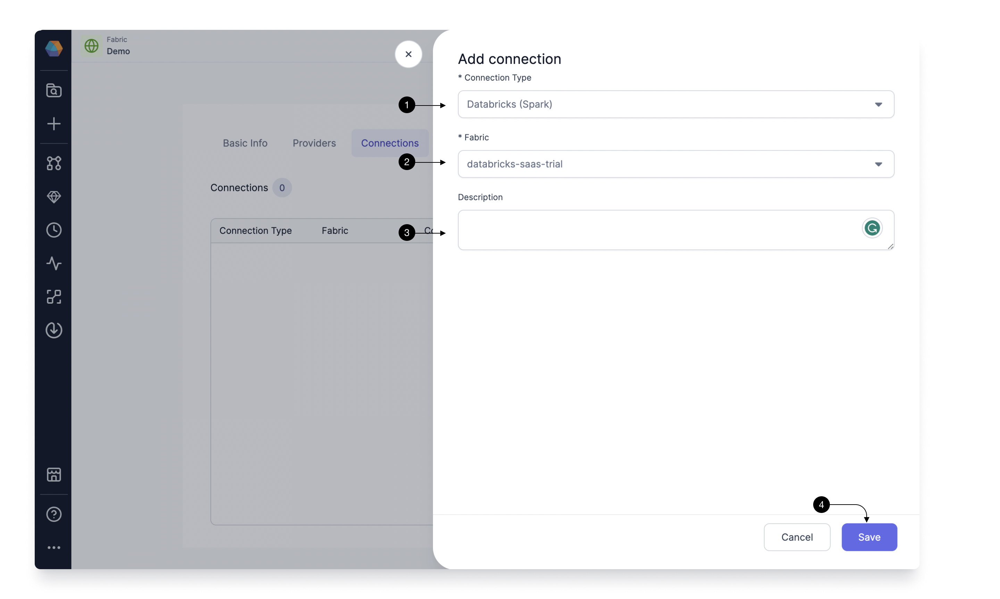

To be able to schedule your Databricks Spark pipelines via Airflow, you need to have a Databricks Spark Connections from Prophecy Managed Airflow to your Databricks Workspace.

## Add a Databricks Spark connection

To add a Databricks Spark connection, click on **+ Add Connection**.

Select Databricks Spark in **(1) Connection Type**. Since you have already provided the details for your Databricks Workspace when creating a Databricks Fabric, you need not provide the details here again.
Under the **(2) Fabric**, select the Fabric you created for Databricks Spark and Prophecy would set up the connection. You can provide a description in the **(3) Description**. Once done, click **(4) Save**.

