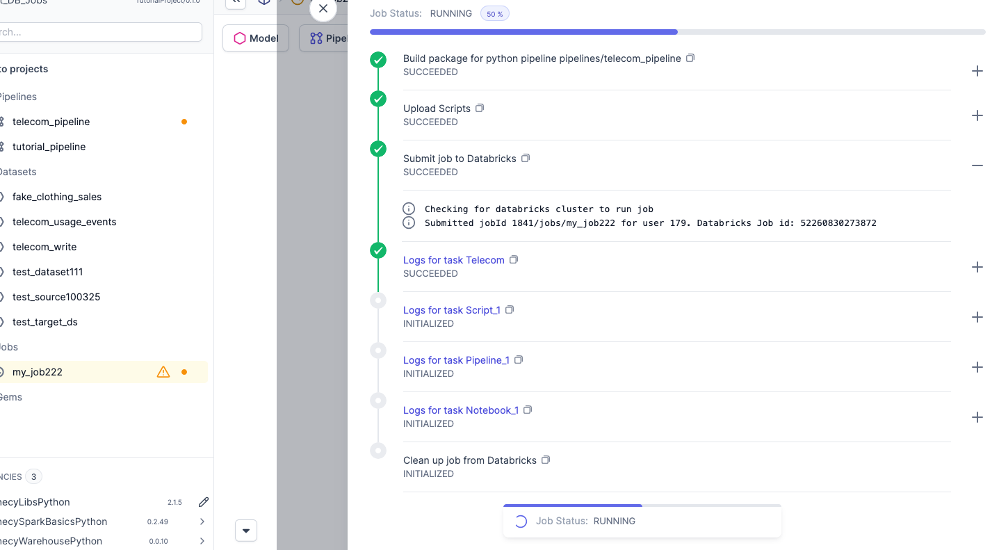

Prophecy provides a visual orchestration layer over [Databricks jobs](https://docs.databricks.com/en/jobs/index.html).
A Prophecy Databricks job corresponds to a Databricks job definition under the hood, enabling you to add and link pipelines, scripts, Databricks notebooks, conditional logic, and other components to a job. Jobs run in Databricks.

## Schedule a Databricks Job

You can create a job from three places:

- To schedule from a pipeline, click the **Schedule** button at the top of the visual canvas. (You can still add other pipelines to the job.)
- To schedule a job from within a project, click **+** to the right of **Jobs** in the left sidebar.
- To schedule a job for any project, click the **Create Entity** button in the left navigation bar. Hover over the **Job** tile and select **Create**.

When you create a new job, you're asked for the following details. Some fields are set automatically when you schedule from a pipeline or project.

| Field Name                | Description                                                                                                                                                                                                                                                                                                                                                    |
| ------------------------- | -------------------------------------------------------------------------------------------------------------------------------------------------------------------------------------------------------------------------------------------------------------------------------------------------------------------------------------------------------------- |
| Project                   | Which [Project](/projects) to create the job in. This controls who has access to the job, groups jobs together for lineage, and allows you to use pipelines already published within that project. Added automatically when you schedule a job from a pipeline or from within a project.                                                                       |
| Branch                    | Which Git branch to use when developing this job. When you schedule a job from a pipeline or project, the job uses the current branch.                                                                                                                                                                                                                         |
| Name                      | Unique name for job.                                                                                                                                                                                                                                                                                                                                           |
| Scheduler                 | The underlying engine that will execute your job. We recommend using Databricks.                                                                                                                                                                                                                                                                               |
| Fabric                    | The [execution fabric](/administration/fabrics/prophecy-fabrics/) to which the job will be deployed.                                                                                                                                                                                                                                                           |
| Job Size                  | The [default size](/administration/fabrics/prophecy-fabrics/) of the cluster that will be created for the job.                                                                                                                                                                                                                                                 |
| Schedule Interval         | Defines how often your job is going to run. The interval is defined using the [Quartz format](https://www.quartz-scheduler.org/documentation/quartz-2.3.0/tutorials/crontrigger.html). For example: `0 0/5 * * * ?` means "runs every 5 minutes," while `0 0 12 * * ?` means "runs daily at noon UTC." You can click on the clock icon to select the interval. |
| Description               | Optional description of job.                                                                                                                                                                                                                                                                                                                                   |
| Alerts email              | Comma separated list of emails that are going to receive notifications on specific job status events (start, failure, or success).                                                                                                                                                                                                                             |
| Per Gem Timeout           | Timeout for each gem in job pipeline.                                                                                                                                                                                                                                                                                                                          |
| Number of retries per gem | Number of retries for each gem in job pipeline.                                                                                                                                                                                                                                                                                                                |

## Build the Job

Once you add a job, Prophecy opens a visual canvas that lets you add and connect gems for the job.

Seven gem types are available when defining Databricks jobs. Each gem represents a discrete task, such as running a pipeline, executing a notebook, or triggering another job, within the Databricks job.

| Gem Type          | Purpose                                                                           |
| ----------------- | --------------------------------------------------------------------------------- |
| Pipeline          | Runs a Prophecy pipeline                                                          |
| Script            | Runs a custom Python script                                                       |
| Notebook          | Runs a Databricks notebook                                                        |
| If Else           | Branches job execution conditionally                                              |
| RunJob            | Runs another Prophecy job                                                         |
| Model             | Runs a dbt-style data project or a specific SQL model as part of a Databricks job |
| Delta Live Tables | Runs a Databricks Delta Live Tables pipeline                                      |

### Pipeline Gem

The **Pipeline Gem** triggers a Spark pipeline that was developed and published in Prophecy. Use this gem when you want to include an existing Prophecy pipeline as a stage within a Databricks job.

To add a pipeline gem:

1. Drag the **Pipeline** gem onto the job canvas and click it to open its settings.
1. Enter a descriptive name for the gem.
1. Select **pipeline** from dropdown menu.
1. Either confirm or configure **Pipeline Configurations**:

   - To confirm, view input parameters in the **Schema** tab (visible by default when you open the gem).

   | Field           | Type     | Description                |
   | --------------- | -------- | -------------------------- |
   | input_path      | `string` | Source file path.          |
   | processing_date | `string` | Date to use for filtering. |

   - To change configuration, click the **Config** tab. This tab allows you to override values in the **Schema** tab: **input_path** and **processing_date**.

Settings for the gem can be inherited from overall job configuration or can be set in the **Settings** tab.

Expand to see information on the Conditional Tab, which is common to several gems

Use the **Conditional** tab to control when and how the gem runs within the job. You can define **run conditions** or configure the gem to run multiple iterations with **For Each**.

#### Run Conditions for Pipeline Gem

Run conditions determine when the gem executes based on the status of preceding gems.

- **All succeeded** – Runs if all upstream gems succeed.
- **At least one succeeded** – Runs if at least one upstream gem succeeds.
- **None failed** – Runs if all upstream gems complete without failure.
- **All done** – Runs after all upstream gems finish, regardless of success or failure.
- **At least one failed** – Runs if at least one upstream gem fails.

#### Use For Each for Pipeline Gem

Use **For Each** to run the gem multiple times with different parameter values.

1. Click **Run multiple iterations [For Each]**.
1. Enter a **parameter name** and a **variable name** to define the iteration context.
1. Set the **number of concurrent runs** to control parallel execution.

### Script Gem

You can use the **Script** gem to add ad-hoc Python code to the job. This gem corresponds to a [Databricks Python script task](https://docs.databricks.com/aws/en/jobs/python-script), which is a `.py` file that executes within the Databricks runtime on the cluster associated with the job.

To add a Script gem:

1. Drag the **Script** gem onto the job canvas and click it to open its settings.
1. Enter a descriptive name for the gem.
1. Enter the Python code you want to execute.

Settings for the gem can be inherited from overall job configuration or can be set in the **Settings** tab.

Expand to see information on the Conditional Tab, which is common to several gems

Use the **Conditional** tab to control when and how the gem runs within the job. You can define **run conditions** or configure the gem to run multiple iterations with **For Each**.

#### Run Conditions for Script Gem

Run conditions determine when the gem executes based on the status of preceding gems.

- **All succeeded** – Runs if all upstream gems succeed.
- **At least one succeeded** – Runs if at least one upstream gem succeeds.
- **None failed** – Runs if all upstream gems complete without failure.
- **All done** – Runs after all upstream gems finish, regardless of success or failure.
- **At least one failed** – Runs if at least one upstream gem fails.

#### Use For Each with Script Gem

Use **For Each** to run the gem multiple times with different parameter values.

1. Click **Run multiple iterations [For Each]**.
1. Enter a **parameter name** and a **variable name** to define the iteration context.
1. Set the **number of concurrent runs** to control parallel execution.

### Notebook Gem

The **Notebook** gem lets you include Databricks notebooks as part of a Prophecy job.  
Use this gem when you want to orchestrate a notebook that already exists in Databricks as one stage within your job.

To add a Notebook gem:

1. Drag the **Notebook** gem onto the job canvas and click it to open its settings.
1. Enter **notebook path** for the Databricks notebook you want to run.
   - The path must reference a notebook that already exists in Databricks.
   - Ensure that the user running the job has Databricks permissions to access this path.

:::note
Prophecy does not support creating or editing notebooks directly in Prophecy.  
All notebooks must be created and maintained within Databricks.
:::

Settings for the gem can be inherited from overall job configuration or can be set in the **Settings** tab.

Expand to see information on the Conditional Tab, which is common to several gems

Use the **Conditional** tab to control when and how the gem runs within the job. You can define **run conditions** or configure the gem to run multiple iterations with **For Each**.

#### Run Conditions for Notebook Gem

Run conditions determine when the gem executes based on the status of preceding gems.

- **All succeeded** – Runs if all upstream gems succeed.
- **At least one succeeded** – Runs if at least one upstream gem succeeds.
- **None failed** – Runs if all upstream gems complete without failure.
- **All done** – Runs after all upstream gems finish, regardless of success or failure.
- **At least one failed** – Runs if at least one upstream gem fails.

#### Use For Each with Notebook Gem

Use **For Each** to run the gem multiple times with different parameter values.

1. Click **Run multiple iterations [For Each]**.
1. Enter a **parameter name** and a **variable name** to define the iteration context.
1. Set the **number of concurrent runs** to control parallel execution.

### If Else Gem

The **If Else** gem lets you branch a job’s execution path based on a logical condition.  
Use this gem when you want the job to continue along one branch if a condition is met, and along another branch if it is not.

To add an If Else gem:

1. Drag the **If Else** gem onto the job canvas and click it to open its settings.
1. Enter a **left operand**, **operator**, and **right operand** to create a logical comparison.
   - Supported operators:
     - equals
     - not equals
     - less than
     - greater than
     - less than or equal to
     - greater than or equal to

#### Branch Behavior

- If the condition evaluates to **true**, the job continues along the **upper branch**.
- If the condition evaluates to **false**, the job continues along the **lower branch**.

Settings for the gem can be inherited from overall job configuration or can be set in the **Settings** tab.

Expand to see information on the Conditional Tab, which is slightly different for the If Else gem. 

The **Conditional** tab in the If Else Gem lets you control when the gem itself runs within the overall job flow.  
Unlike other gems, the If Else Gem supports **run conditions** only and does **not** support _For Each_ iterations.

#### Run Conditions for If Else Gem

Run conditions determine when the gem executes based on the status of preceding gems.

- **All succeeded** – Runs if all upstream gems succeed.
- **At least one succeeded** – Runs if at least one upstream gem succeeds.
- **None failed** – Runs if all upstream gems complete without failure.
- **All done** – Runs after all upstream gems finish, regardless of success or failure.
- **At least one failed** – Runs if at least one upstream gem fails.

### RunJob Gem

The **RunJob** gem lets you trigger another job that has been configured in your workspace.  
Use this gem to chain jobs together or orchestrate dependent workflows as part of a larger process.

To add a RunJob gem:

1. Drag the **RunJob** gem onto the job canvas and click it to open its settings.
1. Choose a **job** from the dropdown menu, or manually enter the **Job ID** of the job you want to trigger.
1. (Optional) Check **Wait for job completion before proceeding** if you want the current job to pause until the triggered job finishes running.

Settings for the gem can be inherited from overall job configuration or can be set in the **Settings** tab.

Expand to see information on the Conditional Tab, which is common to several gems

Use the **Conditional** tab to control when and how the gem runs within the job. You can define **run conditions** or configure the gem to run multiple iterations with **For Each**.

#### Run Conditions for RunJob Gem

Run conditions determine when the gem executes based on the status of preceding gems.

- **All succeeded** – Runs if all upstream gems succeed.
- **At least one succeeded** – Runs if at least one upstream gem succeeds.
- **None failed** – Runs if all upstream gems complete without failure.
- **All done** – Runs after all upstream gems finish, regardless of success or failure.
- **At least one failed** – Runs if at least one upstream gem fails.

#### Use For Each with RunJob Gem

Use **For Each** to run the gem multiple times with different parameter values.

1. Click **Run multiple iterations [For Each]**.
1. Enter a **parameter name** and a **variable name** to define the iteration context.
1. Set the **number of concurrent runs** to control parallel execution.

### Model Gem

The **Model** gem lets you run either an entire Prophecy (dbt-style) project or a specific SQL model within one. Use it when you want to include data modeling or transformation logic as part of a Databricks job.

You can configure the Model Gem in two modes:

#### Run Entire Project

Use this mode to execute all SQL models, tests, and seeds within a selected project.

| Field           | Description                                               |
| --------------- | --------------------------------------------------------- |
| Project         | Select the project to run.                                |
| Fabric          | Select the execution fabric where the project should run. |
| Git Target      | Choose the Git target (branch or tag).                    |
| Reference Value | Specify the reference commit or version to use.           |

#### Run a SQL Model

Use this mode when you want to run a single SQL model from within a project.

| Field           | Description                                                 |
| --------------- | ----------------------------------------------------------- |
| Project         | Select the project containing the SQL model.                |
| SQL Model       | Select the SQL model to run.                                |
| Fabric          | Select the execution fabric where the SQL model should run. |
| Git Target      | Choose the Git target (branch or tag).                      |
| Reference Value | Specify the reference commit or version to use.             |

#### DBT Properties

These options control dbt-style behavior when running a project or SQL model:

| Property                                         | Description                                                                       |
| ------------------------------------------------ | --------------------------------------------------------------------------------- |
| Run tests                                        | Runs dbt tests (`dbt test`) after the model executes.                             |
| Run seeds                                        | Runs dbt seeds (`dbt seed`) before model execution.                               |
| Pull most recent version of dependencies         | Refreshes dbt dependencies (`dbt deps`) before execution.                         |
| Compile and execute against current target (run) | Compiles and executes the selected models (`dbt run`) against the current target. |

:::note
**Note:** The Model Gem refers to _data models_ (SQL/dbt) rather than machine learning models. It lets you compile and run Prophecy or dbt projects as part of a Databricks job orchestration.
:::

### Delta Live Tables Pipeline Gem

The **Delta Live Tables Pipeline** gem lets you run data pipelines that have already been created and deployed in Databricks. Use this gem when you want to orchestrate an existing Delta Live Tables (DLT) pipeline as part of a Prophecy job.

To add a Delta Live Tables Pipeline gem:

1. Drag the **Delta Live Tables Pipeline** gem onto the job canvas and click it to open its settings.
1. Choose from available DLT pipelines for the current fabric.
1. (Optional) Enable the **Trigger full refresh** checkbox to force a full refresh when the pipeline runs.

Settings for the gem can be inherited from overall job configuration or can be set in the **Settings** tab.

Expand to see information on the Conditional Tab, which is common to several gems

Use the **Conditional** tab to control when and how the gem runs within the job. You can define **run conditions** or configure the gem to run multiple iterations with **For Each**.

#### Run Conditions for Delta Live Tables Pipeline Gem

Run conditions determine when the gem executes based on the status of preceding gems.

- **All succeeded** – Runs if all upstream gems succeed.
- **At least one succeeded** – Runs if at least one upstream gem succeeds.
- **None failed** – Runs if all upstream gems complete without failure.
- **All done** – Runs after all upstream gems finish, regardless of success or failure.
- **At least one failed** – Runs if at least one upstream gem fails.

#### Use For Each with Delta Live Tables Pipeline Gem

Use **For Each** to run the gem multiple times with different parameter values.

1. Click **Run multiple iterations [For Each]**.
1. Enter a **parameter name** and a **variable name** to define the iteration context.
1. Set the **number of concurrent runs** to control parallel execution.

## Run the Job

When you are satisfied with the job's configuration, you can run the job.

1. Make sure you are connected to a fabric.
1. Click the run button in the lower right-hand corner of the job configuration page.

If the job fails, Prophecy displays an error message indicating what went wrong. If the job succeeds, Prophecy displays a page indicating that all stages have succeeded.

While the job runs, Prophecy displays a **Job Status: Running** message with a **Detail** button. To view a job's progress, click the **Detail** button. A modal opens showing the job as a series of stages. You can view details on a stage by clicking **+** to the right of the stage. If the job fails, Prophecy displays an error message for the stage at which the job failed.

## Configure Clusters for Job Gems

By default, all Jobs gems run in the same cluster. You can configure clusters for individual gems. This option is especially useful for heavy-duty and production pipelines.

To do so:

1. Select the gem by clicking its border.
1. Click **Configure a Cluster**.
1. Once the cluster is created, select cluster from dropdown menu.
1. Choose **Multi** at the top of the visual canvas.

   When the job runs, each gem runs in its own independent cluster. All clusters are the same size as the cluster selected for the job.

## Deploy Job

To deploy the job on Databricks, you need to release the project from the Prophecy UI. As soon as the project is released, the job will appear in Databricks Jobs.

:::info

Make sure to enable the job before creating a Release. If not enabled, the job will not run.

If a job's selected fabric is changed, it will create a separate Databricks job definition. The previous job (with the previous fabric) will be paused automatically and the new version will be scheduled.
:::

## Guides

1. [How to design a reliable CI/CD process?](/engineers/ci-cd)
