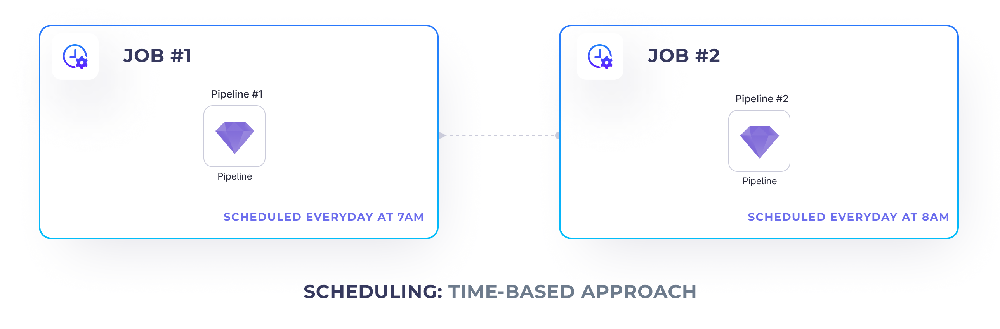

:::edition Enterprise
Available for [Enterprise Edition](/getting-started/editions/) only.
:::

To better structure your projects, sometimes you will want to create multiple different jobs that trigger only a specific set of pipelines. For example, when using the [Bronze, Silver, Gold](https://www.prophecy.io/blogs/prophecy-with-delta#bronze-silver-gold-layers) architecture, one might want to have a project for each one of the stages and run each stage sequentially: run _Gold_ after _Silver_ is finished and run _Silver_ after _Bronze_ is finished.

However, this poses a question: How to schedule multiple jobs together?

This page describes how to trigger jobs using the [Script job gem](/engineers/databricks-jobs#script-gem). You can also use the [RunJob job gem](/engineers/databricks-jobs#runjob-gem) to trigger jobs. See [Databricks jobs](/engineers/databricks-jobs) for more information.

## Time-based Approach



One traditional approach is to schedule the sequential jobs to run at different time intervals. For example, the first job can run at 7am and the second job can run an hour later. This works well if there's no data dependencies between those jobs or if we're confident that the first job is going to always finish before the second job.

But what would happen if our first job (such as bronze ingestion) hasn't yet finished, but the second job (such as silver cleanup) is about to start? This could potentially result in only partially processed data or even break the downstream jobs completely. Recoverability and maintenance also becomes more difficult in this case.

## Trigger-based Approach


This is where it might be worth exploring the trigger-based approach. Using this approach, we place additional triggers in our upstream jobs that trigger the jobs that should be executed after those finished.

To achieve that we can leverage the `Script` gem
and [Databricks Jobs API](https://docs.databricks.com/dev-tools/api/latest/jobs.html#operation/JobsRunNow).

To be able to trigger a job from within another job, we need to:

1. Deploy the job we want to trigger and find it's Databricks `job_id`
2. Add a `Script` gem to the scheduled job that triggers the other one

### Deploying Jobs

First of all, to be able to trigger one job from another, we need to release it and get its Databricks job id.

Please note that this job is disabled, because we’re going to run it from a manual API instead of using a time-based trigger.

### Job trigger

Once we have the ID of the job that we'd like to trigger, we can create a `Script` gem in our upstream job
that's going to run it.

Insert the following script to trigger a job:

```python
import requests

# STEP 1: Enter your workspace ID here
domain = 'https://dbc-147abc45-b6c7.cloud.databricks.com'
# STEP 2: Ensure you have a workspace.token secret created and accessible
token = dbutils.secrets.get(scope='workspace', key='token')

response = requests.post(
    '%s/api/2.1/jobs/run-now' % (domain),
    headers={'Authorization': 'Bearer %s' % token},
    # STEP 3: Enter a job_id you'd like to trigger
    json={'job_id': '549136548916411'}
)

if response.status_code == 200:
    print(response.json())
else:
    raise Exception('An error occurred triggering the job. Complete error: %s' % (response.json()))
```

Make sure to specify the following arguments:

1. Databricks workspace url - [How to find it?](https://docs.databricks.com/workspace/workspace-details.html#workspace-instance-names-urls-and-ids)
2. Databricks token - [How to generate it?](https://docs.databricks.com/dev-tools/api/latest/authentication.html#generate-a-personal-access-token)
3. The Databricks job id as previously embedded

:::caution
Please note, that it's not recommended to store your Databricks token within the code directly, as that creates a
potential venue for the attacker. A better approach is to leverage Databricks secrets. Check
out [this guide](https://docs.databricks.com/security/secrets/secrets.html#create-a-secret-in-a-databricks-backed-scope)
to learn how to create Databricks secrets.
:::
