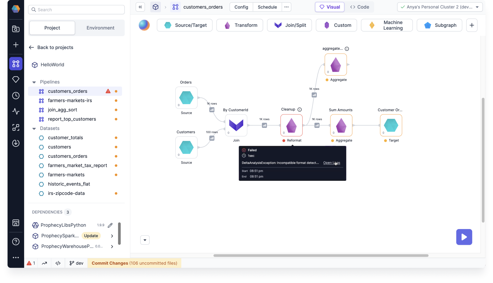
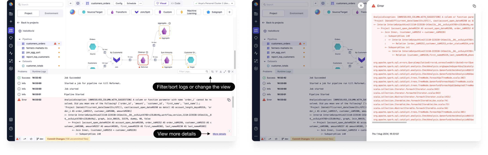
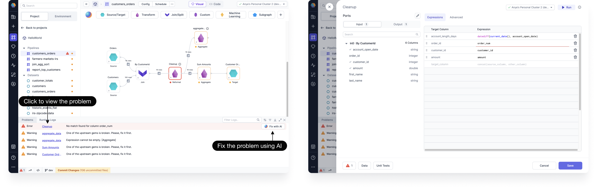
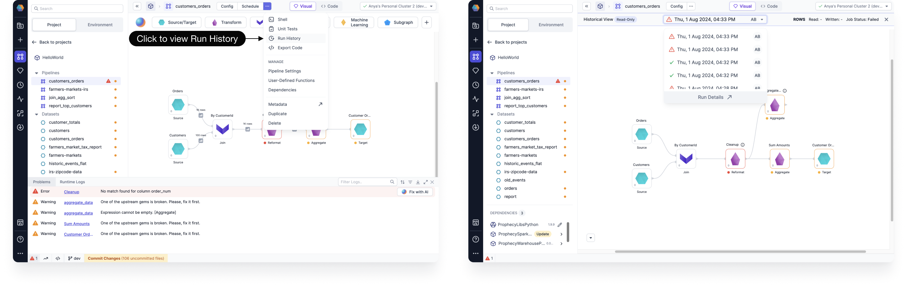
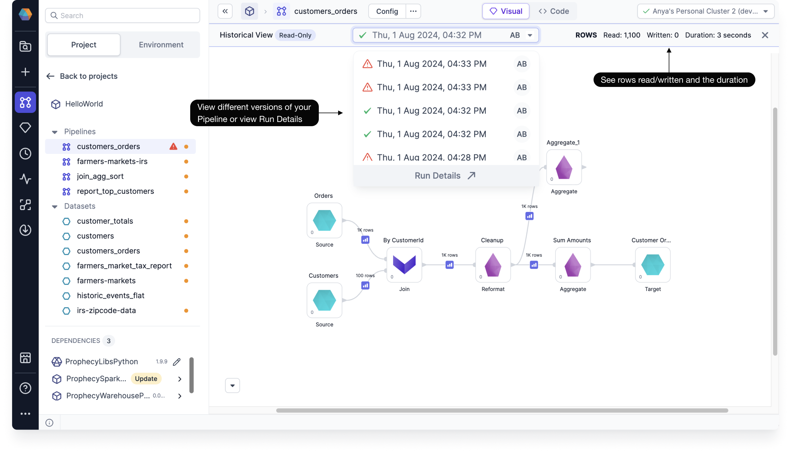

You can use Pipeline Monitoring to help identify errors and failures at runtime. You can identify the cause of the failures, fix them with recommended solutions, and rerun failed or skipped tasks.

## Detect and monitor failures

After your scheduled or ad-hoc run, you can view detected failures on your pipeline. Gems with an error or warning are highlighted on the Visual canvas.

- Hover over the gem to see failure details, such as run duration and the exception.

- You can click **Open Logs** to open the Runtime Logs of that gem.

From the Runtime Logs panel, you can see other logs of the current run, including those that have succeeded. You can filter or sort the logs, and adjust the view.

- Click **More details** to see the entire exception details.

## Troubleshoot and fix problems

From the Runtime Logs panel, you can swap the tabs by clicking **Problems**. The Problems tab shows you a compilation of Warnings and Errors, where they can be found, and brief descriptions of each.

- Click the name to view the problem. A side panel will open, taking you to the error location.
- Or you can click **Fix with AI** to use a recommended solution made by Spark Copilot. And then try rerunning your task.

## View historical runs

You can see a complete history with logs and other debugging details for all of your scheduled and ad-hoc runs.

- To view historical runs, select **Run History**.

This will take you to the Historical View of your pipeline in your particular Fabric.

:::note

It may take a moment to load the Historical View since Prophecy is using your cluster to fetch the historical run information from your table.

:::

- You can view different versions of your pipeline from the dropdown, or go back to view the Run Details.

Successful runs are labeled with a :heavy_check_mark:, while failed runs are labeled with a :warning:.

- You can see the number of rows read and written at the top right.

