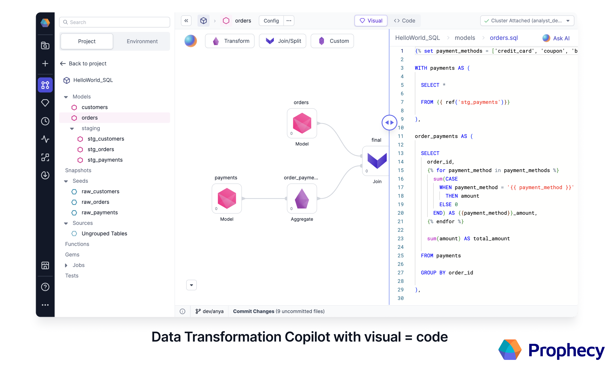

Prophecy Data Transformation Copilot for SQL combines the best of both worlds; **high-quality code** based on software engineering best practices with a complete, **easy-to-use visual** environment.

## Visual = Code for easy collaboration

Visual = Code allows both SQL coders and business users to easily collaborate on the same project. Business users can visually create their data models, with all their work automatically turning into high-quality code on Git. Engineers can use SQL and advanced macros through a code-based editor. Prophecy parses their code and visualizes it on an editable canvas and ensures both views remain in sync at all times.

## Interactive development

At any step of the process, data users can interactively run their models to make sure they're going in the right direction. Models can be additionally tested to ensure robustness over time. Power users can also extend the visual canvas through custom Gems; making even the most complex logic easily accessible in the visual view.

## Deployment from code on Git

Projects built through Prophecy are stored in the dbt Core format as repositories on Git, which allows data teams to follow best software engineering practices like CI/CD.

Maintenance is simple since Prophecy gems turn into code on Git that’s always up-to-date with the latest version of the warehouse or lakehouse used. And, to ensure the best performance at all times, Prophecy is smart about which code construct (subquery or CTE) to use.

## Sharing of Projects as Packages

Data users can import an existing dbt Core project or start from scratch. They can publish those projects to other teams or subscribe to already existing ones. Projects published as packages contain models, functions and Gems allowing for code reusability at every level.

## Learn more

A word from Prophecy's co-Founder, Maciej! See how Prophecy allows every team, whether visual or code developers, to use the same software development best practices.

<iframe src="https://fast.wistia.net/embed/iframe/3i9g2dciah?seo=false?videoFoam=true" title="Design a Pipeline Video" allow="autoplay; fullscreen" allowtransparency="true" frameborder="0" scrolling="no" class="wistia_embed" name="wistia_embed" msallowfullscreen width="100%" height="100%"></iframe>

### Get started

Get started with Copilot for SQL by following this guide for [Databricks](/docs/getting-started/getting-started-with-low-code-sql.md) or [Snowflake.](/docs/getting-started/getting-started-sql-snowflake.md)
