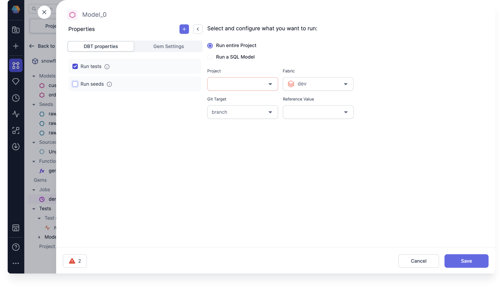

Model and column data tests are dbt macro generated tests that can be parametrized and applied to a given model or any number of columns. These tests are called generic data tests, and are based on the following [dbt generic test types](https://docs.getdbt.com/docs/build/data-tests#generic-data-tests).

- Model-level tests: Can span across many columns for a given model, or even multiple models, and are defined at a model level
- Column-level tests: Are defined on a column level of each model

:::note

There could be many tests within a project. Each test is checking a table created by your choice of input models, data sources, and transformation Gems.

:::

For each model, you can create a macro-based test definition to use as a model test.

For each column within a model, you can define out-of-the box supported dbt Simple data tests.

- Unique: Asserts that each value within a column is unique
- Not null: Asserts that each value within a column is not null
- Accepted values: Asserts that column contains values present within a pre-defined set of values
- Relationships: Asserts that column contains values present within another column

You can also use generic tests defined within the project or those defined within dependency packages.

## Set up a test

Depending on the type of test, you can set up a new model or column test from either the Tests section of the project tab or the Data Tests tab of the Target Model.

### Develop a test

You can create a new data test definition to use in your model or column test. You can also skip creating a data test definition, and use one of the Simple data tests previously mentioned.

To develop a model or column test, start by opening a project:

Add New Test, see four out of box tests
For unique
Can select columns in the modal
Ids should be unique
Create Test definitions in the left have side
They appear in the Data Test Type dropdown in the Target Model
under the current project name
Dependencies
also dependencies, such as github_dbt_base dependency

1. Under the Project Browser, click **Add Test definition**. You can also click **+ New Data Test Type** from the Target Model Data Tests tab.

   

2. Enter your **Test Name**. Project tests are saved to a tests SQL file in the Git directory by default.

3. Click **OK** to create your new test.

4. Create your test model by dragging and dropping Gems to your visual canvas. Connect them to your Data Test. You can also write your test on the Code view. You can use as many models and other database objects as you’d like in your test.

   

On Schema tab
Update for data mismatch
If something changed like a reformat Gem
If column isn’t there anymore, then the test will delete
If updating schema then could affect data test

### Run a test

After you’ve developed your project test and executed all of your models, you can run the test.

1. Click the **Play** button on either the canvas or an individual Gem to execute your test. The table input to the data test Gem is what’s tested.

   1. Run a whole test. Clicking the canvas **Play** button executes the complete test and shows the interim data after the Data Test Gem. Additionally, it displays the final test status, succeeded, warning, or failed, in a summary.

   2. Run a partial test. Clicking the Gem **Play** button executes the test SQL up to a particular Gem, and displays that Gem’s data on the output. This option doesn’t execute the data test.

2. Click **See Run Details** to view the test Summary. Depending on the outcome of the test, the icon displays a different color.

   

   You can click to expand the test logs in the Summary to view the dbt logs.

In addition to the previous relational integrity test, you can create tests to check that the total payment amount from customers is positive or simply check that all of your tables are still accessible. You can test any series of transformation Gems, because a project test simply asserts that the resulting table meets a certain criteria.

## Fix a failed test

If your project test fails, check your test model for any changes.

See Store Failures

- Click the test output to see your failed rows.

Some examples of test failure causes include:

- Happy path: There is now a row in the table → you have detected the thing you were trying to detect!
- The table no longer exists since one or more input data sources were deleted or inaccessible
- The Failure Calculation function is invalid
- The Error If and Warn If conditions are invalid

:::note

Make sure you have write permission to create a new table in your data warehouse, otherwise you may run into errors while trying to run your own tests.

:::

By default, project tests are configured to fail if the table has one or more rows. You can also modify the passing condition of your test through advanced options.

## Configure a test

You can configure your own passing condition of your project test to help decide which cases to focus on.

You might need to pay more attention as the number of rows in a table increases. For example, you might have a customer churn use case where many customers have a few comments (represented by rows in a table), but you need to change course when the number of customer comments exceeds a threshold of five comments. Configuring your test can help you identify and take action, such as assigning more resources to assist that customer.

To configure a test, follow these steps:

Filter conditions
Filter for what your tests to run on
toggle on and add a filter condition expression
Severity
Warn over fail
fail*calc for how many rows fail for error, otherwise just warn
set "fail_calc" property to fx count anglebrackets* +, which counts all of the rows which are failing
set Error If fx count anglebrackets\_ + greater than anglebrackets20
set Warn If to fx count anglebrackets\* + not equals anglebrackets0
Store Failures
The data values that fail will be stored
if true, saves all records that failed the test. failures are saved in a new table with the name of the test.
Connected to a cluster with uses a schema named dbt_test\_\_audit, with table created with model and test name
Failed columns, types
Set max no of failures
When working with huge table with millions of rows, and only care if fails or not, so set threshold. limit the output to 100

1. Click on the test to open the test details.

   

2. Enter conditional values for the following options:

   

   

   - **(A)** **Failure Calculation** - Sets the failure condition used to run against the test result. You can use the `count()` function on a column or multiple columns.
   - **(B)** **Limit**- Sets the maximum number of failures returned by a test query. You can set the limit to save resources and time by having the test stop its query as soon as it encounters a certain number of failed rows.
   - **(C)** **Severity** - Determines whether the failure of the test returns an error or warning. The severity operates from the highest priority selection, error, to the lowest, warning. So if you select error, then the test first checks for errors. If it doesn’t find any, then it then checks for warnings. If you select warning, then the test only checks for warnings. If you don’t select a severity, then error is chosen by default.
   - **(D)** **Error If** and **(E)** **Warning If** - Sets the number of failed rows to determine a failed test. Depending on the selected severity, your test only returns a failed test for error checks. Warning won’t return a failed test.

3. Click **Save**.

## Schedule a test

When scheduling your project, you can opt in to run a test along with the project or model. Scheduling a test allows you to ensure on a daily basis that your data is correct. You can only schedule a test with a project or model. You cannot schedule one individually.

To Schedule your project to run with tests, follow these steps:

Create a Job
Runs all tests for the project or if you choose model

1. Under the Project Browser, click **Add Job**.

   

2. Drag a Model Gem to your visual canvas.

3. Click the Model to open the Model Properties.

4. Select the database object you want to run the test on. You can schedule the entire project or just a single Model:

   - Run entire Project
   - Run a SQL Model

   

5. Select **Run tests**.

6. Check that your **Project, model**, and **Fabric** are correct.

7. Click **Save**. The Job runs automatically. You can see the Job status by clicking **Detail**.
