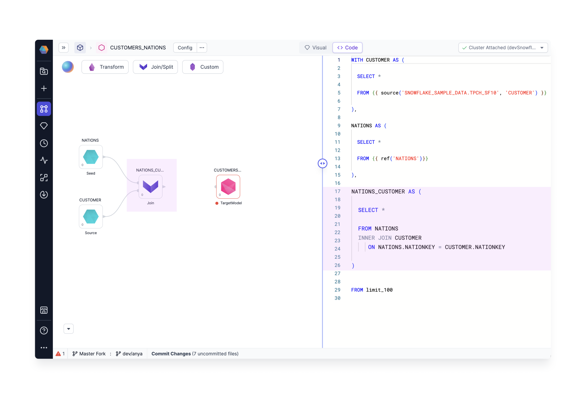

aa

## Code view

The visual developers will appreciate the drag-n-drop canvas, but sometimes it's also nice to view the code. Already Prophecy creates highly performant code behind the scenes. Just click the **Code View** to reveal the SQL queries we've generated using our visual design editor. Each Gem is represented by a CTE or subquery. For example, the Join Gem `NATIONS_CUSTOMERS` is highlighted in both visual and code views.

You may wish to edit the code view - give it a try! Add a SQL statement in the code view and notice the visual editor displays the updated code. For example, we've added a limit statement in the code view, and a new limit Gem appears in the visual view.

<iframe src="https://fast.wistia.net/embed/iframe/gpb6yu0bxv?videoFoam=true" title="Edit Code Video" allow="autoplay; fullscreen" allowtransparency="true" frameborder="0" scrolling="no" class="wistia_embed" name="wistia_embed" msallowfullscreen width="100%" height="100%"></iframe>

Prophecy low-code SQL combines the the best of both worlds: high-quality code based on software engineering best practices with a complete, easy-to-use visual environment.

Visual = Code for easy collaboration
Visual = Code allows both SQL coders and business users to easily collaborate on the same project. Business users can visually create their data models, with all their work automatically turning into high-quality code on Git. Engineers can use SQL and advanced macros through a code-based editor, with Prophecy parses their code and visualizes it on an editable canvas and ensuring both views remain in sync at all times.
Interactive development
At any step of the process, data users can interactively run their models to make sure they're going in the right direction. Models can be additionally tested to ensure robustness over-time. Power users can also extend the visual canvas through custom gems; making even the most complex logic easily accessible in the visual view.
Deployment from code on Git
Projects built through Prophecy are stored in the dbt Core format as repositories on Git, which allows data teams to follow best software engineering practices like CI/CD.
Maintenance is simple since Prophecy gems turn into code on Git that’s always up-to-date with the latest version of the warehouse or lakehouse used. And, to ensure the best perform

Code within Gems
Can modify on the code level after building of the Gems
