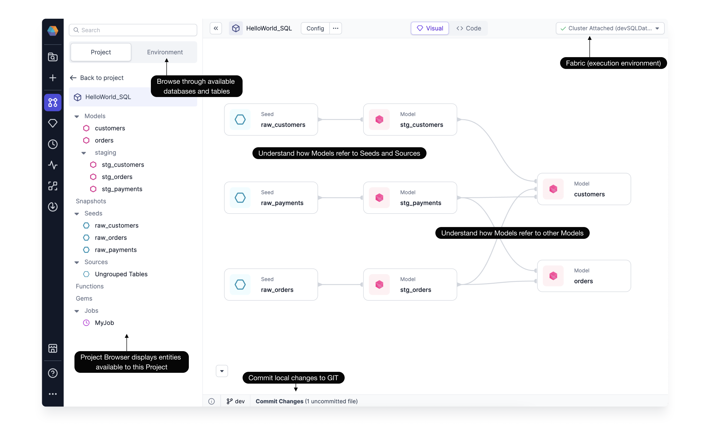
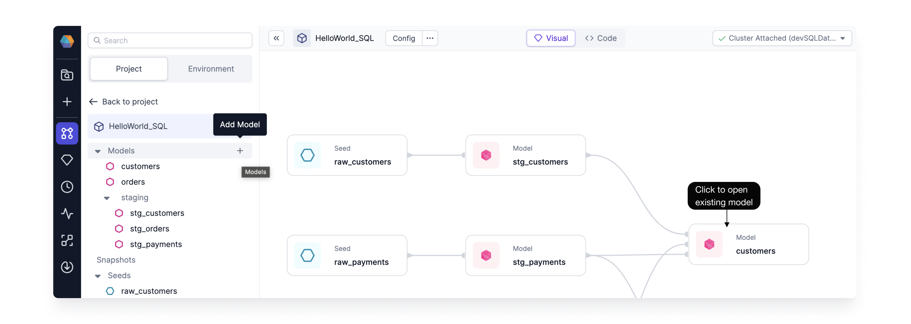
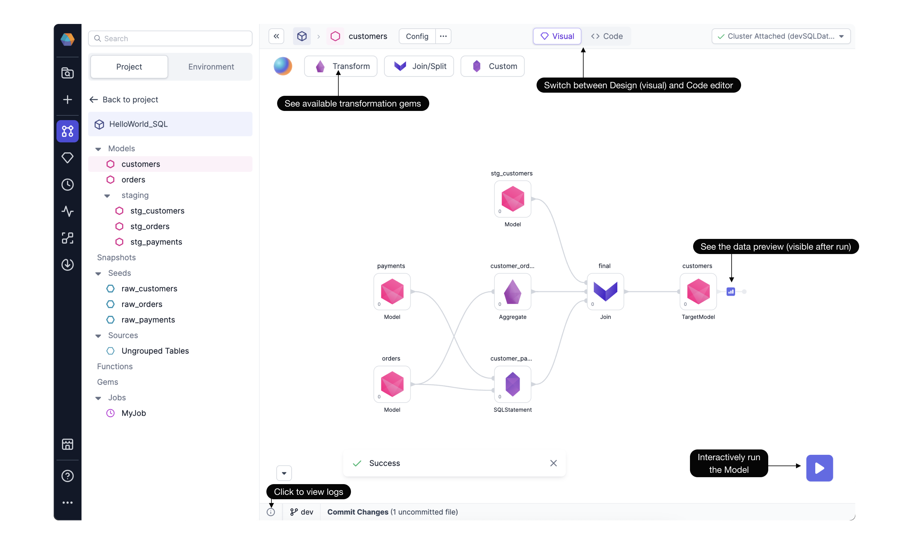
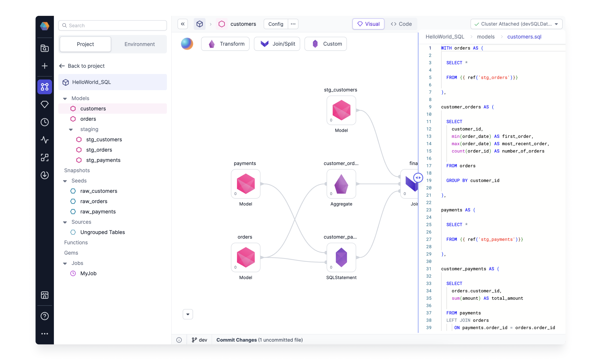

Develop SQL Projects efficiently with Prophecy's Low-code canvas.

## Low-code Canvas

The low-code canvas is the main place to develop data models.
Open any SQL Project in Prophecy to find the complete end-to-end **Project Lineage**. The Project Lineage provides a quick understanding of how Models refer to other Models, Seeds, or Sources. This quick, high-level project overview is explainable without having to read code.

The Project Browser displays entities available or used within this Project. Just click the Environment tab to browse through available databases and tables. Each Project connects to a Fabric, or execution environment. This Fabric defines the SQL Warehouse where each Model will materialize a single table or view. There are lots of additional features to learn more about, including configurations and committing code to Git. A single Project page contains lots of capabilities!

From here easily create new models by clicking on the "+" next to the Models pane, or edit existing Models.

Once a Model is open, the model-editing canvas appears.

Here we can see the `customers` Model starts with three existing Models. The data is transformed according to Aggregate, SQLStatement, and Join Gems. The available Transformation Gems are available by clicking the dropdown menu. As the Model is being developed, iteratively run and see sample data as well as the relevant logs.

## Code = Visual

Prophecy Low-code SQL features two editors:

1. **Visual Editor** - enables data practitioners to easily see and modify the data model definitions in a graphical way. The visual graph is perfect to quickly grasp the purpose and inner workings of the existing models. It’s also a great way to develop brand new models with step-by-step [interactive execution](./interactive-development/data-explorer.md). All models developed through the visual interface will be written in a highly standardized format.

2. **Code Editor** - enables the users already familiar with SQL to optimize and understand their queries in-depth. New data practitioners can also learn best practices as they develop their models by sneak-peaking into the code editor in real-time.

No matter which editor you prefer, Prophecy features a Code = Visual interface that allows teams to collaborate on both interfaces at the same time. Any changes made in the Visual Editor generate high-quality code on Git. And, any changes in the Code Editor can be visualized back as a visual graph.

**Do I have to save my work progress?**

No! Prophecy automatically saves your work as you develop in a working directory securely stored on the cloud. Just make sure to commit your changes every once in a while, to see your code reflected on your Git and to collaborate easier with your team.

**Are all SQL and dbt constructs supported?**

Vast majority of dbt and SQL constructs are supported within the Prophecy Visual editor. However, if something is not yet supported, don’t worry!

- **For SQL** - Prophecy automatically maps unsupported SQL statements to a generic SQL Gem, allowing you to still freely edit even unsupported code.
- **For dbt** - Features in dbt-core that may lack their visual-editor alternatives still work as expected from the standard dbt cli. Prophecy will never modify your existing codebase in unsupported ways.

## Hands-on

To get started developing SQL models, check out the pages below or try the getting-started [guide](/docs/getting-started/getting-started-with-low-code-sql.md).

1. [**Models**](./models.md) - All the steps needed to define a table or view.

2. [**Gems**](./gems/gems.md) - The individual steps, or transformations, to define a table or view.

As you're building your Model by adding individual Gems, see how the process is going by interactively running the model. Explore the [Interactive Development](./interactive-development/data-explorer.md) page to learn more.
