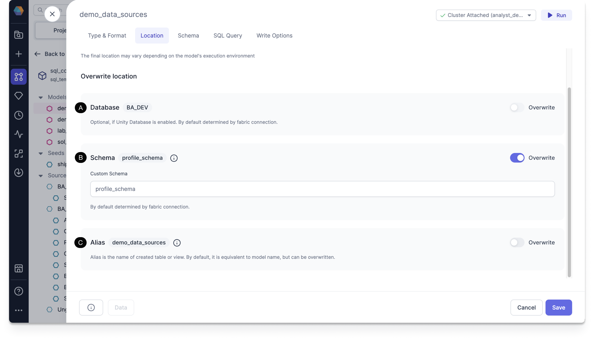

You can use the Location tab to overwrite the Database, Schema, or Alias of your Target Model.

The full location of a table, view, and other objects consists of a database, schema, and alias. dbt allows its users to overwrite any of those parts of the location, with a combination of macros and additional project, folder, and model-level configurations. This tab simplifies those dbt object location parts.

## Overwrite location

Prophecy introduces it’s macro to overwrite the schema behavior to allow users to define it from scratch.

You can select how you want to store the table, choosing the location by overwriting the properties. The defaults are automatically provided for you.

- **Location**: The final location may vary depending on the model's execution environment.

Toggle **Overwrite** for any of the following location to add your own overwrite macro:

- **Database**: Optional, if Unity Database is enabled. By default, it is determined by Fabric connection. You can overwrite it.
- **Schema**: The default schema is determined by the Fabric connection. You can overwrite it.
- **Alias** - Alias is the name of created table or view. By default, it is equivalent to model name, but can be overwritten.

