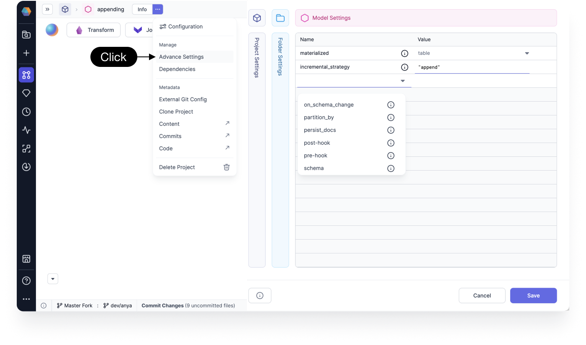

The Target Model Gem has different tabs that help you set advanced options and make it easy for you define how you want to materialize your data using write formats. You can see the UI and capabilities by opening the Target Model in your SQL projects.

These simplified options allow you to use dbt Core™ properties without the need to have any dbt knowledge.

## Target Model tabs

The tabs within the Target Model include the following:

- **[Type & Format](type-and-format.md)**: Update the format of the model between different types of materializations
- **[Location](location.md)**: Update the location by overwriting the Database, Schema, or Alias
- **[Schema](schema.md)**: Make schema changes
- **[SQL Query](sql-query.md)**: View and enable your custom SQL query
- **[Write Options](write-options.md)**: Use Write Modes such as Overwrite, Append, and Merge

## dbt advance settings

You can find advance settings are available for defining model write formats and other DBT options. These include all dbt native settings, traditionally accessible from the yaml file.

If you're familiar with dbt, then you can navigate to and update the advance settings.

- Click **...** > **Advance Settings**. The advance setting dialog opens.

The object properties describe everything from physical locations, materialization logic, business metadata, and access control definitions.

### dbt properties mapping

The following table maps all of the dbt properties for Databricks and Snowflake to the tabs of Prophecy’s Target Model:

| dbt property name      | Provider         | Target Model tab |
| ---------------------- | ---------------- | ---------------- |
| file_format            | Databricks       | Type & Format    |
| alias                  | All              | Location         |
| database               | All              | Location         |
| location_root          | Databricks       | Location         |
| contract               | All              | Schema           |
| enabled                | All              | Schema           |
| schema                 | All              | Schema           |
| tags                   | All              | Schema           |
| cluster_by             | Snowflake        | Schema           |
| partition_by           | Snowflake        | Schema           |
| clustered_by           | Databricks       | Schema           |
| buckets                | Databricks       | Schema           |
| transient              | Snowflake        | Schema           |
| query_tag              | Snowflake        | Schema           |
| automatic_clustering   | Snowflake        | Schema           |
| snowflake_warehouse    | Snowflake        | Schema           |
| copy_grants            | Snowflake        | Schema           |
| secure                 | Snowflake        | Schema           |
| target_lag             | Snowflake        | Schema           |
| docs                   | All              | Schema           |
| group                  | All              | Schema           |
| meta                   | All              | Schema           |
| persist_docs           | All              | Schema           |
| full_refresh           | All              | Write Options    |
| incremental_predicates | All              | Write Options    |
| incremental_strategy   | All              | Write Options    |
| materialized           | All              | Write Options    |
| on_schema_change       | All              | Write Options    |
| merge_exclude_columns  | Snowflake, Spark | Write Options    |
| merge_update_columns   | Snowflake, Spark | Write Options    |

## What's next

To continue configuring your Target Model, see the following pages:

- [Type & Format](type-and-format.md)
- [Location](location.md)
- [Schema](schema.md)
- [SQL Query](sql-query.md)
- [Write Options](write-options.md)
