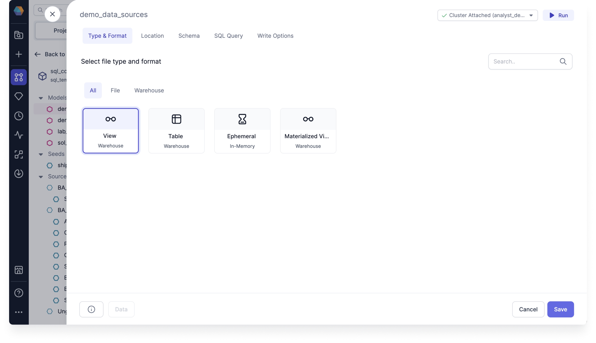

You can use the Type & format tab to update the format of the model between different types of materializations. This determines the underlying physical format of your Target Model.

You can select the type of data you want to write from. The Warehouse represents all warehouse native and optimized data formats.

## Materialization types

The model materialization types include the following:

- **View**: View models are rebuilt as a view on each run. Views on top of source data will always have the latest records in them, but no additional data is stored. So it's simply a query based on other tables. Use the view materialization type for models that do not do significant transformations. This is the default type.
- **Table**: Table models are rebuilt as a table on each run. Tables are fast to query but can take a long time to rebuild. Use the table materialization type for any models being queried by BI tools. To apply a write mode to your Target Model, you must set use Table.
- **Ephemeral**: Ephemeral models are not directly built into the database. Instead, the model code is inserted from an ephemeral model into its dependent models using a common table expression (CTE). Use the ephemeral materialization type for undemanding transformations that are early on in your DAG.
- **Materialized View**: Materialized View models are a combination of a view and a table. They serve use cases similar to incremental models. A Materialized View model allows for the creation and maintenance of a materialized view in the target database Warehouse type.

  
