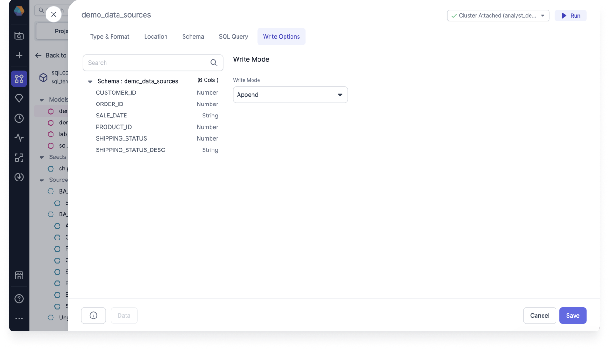
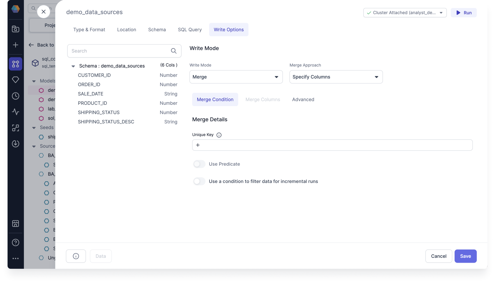
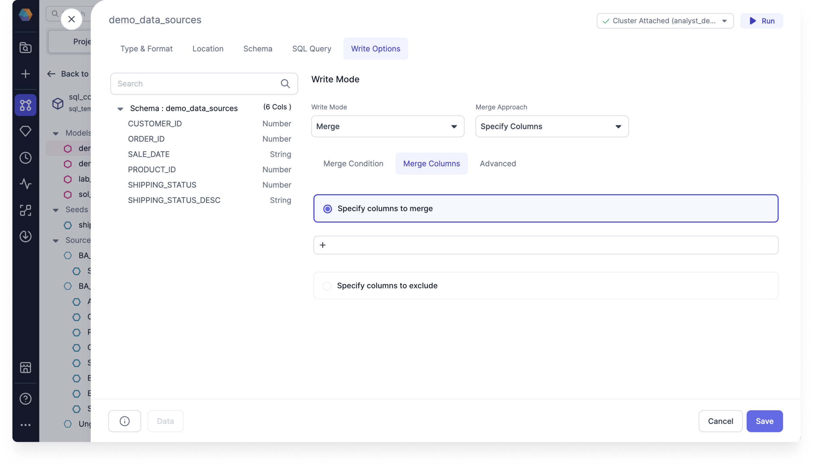
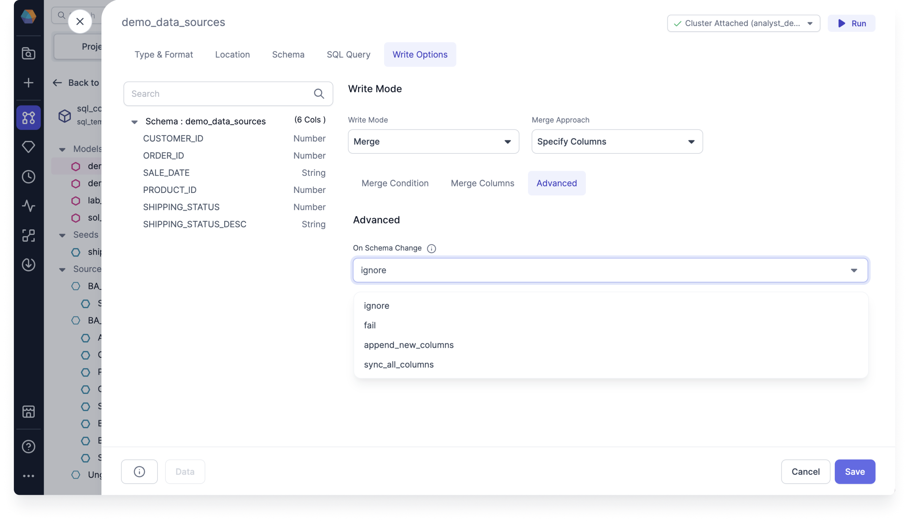
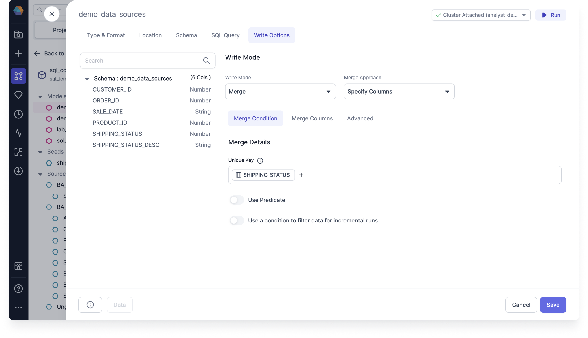
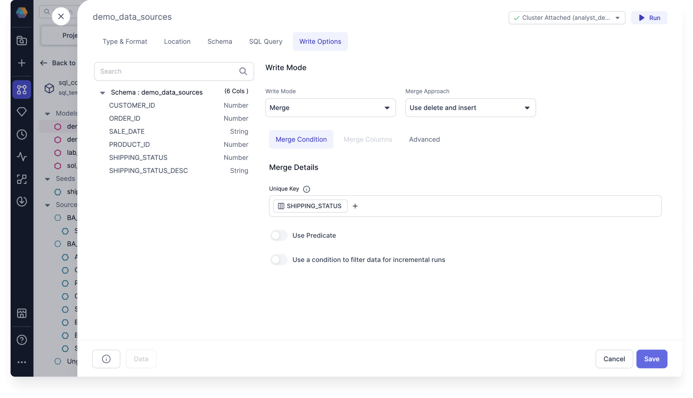
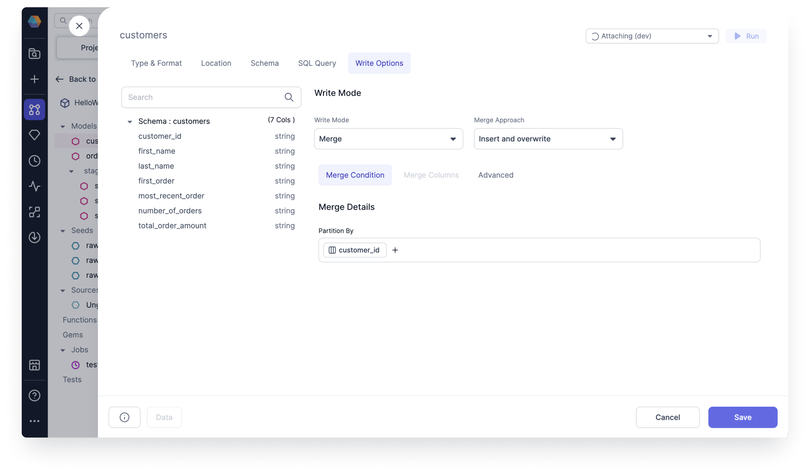

You can use Write Modes such as Overwrite, Append, and Merge to materialize your data. The Write Options tab within your Target Model Gem guides you through building different merge approaches, such as historical data changes with SCD 2, which use incremental materialization strategy.

Target Models are considered incremental models, which use a materialization strategy to update your data warehouse tables by loading and transforming just the changed data since the last run. Incremental models avoid processing your entire Dataset, which allows them to update only the new rows. This greatly reduces the time and resources you need to dedicate for your data transformations.

## Write Modes

You can overwrite the target data entirely, append to existing target data, or merge to address slowly changing dimension scenarios.

- To select write modes, you must set the Target Model [Type & Format](type-and-format.md) to **Table**.

Once you've selected your write mode, you'll see in the Code view that the table is stored as a `"materialized": "incremental"` table, with `"incremental_strategy:` set to whichever write mode and merge approach you choose.

The following table shows which write modes and approaches are available for which provider.

| Provider   | Overwrite               | Append                  | Merge - Specify Columns | Merge - SCD 2           | Merge - Use delete and insert | Merge - Insert and overwrite |
| ---------- | ----------------------- | ----------------------- | ----------------------- | ----------------------- | ----------------------------- | ---------------------------- |
| Databricks |  |  |  |  |       |       |
| Snowflake  |  |  |  |  |        |      |

### Overwrite

You can use overwrite to clear existing data and replace it with new data on each run. It's good for staging and intermediate tables, but not for final tables. It's the default write mode for all types and formats.

- Clear existing data and replace with new data
- Overwrite the entire table

Use overwrite if you don’t need to keep any historical data. When the write mode overwrites the table, the schema has to match, unless you also overwrite the schema.

For example, imagine you have a `CUSTOMERS` table where you're storing phone numbers and addresses. You can use overwrite to replace that data whenever your customers change phone carriers or move to a new address so that you have the most update-to-date data.

To use Overwrite, follow these steps:

1. Open your Target Model and navigate to the **Write Options** tab.
2. For the **Write Mode**, select **Overwrite**.
3. Click **Save**.
4. Run the Target Model and check that the write mode returns data properly.

Overwrite will clear all existing data, and replace it with new data on every run. This is often the right approach for staging and intermediate tables, but it's rarely what you'd want for final tables.

### Append

You can use append to add new rows to the table on each run. It's suitable if the table lacks a unique key. Otherwise, use merge to ensure unique keys.

- Add new rows to the table

Use append when you aren’t concerned with duplicated records. This strategy cannot update, overwrite, or delete existing data, so it's likely to insert duplicate records for many data sources.

For example, imagine you have a `CUSTOMERS` table, where you allow your customers to sign up using alternative accounts. In that case, you want to simply add new rows for new or returning customers. Append will add new rows for them without modifying any of the existing data.

To use Append, follow these steps:

1. Open your Target Model and navigate to the **Write Options** tab.
2. For the **Write Mode**, select **Append**.
3. Click **Save**.
4. Run the Target Model and check that the write mode returns data properly.

Append adds all new rows to the table. If your target table doesn't have a unique key, this approach can be fine. However, if you're trying to ensure unique keys, use merge instead.

### Merge

You can use merge to integrate new data by updating existing rows and inserting new ones. It ensures data consistency and maintains unique keys in the target table.
If a unique key is specified, it will update old records with values from new records that match on the key column.

If you want to keep historical events and also don’t want duplicates, then use the merge write option for SCD 2 scenario.

There are several merge approaches to choose from in the following sections.

## Merge Approach

The available merge approaches integrate new data to ensure consistency and maintain unique keys. There are four merge approaches to choose from:

- Specify Columns
- SCD 2
- Use delete and insert
- Insert and overwrite

And there are three tabs to configure when working with merge approaches:

- Merge Condition
- Merge Columns
- Advanced

Merge Condition tab

Under **Merge Condition**, you must set the **Merge Details**.

- Set the **(A) Unique Key**. The unique key is used to choose the records to update. If not specified, all rows are appended.
- Optional: Toggle **(B) Use Predicate**. Only processes the rows that match the predicate. Build an expression to use predicate.
- Optional: Toggle **(C) Use a condition to filter data or incremental runs**. Filters columns to only select the rows with the latest records. For example, `ORDER_ID greater than fx max ORDER_ID` only selects rows that are newer than the latest `ORDER_ID` since the last run. Build an expression to use a condition to filter data.

Merge Columns tab

Under **Merge Columns**, you must specify the columns to merge or exclude.

- **(A) Specify columns to merge** by clicking **+**.
- **(B) Specify columns to exclude** by clicking **+**.

If you don’t specify then the merge approach will merge all columns.

Advanced tab

Under **Advanced**, select an option for **On Schema Change**.

:::info
Incremental models can be configured to include an optional `on_schema_change` parameter to enable additional control when incremental model columns change. These options enable dbt to continue running incremental models in the presence of schema changes, resulting in fewer `--full-refresh` scenarios and saving query costs.
:::

The advanced on schema change options include the following:

- **ignore**: Newly added columns will not be written to the model. This is the default option.
- **fail**: Triggers an error message when the source and target schemas diverge.
- **append_new_columns**: Append new columns to the existing table.
- **sync_all_columns**: Adds any new columns to the existing table, and removes any columns that are now missing. Includes data type changes. This option uses the output of the previous Gem.

### Specify Columns

Use Specify Columns to customize the columns you want to include in your data queries. Select, deselect, and reorder columns to tailor your Dataset to your specific needs.

- Select which columns you would like to merge

For example, imagine you have an `ORDERS` table with `ORDER_ID`. If an `ORDER_ID` exists for a given order that is coming in, then you want to update the status while leaving all of the other fields untouched.

With `ORDER_ID` as the unique key, if any new records come in that match an existing `ORDER_ID`, specify columms performs a merge on the `SHIPPING_STATUS`.

To use Specify Columns, follow these steps:

1. Open your Target Model and navigate to the **Write Options** tab.
2. For the **Write Mode**, select **Merge**.
3. For the **Merge Approach**, select **Specify Columns**.
4. Under **Merge Condition**, set the **Unique Key** to `ORDER_ID`.
5. Optional: Toggle to **Use Predicate**.
6. Optional: Toggle to **Use a condition to filter data or incremental runs**.
7. Under **Merge Columns**, specify the `SHIPPING_STATUS` column to merge by clicking **+**.
8. Optional: Specify the columns to exclude by clicking **+**.
9. Under **Advanced**, select an option for **On Schema Change**.
10. Click **Save**.
11. Run the Target Model and check that the merge approach returns data properly.

### SCD 2

You can use SCD 2 to manage historical data changes. Type 2 Slowly Changing Dimensions in data warehouse is one of the most popular dimensions that is used. You can use SCD 2 to manage changes to data over time, essentially tracking changes in dimension records, preserving both current and historical data for later analysis.

- Preserve all changes in the Target Model
- Null is a new, active, and currently valid row

Instead of natively exposing the complexity of dbt snapshots, Prophecy introduces SCD 2 as a model write option.

You can take advantage of Prophecy's visual interface to configure SCD type 2 writes and retain data history. See the following SCD 2 merge example for how it works.

#### SCD 2 merge example

We want to use SCD 2 Slowly Changing Dimensions to enable the historic data tracking of data in our warehouse. To do so, we need to store the different states of the data so that we can later analyze it.

We can use fact and dimension tables to store the different states as the dimension attributes are modified over time. Normally, these modified attributes are overwritten.

For SCD 2, the history of a modified attribute is added as a new row.

For our example, imagine we have an `ORDERS` table where the `SHIPPING_STATUS` field can be overwritten as the order is processed.

Table 1

| ORDER_ID | SHIPPING_STATUS | UPDATED_AT |
| -------- | --------------- | ---------- |
| 1        | pending         | 2024-01-01 |
| 2        | pending         | 2024-01-02 |

In the previous orders table, there are `SHIPPING_STATUS` and `UPDATED_AT` fields that are overwritten as the order is processed. When the status changes, the order goes from "pending" to "shipped", and the date is updated. That same record now looks like the following:

Table 2

| ORDER_ID | SHIPPING_STATUS | UPDATED_AT |
| -------- | --------------- | ---------- |
| 1        | shipped         | 2024-01-02 |
| 2        | pending         | 2024-01-02 |

The order is now in the "shipped" state, but we've lost the information about when the order was last in the "pending" state. If we simply update the record with the new value, we won't see the previous records. In order to analyze how long it took for an order to ship, we therefore need to create a new record with a new `SHIPPING_STATUS`. However, we want the other attributes to remain the same.

Once the query is executed, we have the following tables.

Table 3

There are two options you can choose from to configure how to detect record changes:

- Determine new records by checking timestamp column
- Determine new records by looking for differences in column values

For **Determine new records by checking timestamp column**:

Use Determine new records by checking timestamp columns to verify if the record has been updated by looking for a different timestamp for your data. The merge checks the `UPDATED_AT` column to determine if there is a new record. Here, it sees a new timestamp for `ORDER_ID` "1", which is "2024-01-02", so it sets the new data to be valid from then. It sets the historical data to be valid to "2024-01-02".

| ORDER_ID | SHIPPING_STATUS | UPDATED_AT | valid_from | valid_to   |
| -------- | --------------- | ---------- | ---------- | ---------- |
| 1        | pending         | 2024-01-01 | 2024-01-01 | 2024-01-02 |
| 1        | shipped         | 2024-01-02 | 2024-01-02 | null       |
| 2        | pending         | 2024-01-02 | 2024-01-02 | null       |

For **Determine new records by looking for differences in column values**:

Use Determine new records by looking for differences in column values to verify if the record has been updated by looking for a different value for your data. The merge checks to see if there is a difference between the values of the columns to determine if there is a new record. Here, it sees that the `SHIPPING_STATUS` of `ORDER_ID` "1" has changed from "pending" to "shipped".

| ORDER_ID | SHIPPING_STATUS | valid_from | valid_to   |
| -------- | --------------- | ---------- | ---------- |
| 1        | pending         | 2024-01-01 | 2024-01-02 |
| 1        | shipped         | 2024-01-02 | null       |
| 2        | pending         | 2024-01-02 | null       |

The two additional columns `valid_from` and `valid_to` represent the validity period of the data. If the data doesn't have a date but instead has `null`, then it means that the data is currently valid.

The new historical data helps us understand how values in a row change over time.

#### Use SCD 2

To use SCD 2, follow these steps:

1. Open your Target Model and navigate to the **Write Options** tab.
2. For the **Write Mode**, select **Merge**.
3. For the **Merge Approach**, select **Scd 2**.
4. Under **Merge Details**, set the **Unique Key** to `ORDER_ID`.
5. Optional: Toggle on **Invalidate deleted rows**.
   :::info
   This option finds hard deleted records in the source and sets the dbt_valid_to to the current time, if it no longer exists.
   :::
6. Choose one of the following to configure how to detect record changes.
   1. If you select **Determine new records by checking timestamp column**:
      
      1. Under Updated at, click **Add Column** and select `UPDATED_AT`.
   2. If you select **Determine new records by looking for differences in column values**:
      
      1. Click **+** and select `SHIPPING_STATUS`.
7. Click **Save**.
8. Run the Target Model and check that the merge approach returns data properly.

### Use delete and insert

Use delete and insert to replace outdated data efficiently. It deletes existing records and inserts new ones in a single operation, insuring your Dataset remains up-to-date.

- Delete rows that use the predicate
- Use delete and insert for Snowflake

For example, imagine you have an `ORDERS` table where you want to replace outdated `SHIPPING_STATUS` data.

To use delete and insert, follow these steps:

1. Open your Target Model and navigate to the **Write Options** tab.
2. For the **Write Mode**, select **Merge**.
3. For the **Merge Approach**, select **Use delete and insert**.
4. Under **Merge Condition**, set the **Unique Key** to `SHIPPING_STATUS`.
5. Optional: Toggle to **Use Predicate**.
6. Optional: Toggle to **Use a condition to filter data or incremental runs**.
7. Under **Merge Columns**, there's no need to set the merge columns for incremental strategy delete and insert.
8. Under **Advanced**, select an option for **On Schema Change**.
9. Click **Save**.
10. Run the Target Model and check that the merge approach returns data properly.

### Insert and overwrite

Use insert and overwrite to overwrite existing records and insert new ones in a single operation, insuring your Dataset remains accurate.

- Replace all partitions included in your query
- Use insert and overwrite for Databricks

For example, imagine you have a `CUSTOMERS` table where you want to replace all partitions by `CUSTOMER_ID`.

To use insert and overwrite, follow these steps:

1. Open your Target Model and navigate to the **Write Options** tab.
2. For the **Write Mode**, select **Merge**.
3. For the **Merge Approach**, select **Insert and overwrite**.
4. Under **Merge Condition**, set **Partition By** by selecting `CUSTOMER_ID`.
   :::info
   dbt will run an atomic insert overwrite statement that dynamically replaces all partitions included in your query.
   If no `partition_by` is specified, then the insert and overwrite strategy will atomically replace all contents of the table, overriding all existing data with only the new records. The column schema of the table remains the same.
   :::
5. Under **Merge Columns**, there's no need to set the merge columns for incremental strategy delete and insert.
6. Under **Advanced**, select an option for **On Schema Change**.
7. Click **Save**.
8. Run the Target Model and check that the merge approach returns data properly.
