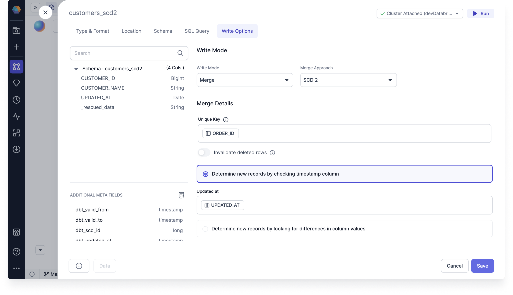
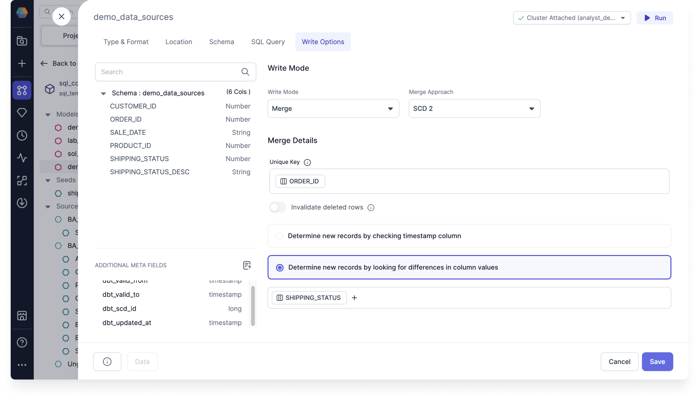

You can use Write Modes such as Overwrite, Append, and Merge to materialize your data. The Write Options tab within your target model Gem guides you through building different merge approaches, such as historical data changes with SCD 2, which use incremental materialization strategy.

Target models are considered incremental models, which use a materialization strategy to update your data warehouse tables by only transforming and loading new or changed data since the last run. Instead of processing your entire Dataset every time, incremental models append or update only the new rows. This significantly reduces the time and resources required for your data transformations.

## Write Modes

You can overwrite the target data entirely, append to existing target data, or merge to address slowly changing dimension scenarios.

- To select write modes, you must set the Target Model Type & Format to **Table**.

Once you've selected your write mode, you'll see in the Code view that the table is stored as a `"materialized": "incremental",` table, with `"incremental_strategy:` set to whichever write mode and merge approach you choose.

The following table shows which write modes and approaches are available for which provider.

| Provider   | Overwrite               | Append                  | Merge - Specify Columns | Merge - SCD 2           | Merge - Use delete and insert | Merge - Insert and overwrite |
| ---------- | ----------------------- | ----------------------- | ----------------------- | ----------------------- | ----------------------------- | ---------------------------- |
| Databricks |  |  |  |  |       |       |
| Snowflake  |  |  |  |  |        |      |

### Overwrite

You can use overwrite to clear existing data and replace it with new data on each run. It's good for staging and intermediate tables, but not for final tables. It's the default write mode for all types and formats.

- Clear existing data and replace with new data
- Overwrite entire table

Use overwrite if you don’t need to keep any historical data. When it overwrites the table, the schema has to match, unless you also overwrite the schema.

Overwrite will clear all existing data, and replace it with new data on every run. This is often the right approach for staging and intermediate tables, but is rarely what you'd want for final tables.

### Append

You can use append to add new rows to the table on each run. It's suitable if the table lacks a unique key. Otherwise, use merge to ensure unique keys.

- Add new rows to the table

Use append when you aren’t concerned with duplicated records. This strategy cannot update, overwrite, or delete existing data, so it's likely to insert duplicate records for many data sources.

Append will add all new rows to the table. If your target table doesn't have a unique key, this approach can be fine. However, if you're trying to ensure unique keys, use merge instead.

### Merge

You can use merge to integrate new data by updating existing rows and inserting new ones. It ensures data consistency and maintains unique keys in the target table.
If a unique key is specified, it will update old records with values from new records that match on the key column.

If you want to keep historical events and also don’t want duplicates, then use the merge write option for SCD 2 scenario.

There are several merge approaches to choose from in the following sections.

## Merge Approach

The available merge approaches integrate new data to ensure consistency and maintain unique keys.

There are three tabs to configure when working with merge approaches:

- Merge Condition
- Merge Columns
- Advanced

Under **Merge Condition**, you must set the **Merge Details**.

- Set the **Unique Key**. The unique key is used to choose the records to update. If not specified, all rows are appended.
- Optional: Toggle **Use Predicate**. Build an expression.
- Optional: Toggle **Use a condition to filter data or incremental runs**. Build an expression.

Under **Merge Columns**, you must specify the columns to merge by clicking **+**. If you don’t specify then the merge approach will merge all columns.

Under **Advanced**, select an option for **On Schema Change**.

:::info
Incremental models can be configured to include an optional `on_schema_change` parameter to enable additional control when incremental model columns change. These options enable dbt to continue running incremental models in the presence of schema changes, resulting in fewer `--full-refresh` scenarios and saving query costs.
:::

- **ignore**: Newly added columns will not be written to the model.
- **fail**: Triggers an error message when the source and target schemas diverge.
- **append_new_columns**: Append new columns to the existing table.
- **sync_all_columns**: Adds any new columns to the existing table, and removes any columns that are now missing. Includes data type changes.

### Specify Columns

Use Specify Columns to customize the columns you want to include in your data queries. Select, deselect, and reorder columns to tailor your Dataset to your specific needs.

- Select which columns you would like to merge

To use Specify Columns, follow these steps:

1. Under **Merge Condition**, set the **Merge Details**.
2. Set the **Unique Key**.
3. Optional: Toggle **Use Predicate**.
4. Optional: Toggle **Use a condition to filter data or incremental runs**.
5. User **Merge Columns**, specify the columns to merge by clicking **+**.
6. Specify the columns to exclude by clicking **+**.
7. Under **Advanced**, select an option for **On Schema Change**:
   1. **ignore**: Newly added columns will not be written to the model.
   2. **fail**: Triggers an error message when the source and target schemas diverge.
   3. **append_new_columns**: Append new columns to the existing table.
   4. **sync_all_columns**: Adds any new columns to the existing table, and removes any columns that are now missing.

### SCD 2

Manage historical data changes with SCD 2. Type 2 Slowly Changing Dimensions in Data warehouse is the most popular dimension that is used in the data warehouse. You can use SCD 2 to manage changes to data over time, essentially tracking changes in dimension records over time, preserving both current and historical data for comprehensive analysis.

- Preserves all changes in target model
  - Additional Meta Fields
- Null is new row
  - And Status is completed

Instead of natively exposing the complexity of dbt snapshots, Prophecy introduces SCD 2 as a model write option.

You can take advantage of Prophecy's visual interface to configure SCD type 2 writes and retain data history. Open the Target Model Gem, select Table format. Just select a unique key and the relevant timestamp column for your data. Now any data practitioner can capture updated records without deleting the previous records.

To use SCD 2, follow these steps:

1. Under **Merge Details**, set the **Unique Key**. The unique key is used to choose the records to update. If not specified, all rows are appended.
2. Optional: Toggle **Invalidate deleted rows**. Finds hard deleted records in the source and sets the dbt_valid_to to current time, if no longer exists.
3. Choose one of the following to configure how to detect record changes.
   1. Select **Determine new records by checking timestamp column**.
      
      1. Under Updated at, click **Add Column**.
   2. Select **Determine new records by looking for differences in column values**.
      
      1. Click **+** to choose a column in Schema.

Updated at timestamp to verify if the row has actually now been updated with new values.

#### SCD 2 merge example

Slowly Changing Dimensions in Data Warehouse is an important concept that is used to enable the historic aspect of data in an analytical system. As you know, the data warehouse is used to analyze historical data, it is essential to store the different states of data.

In data warehousing, we have fact and dimension tables to store the data. Dimensional tables are used to analyze the measures in the fact tables. These dimension attributes are modified over time and in the data warehouse, we need to maintain the history. In operational systems, we may overwrite the modified attributes as we may not need the historical aspects of data.

Since our primary target in data warehousing is to analyze data with the perspective of history, we may not be able to simply overwrite the data and we need to implement special techniques to maintain the history considering analytical and volume aspects of the data warehouse. This implementation is done using Slowly Changing Dimensions in Data Warehouse.

For SCD 2, history is added as a new row.

As we discussed, data warehouse is used for data analysis. If you need to analyze data, you need to accommodate historical aspects of data. Let's see how we can implement SCD Type 2.

Imagine you have an orders table where the SHIPPING_STATUS field can be overwritten as the order is processed.

Table 1

| ORDER_ID | SHIPPING_STATUS | UPDATED_AT |
| -------- | --------------- | ---------- |
| 1        | pending         | 2024-01-01 |
| 2        | pending         | 2024-01-02 |

In the previous orders table, there is a SHIPPING_STATUS field that is overwritten as the order is processed. Imagine that the order goes from "pending" to "shipped". That same record will now look like:

Table 2

| ORDER_ID | SHIPPING_STATUS | UPDATED_AT |
| -------- | --------------- | ---------- |
| 1        | shipped         | 2024-01-02 |
| 2        | pending         | 2024-01-02 |

The order is now in the "shipped" state, but we've lost the information about when the order was last in the "pending" state. As you can see though, if you simply update the record with the new value, you will not see the previous records. In order to analyze how long it took for an order to ship, therefore, a new record will be created with a new SHIPPING_STATUS. However, other attributes will remain the same.

Once the query is executed, the following results will be observed.

Table 3

For **Determine new records by checking timestamp column**:

The merge checks the UPDATED_AT column to determine if there is a new record. Here, it sees a new timestamp for ORDER_ID 1, which is 2024-01-02, so it sets the new data to be valid from then. It sets the historical data to be valid to 2024-01-02.

| ORDER_ID | SHIPPING_STATUS | UPDATED_AT | valid_from | valid_to   |
| -------- | --------------- | ---------- | ---------- | ---------- |
| 1        | pending         | 2024-01-01 | 2024-01-01 | 2024-01-02 |
| 1        | shipped         | 2024-01-02 | 2024-01-02 | null       |
| 2        | pending         | 2024-01-02 | 2024-01-02 | null       |

For **Determine new records by looking for differences in column values**:

The merge checks to see if there is a difference between the values of the columns to determine if there is a new record. Here, it sees that the SHIPPING_STATUS of ORDER_ID 1 has changed.

| ORDER_ID | SHIPPING_STATUS | valid_from | valid_to   |
| -------- | --------------- | ---------- | ---------- |
| 1        | pending         | 2024-01-01 | 2024-01-02 |
| 1        | shipped         | 2024-01-02 | null       |
| 2        | pending         | 2024-01-02 | null       |

The historical data help you understand how values in a row change ove time.

The two additional columns valid_from and valid_to represent the validity period of the data. null means that the data is currently valid.

### Use delete and insert

Use delete and insert to replace outdated data efficiently. It deletes existing records and inserts new ones in a single operation, insuring your Dataset remains up-to-date.

- Deletes rows that use the predicate
- Use delete and insert for Snowflake

To use delete and insert, follow these steps:

1. Under **Merge Condition**, set the **Merge Details**.
2. Set the **Unique Key**.
3. Optional: Toggle **Use Predicate**.
4. Optional: Toggle **Use a condition to filter data or incremental runs**.
5. User **Merge Columns**, specify the columns to merge by clicking **+**. There's no need to set the merge columns for incremental strategy delete and insert.
6. Specify the columns to exclude by clicking **+**.
7. Under **Advanced**, select an option for **On Schema Change**:
   1. **ignore**: Newly added columns will not be written to the model.
   2. **fail**: Triggers an error message when the source and target schemas diverge.
   3. **append_new_columns**: Append new columns to the existing table.
   4. **sync_all_columns**: Adds any new columns to the existing table, and removes any columns that are now missing.

### Insert and overwrite

Use insert and overwrite to overwrite existing records and insert new ones in a single operation, insuring your Dataset remains accurate.

- Replaces all partitions included in your query
- Use insert and overwrite for Databricks

To use insert and overwrite, follow these steps:

1. Under **Merge Condition**, set the **Merge Details**.
2. Set **Partition By**. Select columns in Schema. dbt will run an atomic insert overwrite statement that dynamically replaces all partitions included in your query.
   If no partition_by is specified, then the insert_overwrite strategy will atomically replace all contents of the table, overriding all existing data with only the new records. The column schema of the table remains the same.
3. User **Merge Columns**, specify the columns to merge by clicking **+**. There's no need to set the merge columns for incremental strategy delete and insert.
4. Specify the columns to exclude by clicking **+**.
5. Under **Advanced**, select an option for **On Schema Change**:
   1. **ignore**: Newly added columns will not be written to the model.
   2. **fail**: Triggers an error message when the source and target schemas diverge.
   3. **append_new_columns**: Append new columns to the existing table.
   4. **sync_all_columns**: Adds any new columns to the existing table, and removes any columns that are now missing.
