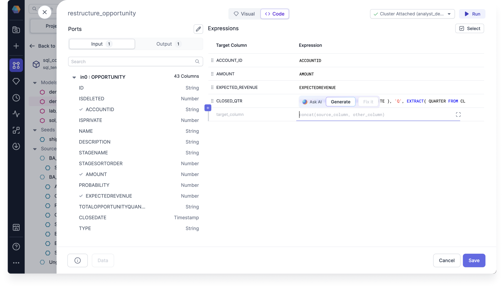

The Expression Builder takes you through building your expressions, following a step-by-step visual guide. You can use the simplified Expression Builder within the following features of Prophecy:

- Data transformation Gems
  - Aggregate
  - Filter
  - Join
  - Reformat
- Data Explorer
  - Filter and Sort Options
- Data Tests

In order to perform complex data analysis tasks, it's important to be able to construct expressions that combine the SQL functions in various ways. Prophecy has now made this easy with support of the Expression Builder. Using the SQL Expression Builder can save you time and effort when constructing complex expressions, and can help you to better understand the relationships between different functions and their arguments.


## Expression components

We support the following expression types and data types.

### Supported expression types

An expression can be build out of the following expression types:

- Static (native to SQL):
  - Column selection - e.g. `customer_id`, `amounts`, `right.customer_id`
  - Hardcoded value (based on the types listed below) - e.g. `15`, `Poland`, `Some longer value`
  - Function call - e.g. `concat(amount, " ", currency)`
  - Case statement - e.g. `WHEN active_flag = True THEN first_name OTHERWISE last_name`
- Dynamic (native to Prophecy - externally provided):
  - Configuration value - e.g. `$currency`
  - Secret value - e.g. `$jdbc_url`

## Supported data types

An expression can use the following data types:

- Basic:
  - Boolean
  - String: String / Varchar
  - Date & time: Date / Datetime / Timestamp / Timestamp NTZ
  - Number: Integer / Long / Short
  - Decimal number: Decimal / Double / Float
- Other (for future versions):
  - Binary
  - Byte
  - Char
  - Calendar interval / Day time interval / Year month interval
  - Null

And we support the following boolean predicates:

- Unary:
  - Exists (In subquery)
  - In
  - Is null
- Binary:
  - Between
  - Equality
  - Less than
  - Then than or equal
  - Greater than
  - Greater than or equal
- Groups:
  - Not
  - And
  - Or

## Expression syntax

As a data user, you'll never again need to remember the right syntax for your expressions. The Expression Builder takes care of the syntax for you as you build your expressions. You can check the syntax of your expressions by viewing the code view of your expression.


## Suggests expressions and functions

As you build your expressions, Data Copilot can suggest expressions and functions to you, including nested and conditional functions.

While viewing the code view of your expression, you can --Ask AI-- to generate your expression using an English text prompt. You can then review the code expression, and test it by running the Model up to and including the Gem with the expression.



## What's next

To continue developing with the Expression Builder, see the following pages:

```mdx-code-block
import DocCardList from '@theme/DocCardList';
import {useCurrentSidebarCategory} from '@docusaurus/theme-common';

<DocCardList items={useCurrentSidebarCategory().items}/>
```
