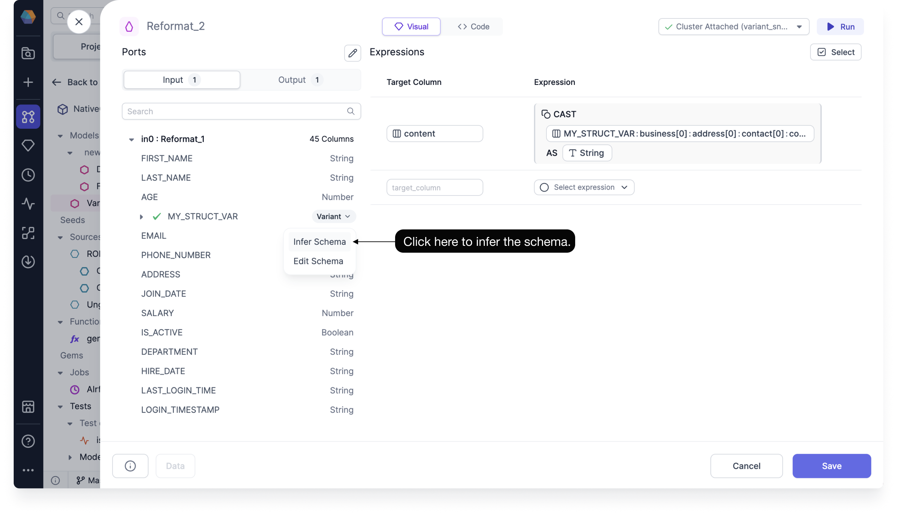
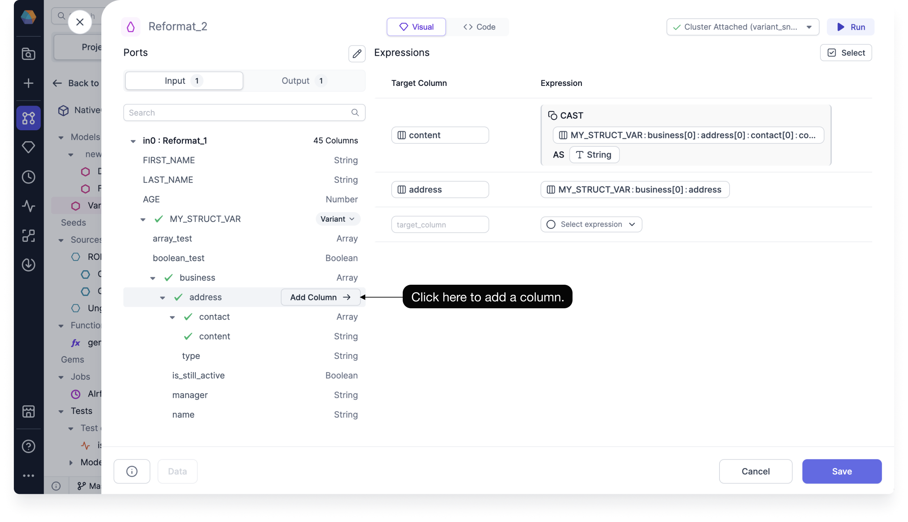
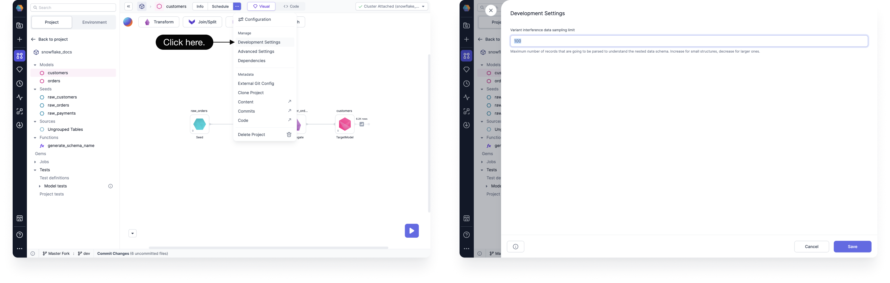

Semi-structured data, commonly stored in JSON and XML formats, is one of the most prevalent data types. These formats are heavily utilized by web applications, making them a significant portion of the data sources that users must work with. However, handling semi-structured data presents a unique set of challenges, adding complexity to an already intricate data transformation process. The primary issue lies in the inconsistency of schemas. Data users often struggle to discern the structure of the data and lack the tools and expertise to manage this data as it evolves and changes over time.

Prophecy empowers all data users, regardless of technical expertise, to build Pipelines that seamlessly process semi-structured data through an intuitive, AI-powered interface. With Prophecy, parsing complex data types such as JSON and XML, understanding their structures, and converting them into flat, structured formats ready for analytics becomes effortless.

Comprehensive support for semi-structured data types in Prophecy Copilot for both Snowflake and Databricks SQL

Using the SQL Visual Expression Builder can save you time and effort when constructing complex expressions, and can help you to better understand the relationships between different functions and their arguments.

Support for semi-structured data like JSON, so columns will have nesting for different data types

## Core features

1. Parse Json/Xml Gem
1. With additional schema input for Databricks users
1. Well-designed variant schema inference
1. Configuration for parsing limit for inferring column structure
1. Ability to pick the nested column inside the expression builder
1. Fallback for picking columns which are not inferred

## Schema and column selector

Building reliable data transformations hinges on correctly understanding schemas. Prophecy now introduces direct support for Variants in the schema selector, addressing a key challenge: unlike standard flat schemas, Variant schemas aren’t stored within the table definition and can vary for each row. To tackle this, Prophecy provides the following functionalities in its column selector:

1. Schema Exploration: Users need to explore sample data to grasp the schema. Prophecy streamlines this process with the introduction of variant schema inference, configurable through global interactive settings.

2. Multi-Type Support: Occasionally, a single key in a Variant may have different value types across various rows. Prophecy addresses this with multi-type support, ensuring accurate data handling.

3. Column Selection: With the schema visually represented, users can easily select columns of interest for their transformations. Prophecy automatically handles the necessary data casting.

Infer nested schema, user need to do first for each variant, so they can see full schema they are working with.

Clicking Edit Schema opens the variant and allows you to manually choose the type of each nested schema.

The provided mockup (refer to Figma) demonstrates a method for inferring nested schemas directly from the schema selector. The only user action required is clicking the infer icon. Behind the scenes, Prophecy initiates a run similar to an interactive run but incorporates an appropriate recursive lateral join. This process samples records to identify all potential iterations of keys and values within the schema.

The inferred schema is cached as part of the previous Gem’s output (within the workflow but not in Git) and remains available whenever the user reopens the Pipeline, Gem, or another Gem connected to the same input port. Users can choose to refresh the schema by simply reinferring it.

## Add column

When adding a column nested within a Variant, the output column name, expression, and data type are automatically generated according to the following rules:

1. Output Column Name: The output column name matches the input field name. If a duplicate exists, the name is prefixed with the next available parent field until it’s unique.

For example, if an output column named name already exists, the new field might be named customers_name.

2. Expression: This represents the full path to the selected field, utilizing existing flattened subpaths.

3. Data Type: The data type is automatically cast to the closest inferred type.

### Default casting

Prophecy automatically adds a cast to any added column from a nested type in the column selector. By default, the column is cast using the standard CAST(x AS y) syntax. In multi-type scenarios, the as\_\* function is used.

Multi-types

In some cases, a path within a Variant may hold different value types across rows. For instance, consider the Dataset on the right-hand side, where each row’s value key contains different types: integer, object, and boolean.

Prophecy supports this scenario by presenting each detected type for a given key, array, or object as a separate item in the column selector. When users press “Add Column,” the column is added to the expressions. Instead of explicit casting (which could cause runtime failures), theas\_\* function is used, returning null if the cast is not possible.

## Variant sampling setting

The development settings menu allows users to customize the maximum number of records to be sampled to understand the Variant schema. This property defines how many records will be parsed to determine the nested data schema. Users can increase this number for smaller structures or decrease it for larger ones. Note that this setting does not rely on the ratio of data since it would require a complete count of data records.

