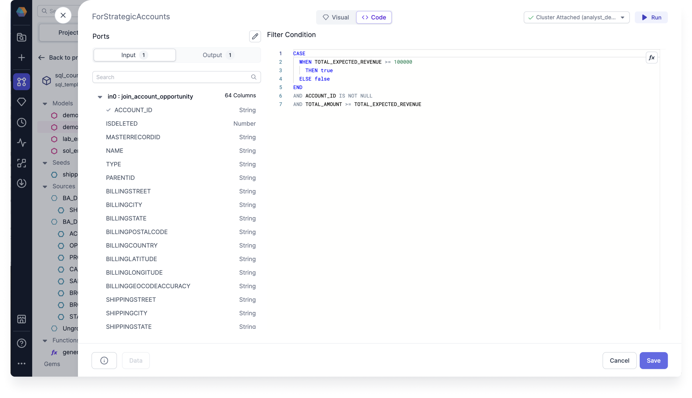

The Visual Expression Builder takes you through building your expressions, following a step-by-step visual guide. You can use the simplified Visual Expression Builder within the following features of Prophecy:

- Data transformation Gems
  - Aggregate
  - Filter
  - Join
  - Reformat
- Data Explorer
  - Filter and Sort Options
- Data Tests

In order to perform complex data analysis tasks, it's important to be able to construct expressions that combine the SQL functions in various ways. Prophecy has now made this easy with support of the Visual Expression Builder. Using the SQL Visual Expression Builder can save you time and effort when constructing complex expressions, and can help you to better understand the relationships between different functions and their arguments.


## Expression syntax

As a data user, you'll never again need to remember the right syntax for your expressions. The Visual Expression Builder takes care of the semantics and syntax for you as you build your expressions. You can check the syntax of your expressions by viewing the code view of your expression.



While you're viewing the code view, you can click **Expand Editor** of any of your expressions to open the [Expression Builder](../../../../Spark/expression-builder.md).

## Suggests expressions and functions

As you build your expressions, Data Copilot can suggest expressions and functions to you, including nested and conditional functions.

While viewing the code view of your expression, you can --Ask AI-- to generate your expression using an English text prompt. You can then review the code expression, and test it by running the Model up to and including the Gem with the expression.


## What's next

To continue developing with the Visual Expression Builder, see the following pages:

```mdx-code-block
import DocCardList from '@theme/DocCardList';
import {useCurrentSidebarCategory} from '@docusaurus/theme-common';

<DocCardList items={useCurrentSidebarCategory().items}/>
```
