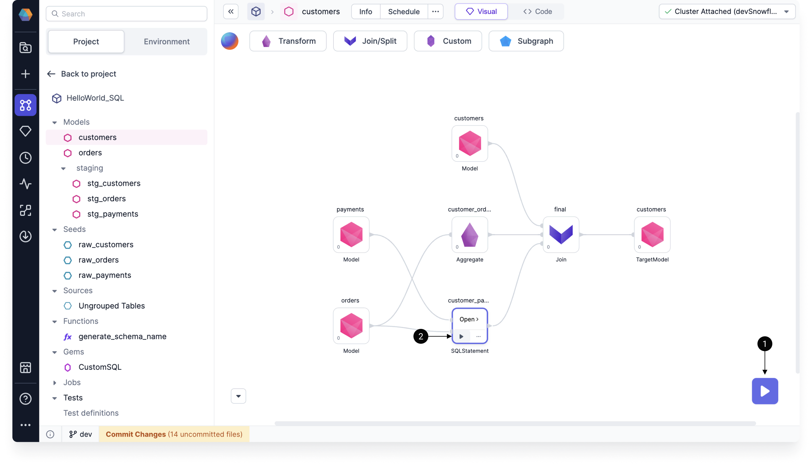

You can leverage Data Copilot for SQL by building your model and adding individual gems, and then check how the process is going by interactively running the model. Use the Data Explorer to dig into your interim data sample, with the ability to sort, filter, and download your sample data.

## Interim data sampling

When you run a model in the model canvas, Prophecy generates **interim** data samples that let you preview the output of your data transformations.

There are two ways to run a model interactively:

- Click the **play** button on the model canvas to run the entire model.
- Click the **play** button on a particular gem to execute the flow **up to and including that gem**. This is useful for testing and debugging when you don't want to run the entire model.



```mdx-code-block
import DocCardList from '@theme/DocCardList';
import {useCurrentSidebarCategory} from '@docusaurus/theme-common';

<DocCardList items={useCurrentSidebarCategory().items}/>
```
