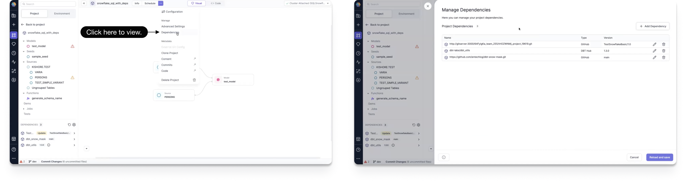
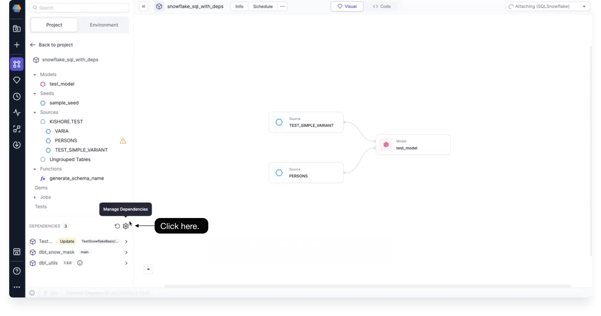
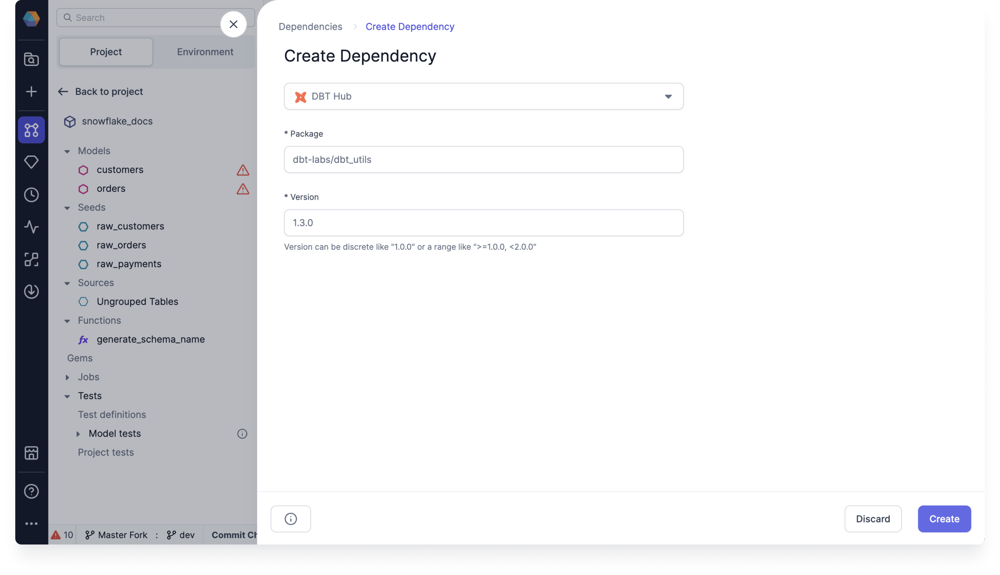
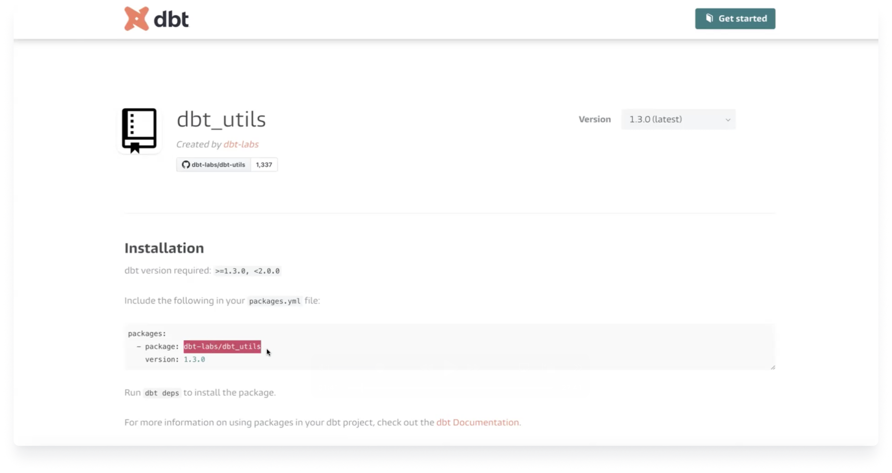
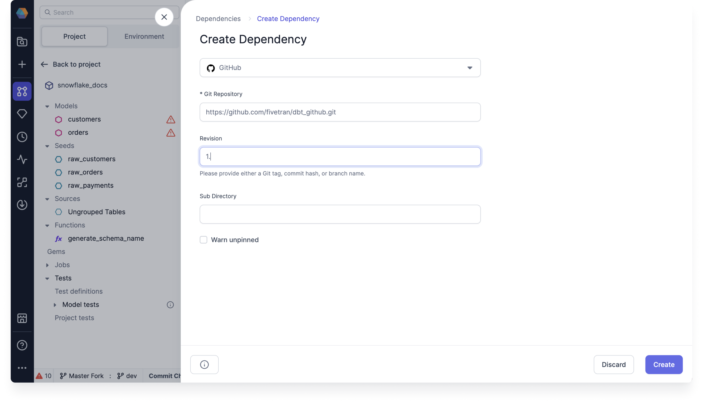
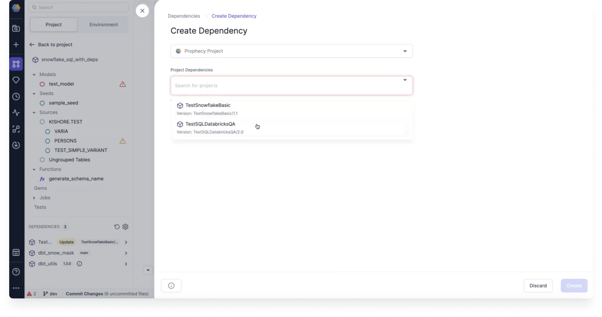
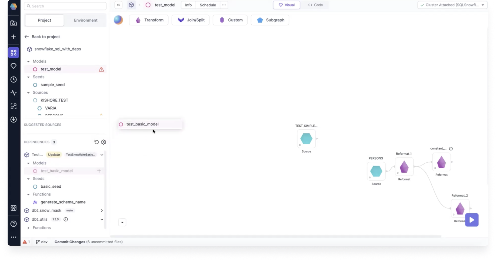

Dependencies allow you to make use of third-party or custom code in your Models and Jobs. You can connect dependencies to your SQL projects, and create them from the DBT Hub, GitHub, or another Prophecy Project.

## View dependencies

To see all of your Project and Model dependencies simply open the Manage Dependencies screen by clicking **... > Dependencies**.

You can also view your dependencies and get to the same Manage Dependencies screen from the bottom left-hand side of the canvas, under **DEPENDENCIES**.

## Add dependency

To add a dependency, first navigate to [Manage Dependencies](#view-dependencies). There you will see a complete list of your dependencies. Click on **+ Add Dependency** to add a new dependency.

You will be taken to the Create Dependency screen, where you can choose to create a dependency from the DBT Hub, GitHub, or another Prophecy Project.

After you've defined the Dependency, click **Create**. Prophecy will validate the dependency and add it to the Project, making it enabled in the current Model, and adding it as a dependency within all of the other Models in the Project.

When adding dependencies, Prophecy validates that the dependency coordinates are valid and accessible. If that fails, you will see an invalid coordinates error.

:::info Invalid coordinates

In rare cases, your dependency might be only accessible to the cluster or the build system but not Prophecy itself. If you're confident that the dependency is correct, but the validation error shows up, it's safe to press **Save Anyways** to ignore that warning.

:::

### Add a DBT dependency

To add a DBT dependency, you must select **DBT Hub** and provide the dbt package and version number.

You can find the DBT package and version number for DBT dependencies from the [dbt Package hub](https://hub.getdbt.com/dbt-labs/). For example, to use the latest `dbt_utils` package, see the [`dbt_utils` package page](https://hub.getdbt.com/dbt-labs/dbt_utils/latest/).

You can copy and paste the information into the Create Dependency fields.

### Add a GitHub dependency

To add a GitHub dependency, you must select **GitHub** and provide the Git Repository, Revision, and Sub Directory.

The Revision must be either a Git tag, commit hash, or branch name.

:::caution

Enable **Warn unpinned** only if you want to point to your GitHub Repository without specifying any version, commit, or branch. Doing so may result in unexpected behavior if there are changes to your latest default branch.

:::

### Add a Prophecy Project dependency

To add another Prophecy Project as a dependency, you must select **Prophecy Project** and select a project from the Project Depedencies dropdown.

:::note

The Prophecy Project must already be released for it to show up in the dropdown.

:::

## Use a dependency

Once you've added a dependency, you can use the following entities from them:

- Models
- Seeds
- Sources
- Functions
- Gems
- Data Tests

Simply drag and drop the entity that you'd like to use from the dependencies section onto your Visual canvas.

## Delete dependency

To delete a dependency, first navigate to the dependencies list on the [Manage Dependencies](#view-dependencies) screen. There you can click on a trash icon next to the dependency that you'd like to delete.

:::caution Deleting a dependency

Deleting a dependency deletes it within the whole Project, and all inheriting Models. If you're not confident about
the functionality of the other Models, it's usually better to disable a dependency, instead of deleting it.

:::

## Storage

All of your dependencies are stored at the Project-level. When adding a dependency to a single Model, by default it becomes available to all the other Models within the same Project.

Prophecy takes care of pulling the dependencies automatically when a Model is run.

Dependencies are saved within your **packages.yml** file.
