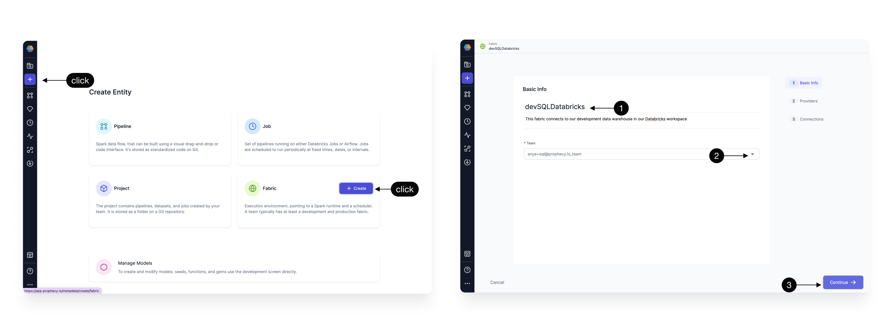
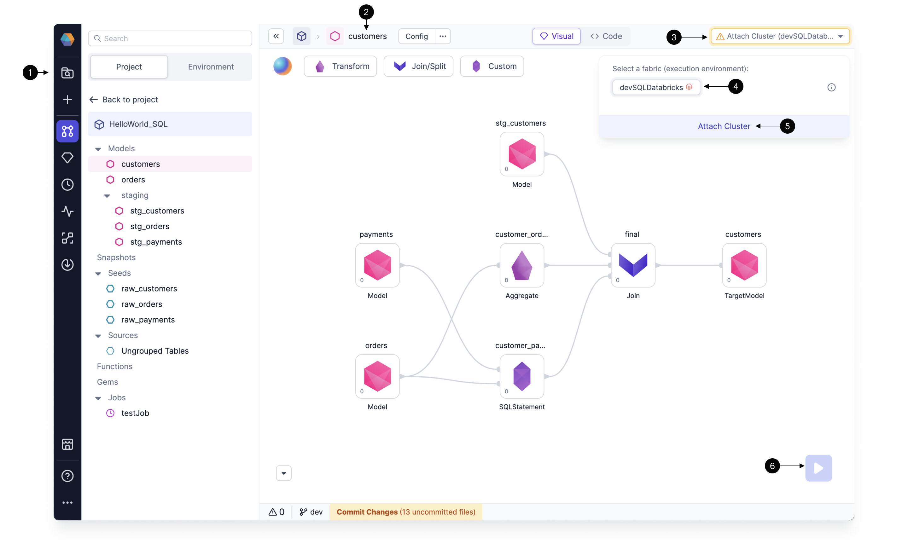

Databricks SQL Warehouse offers seamless integration into the Databricks ecosystem. Follow the steps below to create a Fabric in Prophecy so that you can execute data transformations on your Databricks Warehouse.

## Create a Fabric

Create an entity by clicking the **plus** icon. Click to **Create a Fabric**.
There are three steps to creating a Fabric:

1. [Basic info](./databricks.md#basic-info)
2. [Providers](./databricks.md#provider)
3. [Connections](./databricks.md#connections) (optional)

### Basic Info

Each Fabric requires some **Basic information**

| **Basic Info**                                                                                                                                                                                     |
| -------------------------------------------------------------------------------------------------------------------------------------------------------------------------------------------------- |
| **1 - Title** - Specify a title, like devDatabricks, for your Fabric. “dev” or “prod” are helpful descriptors for this environment setup. Also specify a description (optional).                   |
| **2 - Team** - Select a team to own this Fabric. Click the dropdown to list the teams your user is a member. If you don’t see the desired team, ask a Prophecy Administrator to add you to a team. |
| **3 - Continue** to the Provider step.                                                                                                                                                             |

### Provider

The SQL **provider** is both the storage warehouse and the execution environment where your SQL code will run. Be sure to **Start** the Databricks Warehouse before trying to setup the Fabric.

| **Provider details**                                                                                                                                                                                                                                                                                                            |
| ------------------------------------------------------------------------------------------------------------------------------------------------------------------------------------------------------------------------------------------------------------------------------------------------------------------------------- |
| **1 - Provider Type** - Select SQL as the Provider type. (Alternatively, create a Spark type Fabric using instructions [here](/docs/Spark/fabrics/fabrics.md) or an Airflow type Fabric following these [instructions](/docs/Orchestration/airflow/fabric/fabric.md).)                                                          |
| **2 - Provider** - Click the dropdown menu for the list of supported Provider types. Select Databricks.                                                                                                                                                                                                                         |
| **3 - JDBC URL** - Copy the JDBC URL from the Databricks UI as shown. This is the URL that Prophecy will connect for SQL Warehouse data storage and execution.                                                                                                                                                                  |
| **4 - Personal Databricks Access Token ** - This is the token Prophecy will use to connect to Databricks. Each user will need to apply their own token. To generate a Databricks PAT follow [these instructions](https://docs.databricks.com/en/dev-tools/auth/pat.html#databricks-personal-access-tokens-for-workspace-users). |
| **5 - Catalog** - (Optional) Enter the Catalog name if you are using Unity Catalog                                                                                                                                                                                                                                              |
| **6 - Continue** to the optional Connections step.                                                                                                                                                                                                                                                                              |

### Connections

(Optional) Browsing data catalogs, tables, and schemas can be a time-intensive operation especially for Warehouses with hundreds or thousands of tables. To address this challenge, Prophecy offers a [Metadata Connection](/docs/metadata/metadata-connections.md) to sync metadata from the data provider at regular intervals. These [steps](/docs/metadata/metadata-connections.md#add-a-metadata-connection) describe how to setup a metadata connection once a Databricks SQL Fabric is created.

## Using Fabrics

Completed Fabrics will appear on the Metadata page and can be managed by Team admins.

Each team member can attach completed Fabrics to their Projects and Models.

| **Attach a Fabric to a Model**                                                                                                            |
| ----------------------------------------------------------------------------------------------------------------------------------------- |
| **1 Metadata** - Click the Prophecy Metadata and search for a SQL Project or Model of interest. Open the Model.                           |
| **2 Model** - Here we have opened a Model called "Customers."                                                                             |
| **3 Attach Cluster Menu** - This dropdown menu lists the Fabrics and execution clusters available to this Project, according to the Team. |
| **4 Databricks Fabric** - The available Fabrics appear here. Only SQL Fabrics are available to attach to SQL Projects.                    |
| **5 Attach Cluster** - The Databricks Warehouse can be attached to the Model for execution.                                               |
| **6 Run Model** - Once a Fabric and Cluster are attached to the Project, the Model can be run interactively using the play button.        |

:::info
Remember, each user will be prompted to update the Fabric with their own credentials. Prophecy respects these credentials when accessing Databricks catalogs, tables, databases, etc.
:::

Once a Project is attached to a Fabric, and the Project is released, the Project can be scheduled to run on a regular frequency using [Databricks Jobs](/docs/getting-started/getting-started-with-low-code-sql.md#5-orchestrate-and-deploy)
