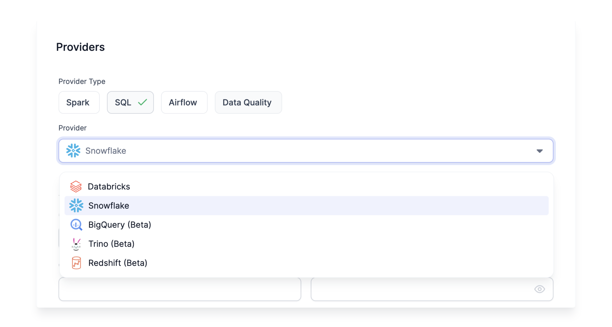

A Fabric is a logical execution environment. Teams can organize their data engineering into multiple environments such as development, staging, and production. SQL Fabrics define the credentials for Prophecy to connect to the SQL Warehouse or Lakehouse. Importantly, each user must update the relevant Fabric with their own credentials. Once a SQL Fabric is created, Prophecy can access data, execute data models and generate target tables.

Prophecy supports Databricks and Snowflake SQL Warehouses.


1. **[Snowflake SQL Fabrics](./snowflake.md)** - Provide Prophecy access to use the Snowflake warehouse data storage and compute engine capabilities.

2. **[Databricks SQL Fabrics](./databricks.md)** - Provide Prophecy access to use the Databricks' Warehouse storage and compute engine capabilities.

## Job Scheduling

In addition to secure, ad-hoc model runs on Snowflake and Databricks, Job scheduling is done with a visual, easy-to-use interface.

1. Snowflake users schedule Jobs with Airflow. Prophecy's [Airflow Fabric](/docs/Orchestration/airflow/setup/setup.md) facilitates a [Connection](/docs/Orchestration/airflow/setup/mwaa.md#setting-up-snowflake-connection) to the Snowflake Fabric.

2. Databricks users schedule Jobs with [Databricks Jobs](/docs/Orchestration/databricks-jobs.md) in Prophecy.

Once a Snowflake or Databricks SQL Fabric is setup, Prophecy's interface makes it easy to run Models on a daily, weekly, or monthly basis using Airflow or Databricks Jobs.

## What's next

To continue creating Fabrics, see the following pages:

```mdx-code-block
import DocCardList from '@theme/DocCardList';
import {useCurrentSidebarCategory} from '@docusaurus/theme-common';

<DocCardList items={useCurrentSidebarCategory().items}/>
```
