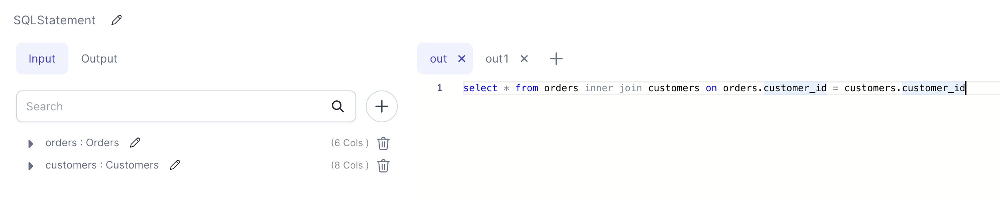

import Requirements from '@site/src/components/gem-requirements';

<Requirements
  python_package_name=""
  python_package_version=""
  scala_package_name=""
  scala_package_version=""
  scala_lib=""
  python_lib=""
  uc_single="14.3+"
  uc_shared="14.3+"
  livy="3.0.1"
/>

Create one or more models based on provided SQL queries to run against one or more input sources.

### Parameters

| Parameter   | Meaning                       | Required |
| :---------- | :---------------------------- | :------- |
| Models      | Input Source(s)               | True     |
| SQL Queries | SQL Query for each output tab | True     |

### Example

:::info
Number of inputs and outputs can be changed as needed by clicking the `+` button on the respective tab.
:::
