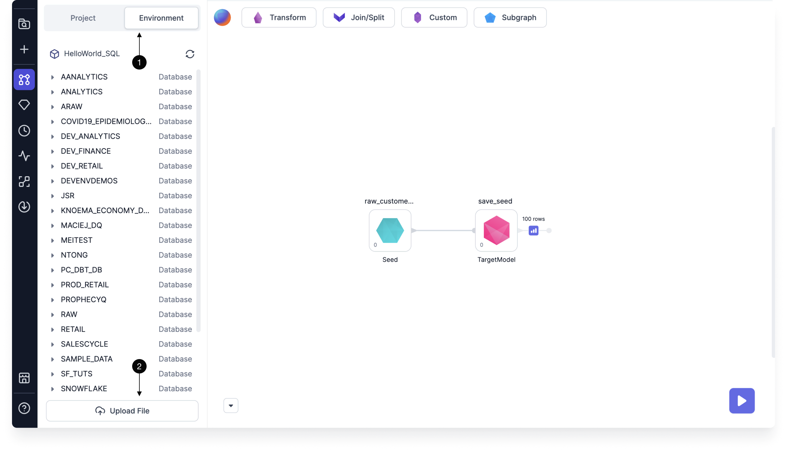
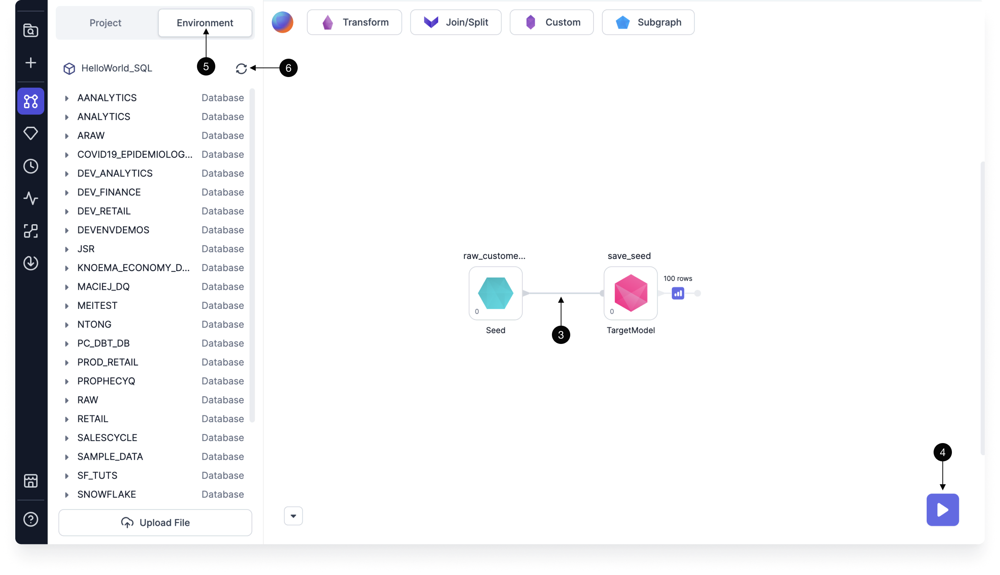

To load data into a SQL project, use [seed](#seeds), [source](#sources), or [model](#models) gems. These are all based on [dbt](https://docs.getdbt.com/docs/build/projects) concepts.

## Sources

Sources are pointers to tables in the SQL warehouse(s) specified in the SQL fabric.

1. You can browse available tables in the **Environment** tab of the Project Editor. Tables can be dragged onto the model canvas.
2. To upload a file to the warehouse directly from Prophecy, use the [Upload File](docs/analysts/development/gems/source-target/file/upload-files.md) option.

:::note
You can also add a source by clicking the **plus** sign next to Sources. Use this when you want to define your data model without a cluster connection or predefined table.
:::

## Seeds

Seeds let you load small CSV files into Prophecy. This is useful for small test datasets or lookup mappings, like a list of cities or countries. Seeds are saved as SQL files on Git when projects are committed and released. Follow the steps below to create a seed and write to the SQL warehouse defined in the fabric.

1. Inside the model canvas, from the project tab, select **+ Add Seed** and provide a name.
1. Open the **Code view** to view the text editor. You'll see a file for your seed.
1. Paste the data here in CSV format separated by commas.
1. The seed file should be listed in the files that will be committed to Git.
1. To make the seed usable in your project, run the seed by clicking the **large play button** in the bottom right corner.

To write the seed to your SQL warehouse:

1. Create a new model and define its location.
1. Add the seed to the model canvas.
1. Connect your seed to the **Target Model** gem.
1. **Run** the model. This runs the Target Model gem that writes the seed to the warehouse.
1. To view the new table in your SQL warehouse, click on the **Environment** tab in the project.
1. Use the **Refetch Sources** button to resync the data.
1. Now, you should see the new table.

## Models

A model is similar to a pipeline, as both contain data transformation steps. Unlike a pipeline, however, each model defines a single [materialized view or table](https://docs.getdbt.com/docs/build/materializations#materializations). Because models define a single materialized view or table, models can serve as inputs to other models. Each model is a single SQL file in the Code view.

To create a new model:

1. Click the **plus** sign next to Models.
1. Provide a name for the new model and define the desired storage path in Git to store the new model SQL file.
1. Click **Create**. This opens the model canvas. A [Target Model](docs/SQL/gems/target-models/target-models.md) gem automatically appears on the canvas.

:::note

You can't use statements (such as `CALL` and `EXECUTE IMMEDIATE`) directly inside of models. Instead, you must use them in pre-hooks.

:::

### Advanced model settings

The advanced settings of a model let you define whether the model should be materialized as a view, table, ephemeral, incremental, or dynamic table.

## What's next

For more details on dbt concepts including [sources](https://docs.getdbt.com/docs/build/sources), [seeds](https://docs.getdbt.com/docs/build/seeds), and [models](https://docs.getdbt.com/docs/build/models), explore the dbt documentation or check out the [SQL with Databricks](docs/getting-started/tutorials/sql-with-databricks.md) tutorial.
