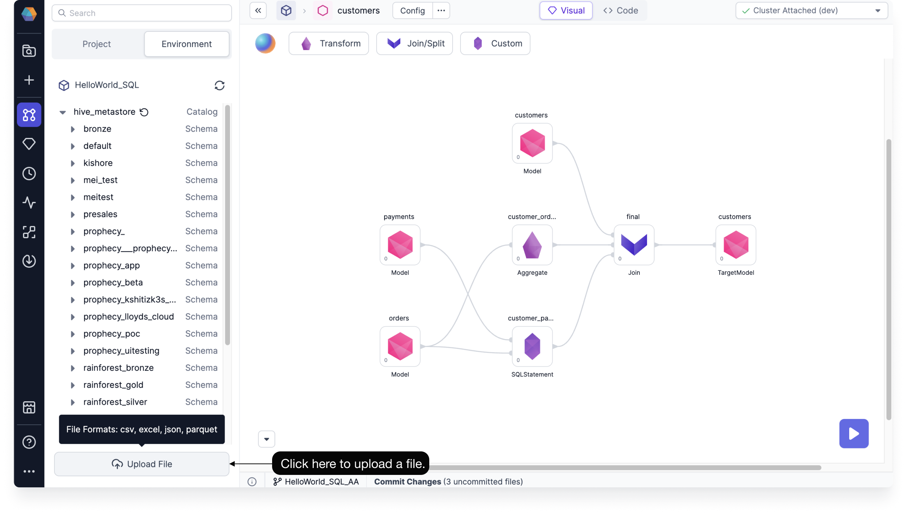
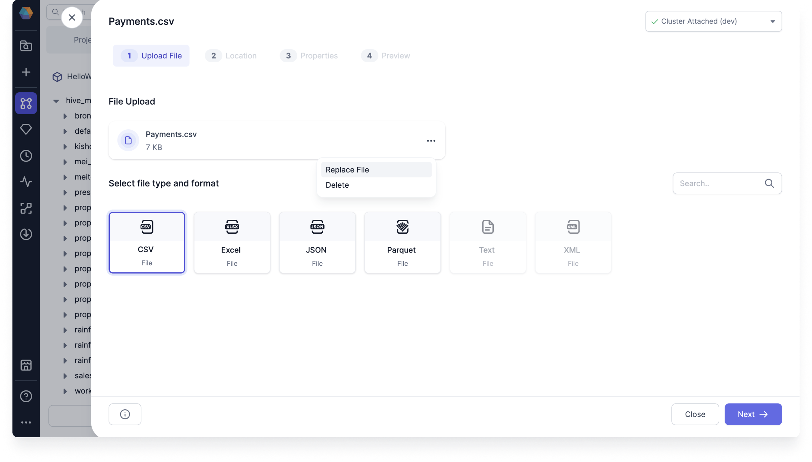
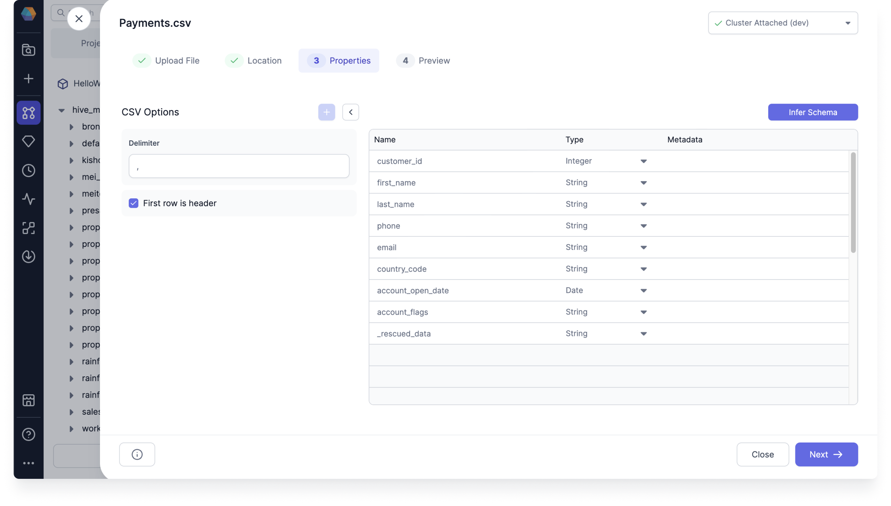
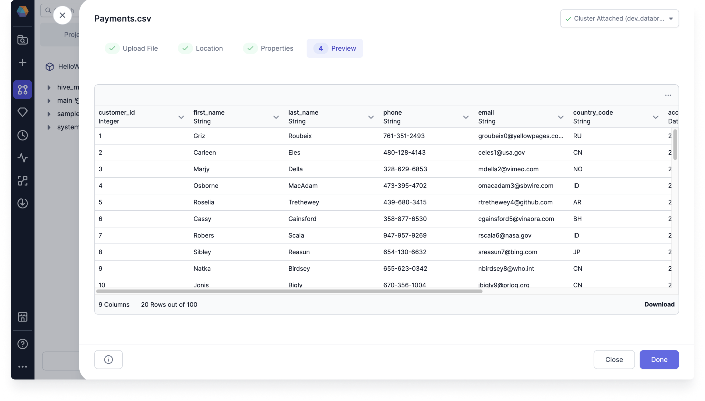

You can add a source table to your SQL Environment by uploading a file directly onto the Visual canvas. This effectively uploads your file as a table. As a business user, this gives you more control over your data and how you choose to incorporate them into your Model transformation.

The file can be one of the following file types:

- CSV - The default format is comma-separated. You have the option to change this during upload.
- Excel - The upload supports both XLS and XLSX.
- JSON - The upload supports single JSON per line with a consistent set of keys.
- Parquet - The upload supports single file upload.

When you upload your file through Prophecy, it's added directly to your Databricks or Snowflake SQL warehouse as a table. This eliminates the need to use other tools to upload your files. Once you've uploaded your file, you can join the data in the file's table with existing big data tables that already exist in your SQL warehouse.

## Upload a file

To upload your file, start by opening a Model within a project and following one of these steps:

:::note

The recommended maximum file size is 100&nbsp;MB.

:::

- Under the Environment Browser, click **Upload File**, and then select your file.

  

- Drag and drop your file onto the Visual canvas.

  

### Select the file type

Both Databricks and Snowflake SQL warehouses support CSV, Excel, JSON, and Parquet file types.

Select the file type:

- Select your file type and format, and then click **Next**.

  

You can also replace your uploaded file or delete it.

### Select the table location

You can select the database and schema for your table. For the table location, you can either create a new table or select a table you want to write your uploaded file to.

:::caution Warning

Selecting a table to write your uploaded file to deletes and re-creates the table.

:::

Select the table location:

- Select the following table locations in order using the dropdown menus:

  - Database
  - Schema
  - Table
    - Choose a table to overwrite or click **Create New** to create a new table.

  

  The dropdown menu choices are taken from the underlying warehouse, which already has these databases, schemas, and tables. You cannot create a new database or schema.

### Configure the table properties

You can configure the table properties before completing the file upload.

To configure the table properties, follow these steps:

1. Review the file's Options. Depending on the file type and format, common defaults are already chosen for you.

2. Optional: Modify the Options. For example, you can update the schema or change the header row by selecting **First row is header**.

3. Optional: If you made any changes to the Options, click **Infer Schema**. Infer schema runs automatically with the default options when you first get to the Properties step.

### Preview the table

The preview shows your table data and gives you the option to download it.

Preview the table:

- Check that your preview looks correct, and then click **Done**.

  

  If you selected a table to write your uploaded file to, you'll need to confirm the upload in the pop-up window by clicking **Proceed**.

The uploaded file's table is now available in the Source/Target node. The table is created in your environment and a source is created within your Model. You can upload another file or start working with your new source gem.
