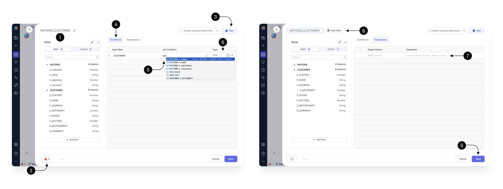
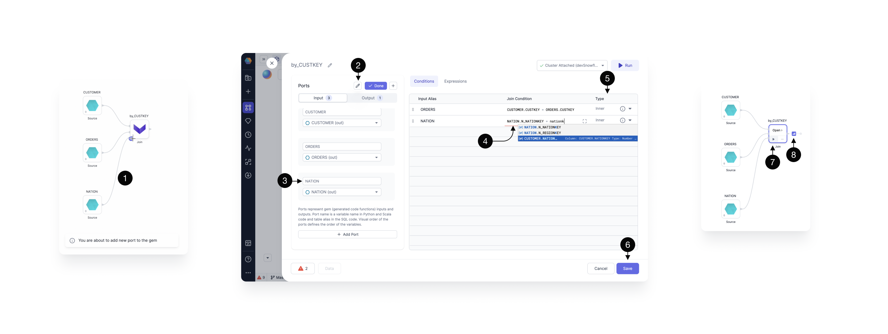

Upon opening the join Gem, you can see a pop-up which provides several helpful features.

For transparency, you can always see the **(1) Input schema** on the left hand-side, **(2) Errors** in the footer, and have the ability to **(3) Run** the Gem on the top right.

To fill-in our **(5) Join condition** within the **(4) Conditions** section, start typing the input table name and key. For example, if we have two input tables, `nation` and `customer`, type `nation.nationkey = customers.nationkey`. This condition finds a nation based on the nationkey feild for every single customer.

When you’re writing your join conditions, you’ll see available functions and columns to speed up your development. When the autocomplete appears, press ↑, ↓ to navigate between the suggestions and press tab to accept the suggestion.

Select the **(6)Join Type** according to the provider, eg [Databricks](https://docs.databricks.com/en/sql/language-manual/sql-ref-syntax-qry-select-join.html) or [Snowflake.](https://docs.snowflake.com/en/user-guide/querying-joins)

The **(7) Expressions** tab allows you to define the set of output columns that are going to be returned from the Gem. Here we leave it empty, which by default passes through all the input columns, from both of the joined sources, without any modifications.

To rename our Gem to describe its functionality, click on it’s **(8) Name** or try the **Auto-label** option. Gem names are going to be used as query names, which means that they should be concise and composed of alphanumeric characters with no spaces.

Once done, press **(9) Save.**

:::info
To learn more about the Join Gem UI, see [this page](/docs/concepts/project/gems.md) which illustrates features common to all Gems.
:::

## Add a port

It's easy to add an extra source to a Join Gem. Just connect and configure.

Once the source is **(1) connected**, click to **(2) edit** the ports.

Update the **(3) port name** from the default input `in2` to a more descriptive name such as the table name, in this case `NATIONS`.

Fill in the **(4) Join condition** for the new table and specify the **(5) Join type**.

Click **(6) Save**.

## Run

When your Join Gem has the desired inputs, conditions and expressions, **(7) run** interactively to view **(8) [sample data](/docs/SQL/development/visual-editor/interactive-development/data-explorer.md).**

## Types of Join

Suppose there are 2 tables TableA and TableB with only 2 columns (Ref, Data) and following contents:

### Table A

| Ref | Data     |
| :-- | :------- |
| 1   | Data_A11 |
| 1   | Data_A12 |
| 1   | Data_A13 |
| 2   | Data_A21 |
| 3   | Data_A31 |

### Table B

| Ref | Data     |
| :-- | :------- |
| 1   | Data_B11 |
| 2   | Data_B21 |
| 2   | Data_B22 |
| 2   | Data_B23 |
| 4   | Data_B41 |

### INNER JOIN

Inner Join on column Ref will return columns from both the tables and only the matching records as long as the condition is satisfied:

| Ref | Data     | Ref | Data     |
| :-- | :------- | :-- | :------- |
| 1   | Data_A11 | 1   | Data_B11 |
| 1   | Data_A12 | 1   | Data_B11 |
| 1   | Data_A13 | 1   | Data_B11 |
| 2   | Data_A21 | 2   | Data_B21 |
| 2   | Data_A21 | 2   | Data_B22 |
| 2   | Data_A21 | 2   | Data_B23 |

### LEFT JOIN

Left Join (or Left Outer join) on column Ref will return columns from both the tables and match records with records from the left table. The result-set will contain null for the rows for which there is no matching row on the right side.

| Ref | Data     | Ref  | Data     |
| :-- | :------- | :--- | :------- |
| 1   | Data_A11 | 1    | Data_B11 |
| 1   | Data_A12 | 1    | Data_B11 |
| 1   | Data_A13 | 1    | Data_B11 |
| 2   | Data_A21 | 2    | Data_B21 |
| 2   | Data_A21 | 2    | Data_B22 |
| 2   | Data_A21 | 2    | Data_B23 |
| 3   | Data_A31 | NULL | NULL     |

### RIGHT JOIN

Right Join (or Right Outer join) on column Ref will return columns from both the tables and match records with records from the right table. The result-set will contain null for the rows for which there is no matching row on the left side.

| Ref  | Data     | Ref | Data     |
| :--- | :------- | :-- | :------- |
| 1    | Data_A11 | 1   | Data_B11 |
| 1    | Data_A12 | 1   | Data_B11 |
| 1    | Data_A13 | 1   | Data_B11 |
| 2    | Data_A21 | 2   | Data_B21 |
| 2    | Data_A21 | 2   | Data_B22 |
| 2    | Data_A21 | 2   | Data_B23 |
| NULL | NULL     | 4   | Data_B41 |

### FULL OUTER JOIN

Full Outer Join on column Ref will return columns from both the tables and matching records with records from the left table and records from the right table . The result-set will contain NULL values for the rows for which there is no matching.

| Ref  | Data     | Ref  | Data     |
| :--- | :------- | :--- | :------- |
| 1    | Data_A11 | 1    | Data_B11 |
| 1    | Data_A12 | 1    | Data_B11 |
| 1    | Data_A13 | 1    | Data_B11 |
| 2    | Data_A21 | 2    | Data_B21 |
| 2    | Data_A21 | 2    | Data_B22 |
| 2    | Data_A21 | 2    | Data_B23 |
| 3    | Data_A31 | NULL | NULL     |
| NULL | NULL     | 4    | Data_B41 |

### LEFT SEMI JOIN

Left Semi Join on column Ref will return columns only from left table and matching records only from left table.

| Ref | Data     |
| :-- | :------- |
| 1   | Data_B11 |
| 1   | Data_B21 |
| 1   | Data_B22 |
| 2   | Data_B23 |
| 3   | Data_B41 |

### LEFT ANTI JOIN

Left anti join on column Ref will return columns from the left for non-matched records :

| Ref | Data     | Ref  | Data |
| :-- | :------- | :--- | :--- |
| 3   | Data_A31 | NULL | NULL |
