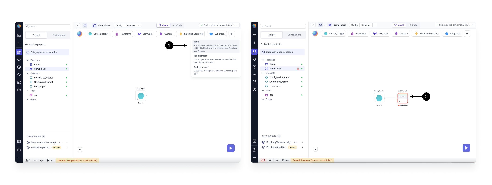

Subgraph allows you to take multiple different Gems and wrap them under a single parent Gem. It allows you to decompose complex logic into components.

By incorporating Gems into a Subgraph, you can make your Model look cleaner

## Basic Subgraph

Subgraph works just like the sequence of Gems, can run to see the output
Connect the input port, can add more input ports

The [Basic](./basic-subgraph) Subgraph is a great introduction to using Subgraphs.

| Name                      | Description                                                    |
| ------------------------- | -------------------------------------------------------------- |
| [Basic](./basic-subgraph) | Captures one or more Gems within a Model across your Projects. |

In a **Basic Subgraph**, you have the capability to encapsulate multiple distinct Gems within a single, reusable parent Gem. This organizational approach enhances the visual clarity of your Model by grouping various sections together under a common parent Gem. Additionally, it empowers users to break down intricate logic into modular components, thereby streamlining the Data Engineering processes.

### Create a Basic Subgraph

To create a Basic Subgraph, Drag and Drop the **(1) Basic** Subgraph Gem from the Subgraph Menu and connect it to any previously created Gems on your canvas.
Once the Gem is added, Click **(2) Open**, to open the subgraph canvas.

Once you are on the canvas, You can start adding Gems to your subgraph by dragging and dropping from the Gems Menu.

### Add/Remove Port

While using a Subgraph, You can control the Input and Output ports as per the requirements. Click on the **(1) Add/Remove Part** Button to open the port settings dialog as shown below.

In this dialog, you can add or remove the Input or Output ports.
To Add an input Put click on **(2) + button**. This will add an input Port.
To remove an Input port, Click the **(3) Delete** icon next to the input port you want to delete.

Similarly, you can control the Output Ports by switching to the **(4) Output** Tab.
As you connect the input and output ports to gems Outside the subgraph, you would be able to see the schema for the port reflected here.

## Code view

a

## Subgraph Configurations

Subgraphs are configurable just like how Models and projects are configurable. For Subgraphs, the configurations can apply in one of two ways: (1) Model-level configurations apply to the Subgraph or (2) Project-level configurations apply to the Subgraph.
