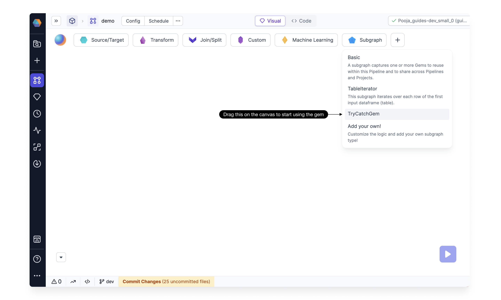

Subgraph allows you to take multiple different Gems and wrap them under a single reusable parent Gem. It allows the user to decompose complex logic into reusable components. See how to **create** and **publish** a Subgraph in the video below.

<iframe src="https://fast.wistia.net/embed/iframe/e1q56n0gjb?seo=false?videoFoam=true" title="Getting Started With SQL Video" allow="autoplay; fullscreen" allowtransparency="true" frameborder="0" scrolling="no" class="wistia_embed" name="wistia_embed" msallowfullscreen width="100%" height="100%"></iframe>

## Types of Subgraphs

There are three types of Subgraph available by default. The [Basic](./basic-subgraph) Subgraph is a great introduction to using Subgraphs.

| Name                                                         | Description                                                                               |
| ------------------------------------------------------------ | ----------------------------------------------------------------------------------------- |
| [Basic](./basic-subgraph)                                    | Captures one or more Gems within a Pipeline to reuse across other Pipelines and Projects. |
| [Novel Type](./subgraph.md#create-your-own-type-of-subgraph) | Apply any custom logic to the group of Gems present inside the Subgraph.                  |

## Create your own type of Subgraph

You can also create your own Subgraph to apply any custom logic on the group of Gems present inside it. For example Try Catch, etc.

To create your own Subgraph type, Go to the project you want to create the Gem in.
Click on the **(1) Create Gem** button. This will open up the **Create Gem** Form. Provide a **(2) Name** for the Gem, and select the mode as **Control Flow Gem**.

This takes to you the Gem Code Editor with a basic structure of the code generated. Here you can start modifying your dialog, validation and the actual logic of the Gem.
Read [here](/docs/package-hub/package-builder/gem-builder.md) for more details of the Gem code. More detailed docs on writing Subgraph Gems to follow soon.

The newly constructed Subgraph Gem can be utilized within any Pipeline of this Project, accessible through the Subgraph menu as demonstrated below.
Furthermore, you have the option to Release this project, enabling its use as a dependency in other projects, thus incorporating the created Gem into various projects.
Read [here](/docs/package-hub/package-hub.md) for more details on project as a dependency.

## What's next

To create a basic subgraph, see [Basic Subgraph](basic-subgraph.md).
