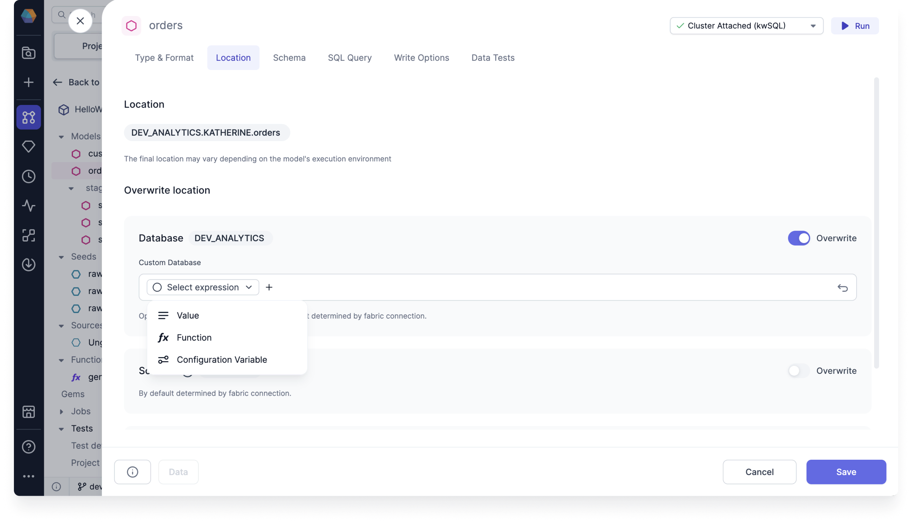

You can use the Location tab to overwrite the database, schema, or alias of your Target model.

The full location of a table, view, and other objects consists of a database, schema, and alias. dbt allows its users to overwrite any of those parts of the location, with a combination of macros and additional project, folder, and model-level configurations. This tab simplifies those dbt object location parts.

The **Location** section shows you where your model will be stored **by default**. This is inferred from the configuration of your connected [fabric](docs/getting-started/concepts/fabrics.md).

## Overwrite location

You also have the option to overwrite location behavior and define it from scratch.

| Field    | Description                                                    | Advanced mode |
| -------- | -------------------------------------------------------------- | ------------- |
| Database | The name of the target SQL database                            | Yes           |
| Schema   | The name of the target schema (collection of database objects) | Yes           |
| Alias    | The name of the created table or view                          | No            |

### Advanced mode

You can use **Advanced mode** for the database or schema when you want to populate these fields dynamically.

### Example

Let's say you want to use one database location during development and interactive execution, but you want to write to a different database for production. You can use a configuration variable to do so.

First, you will have to create the variable:

1. Click **...** in the project header and select **Configuration**.
1. Make sure you are in **Project Configuration**.
1. Create a variable and make the default value the name of the development database you want to use during interactive execution. The value should be a string.

Next, how will you change the variable to save to a **production** database?

1. Create a job that includes your model.
1. Open the model configuration and add the **Supply variables to project** DBT property.
1. Add your project variable and assign it the name of the production database. This will override the default value you provided in the Project Configuration.

Now, when the job runs, your model should be stored in the production database.

:::note

You can also run a dbt command using the --vars flag to override the default variable value.

:::
