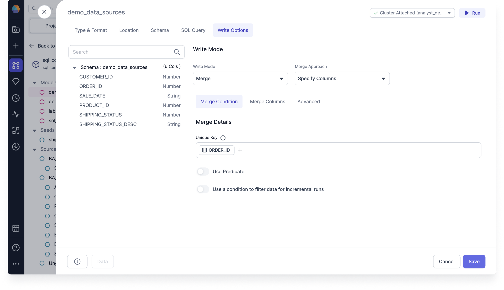

The **Write Options** tab lets you determine how you will store your processed data. These settings are important if your data will change over time. There are three main write modes that you can choose from.

- **Overwrite**: Replace your table with new data.
- **Append**: Add new data without changing the old data.
- **Merge**: Update existing data while keeping track of changes over time. There are also additional merge approaches that you can select for this write mode.

To select write modes, you must set the Target model [Type & Format](type-and-format.md) to **Table**.

:::info Providers
The write modes available will depend on which data provider you use (Databricks or Snowflake).
:::

## Overwrite

The **Overwrite** mode will replace the stored data entirely with new data on each run. This is the default write mode for all types and formats. When the write mode overwrites the table, the schema has to match. This is often the right approach for staging and intermediate tables, but it's rarely what you'd want for final tables.

## Append

The **Append** mode will add new rows to the table on each run. This works best if your table doesn't require a unique key per record, and you don't mind having duplicate records. If you need to ensure unique keys, use the **Merge** write mode instead.

## Merge

The **Merge** mode will integrate new data by updating existing rows and inserting new ones. It ensures data consistency and maintains unique keys in the target table.
If a unique key is specified, it will update old records with values from new records that match on the key column.

There are four merge approaches to choose from:

- Specify columns: Merges specific columns and updates existing records that match on a unique key.
- SCD2: Preserves historical data changes by tracking record validity and creating new records.
- Insert and overwrite: Replaces existing records and inserts new ones in one operation.
- Replace where: Replaces existing records with new records based on certain conditions.

### Specify columns

The **Specify columns** approach lets you customize the columns included in your data queries by selecting, deselecting, and reordering columns.

| Parameter                                          | Description                                                                                                                                                                                                                                                                                                                                                                                                                                                                                                                                                                                                                           |
| -------------------------------------------------- | ------------------------------------------------------------------------------------------------------------------------------------------------------------------------------------------------------------------------------------------------------------------------------------------------------------------------------------------------------------------------------------------------------------------------------------------------------------------------------------------------------------------------------------------------------------------------------------------------------------------------------------- |
| Unique Key                                         | The key used to match existing records in the target dataset for merging.                                                                                                                                                                                                                                                                                                                                                                                                                                                                                                                                                             |
| Use Predicate                                      | Lets you add conditions that specify when to apply the merge.                                                                                                                                                                                                                                                                                                                                                                                                                                                                                                                                                                         |
| Use a condition to filter data or incremental runs | Enables applying conditions for filtering data or incremental runs.                                                                                                                                                                                                                                                                                                                                                                                                                                                                                                                                                                   |
| Merge Columns                                      | Specifies which columns to update during the merge. If empty, the merge includes all columns.                                                                                                                                                                                                                                                                                                                                                                                                                                                                                                                                         |
| Exclude Columns                                    | Defines columns that should be excluded from the merge operation.                                                                                                                                                                                                                                                                                                                                                                                                                                                                                                                                                                     |
| On Schema Change                                   | Specifies how schema changes should be handled during the merge process.<ul style={{margin:0}}><li><strong>ignore</strong>: Newly added columns will not be written to the model. This is the default option.</li><li><strong>fail</strong>: Triggers an error message when the source and target schemas diverge.</li><li><strong>append_new_columns</strong>: Append new columns to the existing table.</li><li><strong>sync_all_columns</strong>: Adds any new columns to the existing table, and removes any columns that are now missing. Includes data type changes. This option uses the output of the previous gem.</li></ul> |

#### Example A

Consider a scenario where you have an **ORDERS** table with a column called _ORDER_ID_. In this case, you want to update the shipping status for existing orders without affecting any other fields. When new records are added, if an _ORDER_ID_ already exists in the table, only the _SHIPPING_STATUS_ column should be updated, and all other fields should remain unchanged.

By using the **specify columns** merge approach, the merge operation targets only the _SHIPPING_STATUS_ column, ensuring that it is updated while preserving the values in all other columns based on the matching _ORDER_ID_.

### SCD2

SCD2 (Slowly Changing Dimensions Type 2) is a method for managing historical data changes in data warehouses. It tracks changes in dimension records over time, preserving both current and historical data. SCD2 captures all changes in the target model, with null values representing new, active, and valid rows. Prophecy simplifies SCD2 by offering it as a model write option, using a visual interface to configure writes and retain data history.

| Parameter                                                         | Description                                                                      |
| ----------------------------------------------------------------- | -------------------------------------------------------------------------------- |
| Unique Key                                                        | The key used to match existing records in the target dataset for merging.        |
| Invalidate deleted rows                                           | When enabled, records that match deleted rows will be marked as no longer valid. |
| Determine new records by checking timestamp column                | Recognizes new records by the time from the timestamp column.                    |
| Determine new records by looking for differences in column values | Recognizes new records based on a change of values in a specified column.        |

#### Example B

Imagine you have an ORDERS table with a _SHIPPING_STATUS_ field. As orders are processed, the status may change from "pending" to "shipped". However, simply updating the status field would overwrite the previous value, making it impossible to analyze how long an order stayed in the "pending" state.

To solve this, SCD2 adds a new row each time the status changes, rather than overwriting the existing data. For example, when an order’s status changes, a new row is added with the updated status, and the previous row is preserved with the relevant historical information. Here's how this works:

**Table 1**: When an order is first created, the status is "pending".

| ORDER_ID | SHIPPING_STATUS | UPDATED_AT |
| -------- | --------------- | ---------- |
| 1        | pending         | 2024-01-01 |
| 2        | pending         | 2024-01-02 |

**Table 2**: When the status changes, the previous record remains, and a new row is added with the updated status. Additionally, new columns are added to record the validity of the record. In this case, the order was pending until **2024-01-02**.

| ORDER_ID | SHIPPING_STATUS | UPDATED_AT | valid_from | valid_to   |
| -------- | --------------- | ---------- | ---------- | ---------- |
| 1        | pending         | 2024-01-01 | 2024-01-01 | 2024-01-02 |
| 1        | shipped         | 2024-01-02 | 2024-01-02 | null       |
| 2        | pending         | 2024-01-02 | 2024-01-02 | null       |

If the data doesn't have a date but instead has `null`, then it means that the data is currently valid.

### Insert and overwrite

The Insert and Overwrite approach allows you to overwrite existing records and insert new ones in a single operation, ensuring data accuracy. This is particularly helpful when using Databricks.

| Parameter        | Description                                                                                     |
| ---------------- | ----------------------------------------------------------------------------------------------- |
| Partition By     | Defines the partitioning column used to determine which data to replace during the merge.       |
| On Schema Change | Specifies how schema changes should be handled during the merge process. The default is ignore. |

If **Partition By** is specified, dbt runs an atomic insert overwrite statement that dynamically replaces all partitions included in your query. If no partition is specified, the strategy replaces the entire table, overriding all existing data with only the new records while maintaining the original schema.

#### Example C

Consider a scenario where you have a **CUSTOMERS** table and want to replace all partitions based on the _CUSTOMER_ID_ column. Instead of updating individual records, this approach replaces all partitions that match the query conditions with new data. This ensures that only the most current records are retained while outdated partitions are efficiently replaced.

### Replace where

The **Replace where** approach lets you update records that match the condition defined in the predicate. This is particularly helpful when using Snowflake.

| Parameter                                          | Description                                                                                                                                                                                                                                                                                                                                                                                                                                                                                                                                                                                                                           |
| -------------------------------------------------- | ------------------------------------------------------------------------------------------------------------------------------------------------------------------------------------------------------------------------------------------------------------------------------------------------------------------------------------------------------------------------------------------------------------------------------------------------------------------------------------------------------------------------------------------------------------------------------------------------------------------------------------- |
| Use Predicate                                      | Lets you add conditions that specify when to apply the merge.                                                                                                                                                                                                                                                                                                                                                                                                                                                                                                                                                                         |
| Use a condition to filter data or incremental runs | Enables applying conditions for filtering data or incremental runs.                                                                                                                                                                                                                                                                                                                                                                                                                                                                                                                                                                   |
| On Schema Change                                   | Specifies how schema changes should be handled during the merge process.<ul style={{margin:0}}><li><strong>ignore</strong>: Newly added columns will not be written to the model. This is the default option.</li><li><strong>fail</strong>: Triggers an error message when the source and target schemas diverge.</li><li><strong>append_new_columns</strong>: Append new columns to the existing table.</li><li><strong>sync_all_columns</strong>: Adds any new columns to the existing table, and removes any columns that are now missing. Includes data type changes. This option uses the output of the previous gem.</li></ul> |

#### Example D

In a **TRANSACTIONS** table, you may want to update the payment status only for transactions made within the last 30 days. By defining a predicate such as `TRANSACTION_DATE >= DATE_SUB(CURRENT_DATE(), 30)`, only records created within the last 30 days should be modified, ensuring efficient updates while preserving historical data.

## Additional information

Target models are incremental models. They update data by processing only new or changed records instead of reloading all data. This makes updates faster and reduces resource use. Once you've selected your write mode, you'll see in the code view that the table is stored as a `"materialized": "incremental"` table, with `"incremental_strategy"` set to whichever write mode and merge approach you choose.

Incremental models can be configured to include an optional `on_schema_change` parameter to enable additional control when incremental model columns change. These options enable dbt to continue running incremental models in the presence of schema changes, resulting in fewer `--full-refresh` scenarios and saving query costs.
