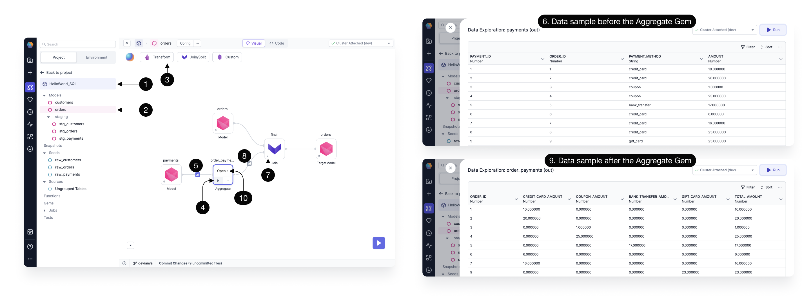
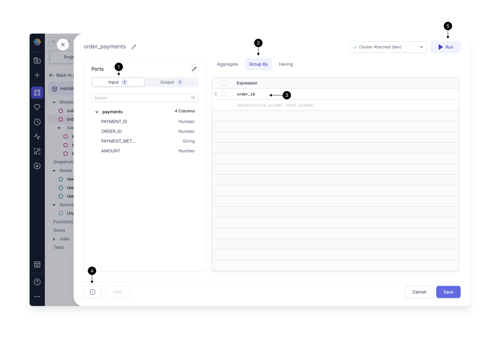
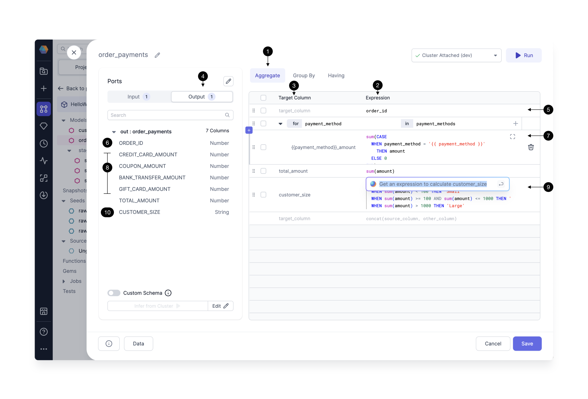
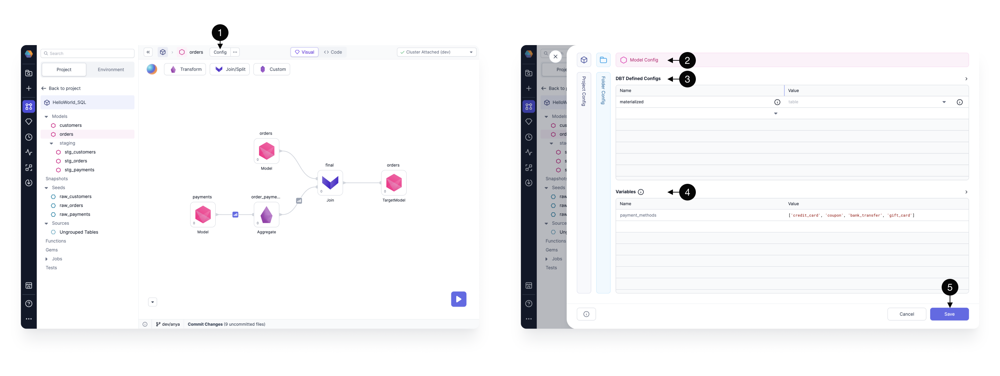

import Requirements from '@site/src/components/gem-requirements';

<Requirements
  python_package_name="ProphecySparkBasicsPython"
  python_package_version="0.0.1+"
  scala_package_name="ProphecySparkBasicsScala"
  scala_package_version="0.0.1+"
  scala_lib=""
  python_lib=""
  uc_single="14.3+"
  uc_shared="14.3+"
  livy="3.0.1"
/>

Together let's deconstruct a commonly used Transformation, the Aggregate gem. Follow along in the `HelloWorld_SQL` project.

## Using the gem

1. **Open** the HelloWorld_SQL [Project](https://app.prophecy.io/metadata).
2. From the list of models, select the **Orders** model. A model is a series of transformation steps (Gems) that describe how to create a single table or view. The Orders model defines the steps to create the Orders table.
3. Open the **Transformation** dropdown to see the available Transformation gems. The Aggregate gem has already been dragged to the canvas and configured in this HelloWorld_SQL example.
4. Click the arrow to **Run up to the Aggregate gem**.
5. Preview a **data sample** before the Aggregate gem.
6. This is the `payments` data sample before the Aggregate gem. There is one row per payment.
7. Click to **Run up to the Join gem**.
8. Preview a **data sample** after the Aggregate gem.
9. This is the `order_payments` data sample after the Aggregate gem. The individual rows of `payments` have been grouped according to `ORDER_ID`, and the amounts have been summed according to the payment type.
10. Let's see how to use expressions. Click to **Open**.

## Using Expressions

### GroupBy expression

1. There is one **Input** dataset, `payments`, and we can see the columns and datatypes below.
2. Open the **GroupBy** tab.
3. We can see the gem is configured to group according to the `order_id` column. Just click any column name listed in **(1) Input** to add a column to the GroupBy expressions.
4. Syntax **errors** are surfaced here as you're designing your gem (and model) on the canvas. That's handy so you don't have to run a job to discover a typo.
5. The **Run** button is available here to test and view data samples. This way you can make sure your Aggregate gem is configured as desired.

### Aggregate expressions

Next we'll walk through the Aggregate tab, where we have a lot more bells and knobs to turn.

1. Click the **Aggregate** tab, where we'll define our new column names and data manipulation expressions.
2. The list of **Expressions** describe how to manipulate a particular column from the input dataset.
3. The list of **Target Columns** is the list of column names to be manipulated by the Aggregate gem and included in the gem's output.
4. Click **Output** to see the schema of the dataset resulting from the Aggregate gem.
5. The `order_id` column is getting passed through the Aggregate step without being changed. Recall this is the column that will be used to group the data. To add any column, just click the column name from the Input list, or start typing the column name and Prophecy Copilot will provide suggestions.
6. Since the `order_id` column was **(5)selected,** then this column appears in the output dataset. It has a number datatype.
7. Here is an **expression** that includes some data manipulation logic. The amount is summed according to the payment method. `payment_method` is being passed as a configurable variable surrounded by curly braces `{{ }}`. We'll see how to configure the variables `credit_card`, `coupon`, `bank_transfer`, `gift_card` in the next section.
8. These are the **output columns** according to the **(3)Target Column.** `{{ payment_method }}` is a configurable parameter, and each of the payment methods (e.g. GIFT_CARD) has been appended with the string `amount`. Now we are starting to see how the data sample output from the Aggregate gem will be constructed.
9. Let's **AskAI** to help write a new expression. Type "Calculate customer size based on the amount purchased." Copilot AI generates a SQL expression and we can keep or reject the suggestion.
10. The new expression will be reflected in the Aggregate gem output, `CUSTOMER_SIZE` column.

## Using Variables

Now let's see how to configure the `payment_methods` variable.

1. Click **Config** to open the configuration screen.
2. We see the option to apply a configuration at several different **levels:** apply to the entire model, all the models in the GitHub folder, or all the models in the project. Here we can see there are Configurations that apply to this particular `Orders` model.
3. See the list of [DBT Defined Configs](https://docs.getdbt.com/reference/configs-and-properties). These are configs every user could employ with their DBT projects, such as whether to materialize the model as table, view, ephemeral, or incremental. Click the dropdown to select the config of interest, then enter the appropriate value. Hover over the "i" icon for a short description of each DBT Config.
4. See the list of user-defined **Variables**. In our HelloWorld_SQL project, the `payment_methods` variable has been defined with the four **values** shown.
5. Click **Save** after editing the Config for the model, folder, or project.

Click the code view to see the Config encoded in the `dbt_project.yml` file or the `schema.yml/properties.yml` file. Further information can be found in DBT documentation, as Prophecy's model Config is based on DBT's [Model Configurations](https://docs.getdbt.com/reference/model-configs).

Using Config variables (and DBT Defined Configs) within a gem is easy. Just wrap the variable name (e.g. `payment_method`) in curly braces `{{ }}` like this: `{{ payment_method }}`.

:::info
To learn more about the Aggregate gem UI, see [this page](/docs/concepts/project/gems.md) which illustrates features common to all [Gems](/SQL/gems/gems.md).
:::

Here we used the Aggregate gem from the HelloWorld_SQL project as a learning guide. What types of Aggregations will you build? [Reach out](/docs/getting-help/getting-help.md) with questions and to let us know how you're using Prophecy.
