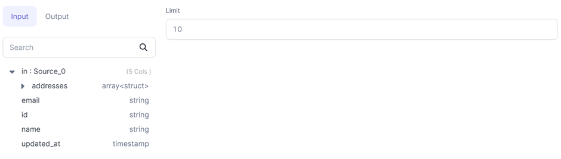

<h3>SQL Gem</h3>

Limits the number of rows in the output.

### Parameters

| Parameter | Description                                                               | Required |
| :-------- | :------------------------------------------------------------------------ | :------- |
| Model     | Input Source                                                              | True     |
| Limit     | Number of rows required in output (Allowed range: [0, 231 -1]) | True     |

### Example

