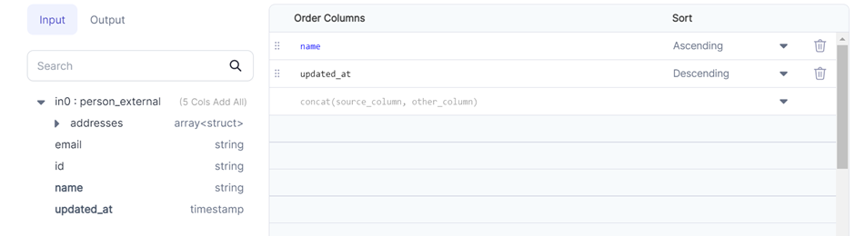

<h3>SQL Gem</h3>

Transforms one or more column names or values by using expressions and/or functions. It's useful when we need to extract only the required columns or make changes column-wise.

## Parameters

| Parameter     | Description                                | Required                                 |
| :------------ | :----------------------------------------- | :--------------------------------------- |
| Model         | Input Source on which changes are required | True                                     |
| Target column | Output column name                         | False                                    |
| Expression    | Expression to compute target column        | Required if a `Target column` is present |

:::info
If no columns are selected, then all columns are passed through to the output
:::

## Example

