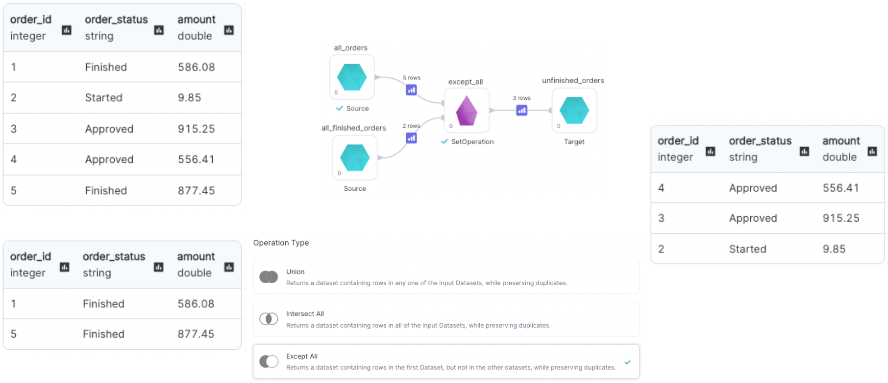

import Requirements from '@site/src/components/gem-requirements';

<Requirements
  python_package_name="ProphecySparkBasicsPython"
  python_package_version="0.0.1+"
  scala_package_name="ProphecySparkBasicsScala"
  scala_package_version="0.0.1+"
  scala_lib=""
  python_lib=""
  uc_single="14.3+"
  uc_shared="14.3+"
  livy="3.0.1"
/>

Use the SetOperation gem to perform addition or subtraction of rows from models with identical schemas and different data.

### Parameters

| Parameter      | Description                                                                                                                                                                                                                                                                                                                                                                     | Required |
| :------------- | :------------------------------------------------------------------------------------------------------------------------------------------------------------------------------------------------------------------------------------------------------------------------------------------------------------------------------------------------------------------------------ | :------- |
| Model 1        | First input Source                                                                                                                                                                                                                                                                                                                                                              | True     |
| Model 2        | Second input Source                                                                                                                                                                                                                                                                                                                                                             | True     |
| Model N        | Nth input Source                                                                                                                                                                                                                                                                                                                                                                | False    |
| Operation type | Operation to perform - `Union`: Returns a model containing rows in any one of the input Sources, while preserving duplicates. - `Intersect`: Returns a model containing rows in all of the input Sources, while preserving duplicates.  - `Except`: Returns a model containing rows in the first Source, but not in the other Sources, while preserving duplicates. | True     |

:::info
To add more input Sources, simply click `+` icon on the left sidebar

:::

### Examples

---

#### Operation Type - `Union`

---

#### Operation Type - `Intersect`

---

#### Operation Type - `Except`

